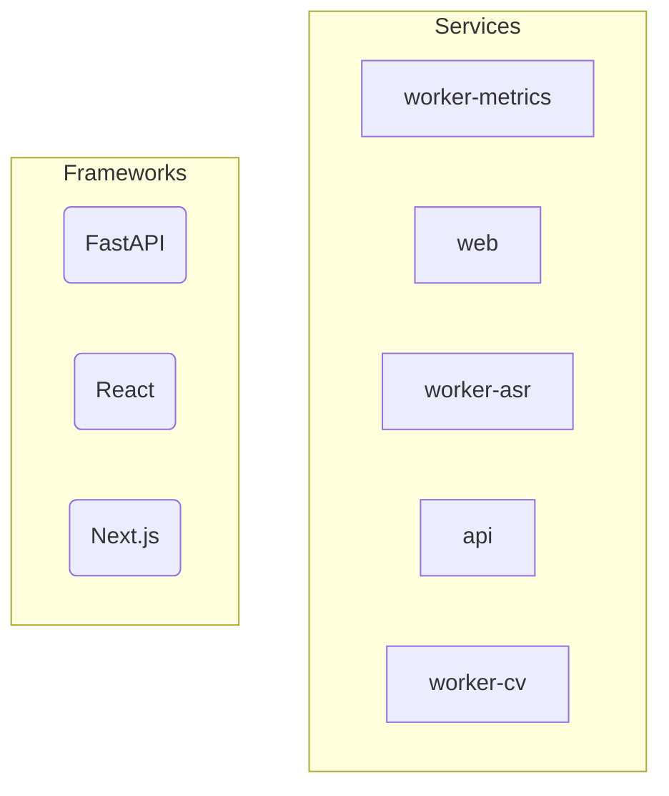

# PedagogyX - Autonomous Repository

## Project Overview
This repository is continuously analyzed, documented, and visualized automatically.

## Technology Stack
- FastAPI
- React
- Next.js

## AI Generated Architecture Summary (Fallback)

This repository is built using **FastAPI, React, Next.js**.

### Core Services

- **worker-metrics**: Microservice part of the architecture.
- **web**: Microservice part of the architecture.
- **worker-asr**: Microservice part of the architecture.
- **api**: Microservice part of the architecture.
- **worker-cv**: Microservice part of the architecture.

## Repository Structure
- **[worker-metrics](services/worker-metrics)**
- **[web](services/web)**
- **[worker-asr](services/worker-asr)**
- **[api](services/api)**
- **[worker-cv](services/worker-cv)**

## Architecture Diagrams

### Services & Frameworks

## Setup Instructions
1. Install dependencies via `pip install -r services/api/requirements.txt` or Node/NPM.
2. Run locally via Docker: `docker compose -f infra/compose.dev.yaml up --build`

## Environment Variables
The following environment variables are detected in the codebase:

## Contribution Guide
Please see [CONTRIBUTING.md](CONTRIBUTING.md) for details.

