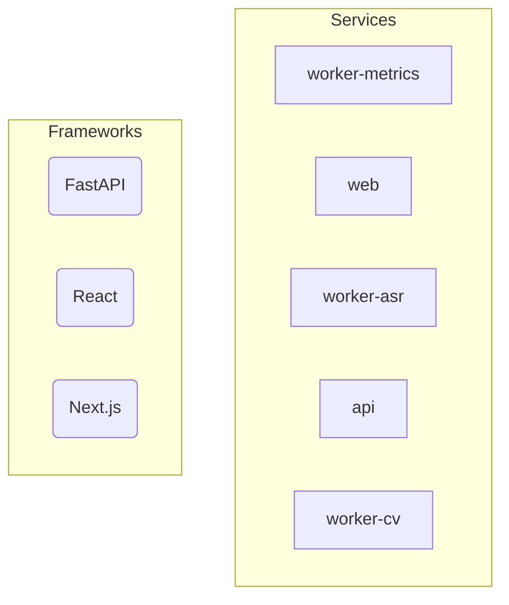

# PedagogyX - Autonomous Repository

## Project Overview

This repository is continuously analyzed, documented, and visualized automatically.

## Technology Stack

- FastAPI
- React
- Next.js

## Core Architecture

PedagogyX is a distributed platform designed for educational data processing and analytics. It leverages a microservice architecture built on a modern, open-source stack.

### Key Components

- **API Service (`api`)**: The central gateway powered by FastAPI, handling client requests and internal routing.
- **Web Frontend (`web`)**: A high-performance user interface built with Next.js and React.
- **ASR Worker (`worker-asr`)**: Dedicated microservice for Automatic Speech Recognition processing.
- **Computer Vision Worker (`worker-cv`)**: Dedicated microservice for Computer Vision processing pipelines.
- **Metrics Worker (`worker-metrics`)**: Analytics engine responsible for aggregating and processing educational metrics.

## Repository Structure

- **[worker-metrics](services/worker-metrics)**
- **[web](services/web)**
- **[worker-asr](services/worker-asr)**
- **[api](services/api)**
- **[worker-cv](services/worker-cv)**

## Architecture Diagrams

### Services & Frameworks

```mermaid
graph TD
    subgraph Services
        worker_metrics["worker-metrics"]
        click worker_metrics href "services/worker-metrics" "Go to worker-metrics source"
        web["web"]
        click web href "services/web" "Go to web source"
        worker_asr["worker-asr"]
        click worker_asr href "services/worker-asr" "Go to worker-asr source"
        api["api"]
        click api href "services/api" "Go to api source"
        worker_cv["worker-cv"]
        click worker_cv href "services/worker-cv" "Go to worker-cv source"
    end

    subgraph Frameworks
        FastAPI(FastAPI)
        React(React)
        Next_js(Next.js)
    end

```

## Setup Instructions

1. Install dependencies via `pip install -r services/api/requirements.txt` or Node/NPM.
2. Run locally via Docker: `docker compose -f infra/compose.dev.yaml up --build`

## Environment Variables

The following environment variables are detected in the codebase:

## Contribution Guide

Please see [CONTRIBUTING.md](CONTRIBUTING.md) for details.
