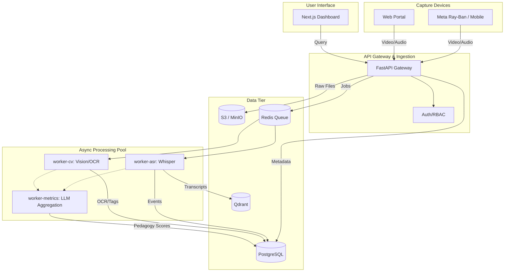

# PedagogyX: Phase 0 Comprehensive Foundational Research Report

**Role:** Autonomous Principal Research Architect & Lead Systems Engineer
**Objective:** Establish the absolute bedrock of architectural, scientific, and product truth before writing a single line of production code.

---

## 1. Founder Interrogation (Product & Technical)

### 1.1 Product Strategy Interrogation

- **Is this enterprise SaaS or B2C?** If enterprise, how are we handling complex procurement cycles and stringent IT security reviews in school districts?
- **Who is the real user vs. the buyer?** Is the buyer the district superintendent optimizing for test scores, while the user is the teacher fearing surveillance? This dichotomy dictates UX.
- **Is this for instructional coaching or performance evaluation?** If evaluation, teacher unions will block adoption. We must position as a private, self-improvement tool ("coach, not cop").
- **Privacy-first architecture?** Are we processing video on edge devices to avoid streaming PII (minors' faces) to the cloud?
- **Compliance:** How do we handle FERPA (US), GDPR (EU), and DPDP (India)? Are we stripping biometric data immediately?

### 1.2 Deep Technical Interrogation

- **Classroom Hardware Topology:** Are we relying on Meta Ray-Ban glasses (v1), stationary 360 cameras, or mobile devices? The sync pipeline for multi-angle audio/video is non-trivial.
- **Inference Latency:** Does feedback need to be real-time (requires edge GPU) or post-processed (batch cloud processing)?
- **Acoustic Environment:** Classrooms are incredibly noisy. How are we handling far-field speech recognition, overlapping voices, and reverberation? Do we need beamforming arrays?
- **Multimodal Fusion:** How are we aligning timestamps between slide OCR, teacher voice (ASR), and student engagement video metrics?
- **Storage Scale:** A 1-hour 1080p video per teacher, per day, across 10,000 teachers is massive. What is our cold-storage tiering strategy?

---

## 2. Competitor Analysis

### 2.1 Incumbents & Specialized Tools

- **Edthena:**
  - _Architecture:_ Cloud-based asynchronous video upload, manual tagging, basic AI integration.
  - _Weakness:_ Heavy reliance on manual human review. Lacks continuous, autonomous multimodal intelligence.
- **Vosaic / IRIS Connect:**
  - _Architecture:_ Hardware + SaaS. Stationary cameras, cloud processing.
  - _Weakness:_ Bulky hardware setup. Not optimized for dynamic, roaming teachers.
- **Chinese Smart Classroom Systems:**
  - _Architecture:_ Heavy surveillance, high-end stationary cameras, intense facial recognition, massive central state servers.
  - _Weakness:_ Extreme privacy violations; completely un-deployable in Western/democratic markets due to ethics and union pushback.

### 2.2 Differentiators & Opportunities

PedagogyX must bridge the gap: we need the sophisticated multimodal intelligence of high-end surveillance systems, but packaged in a strict, privacy-preserving, edge-computed, teacher-empowering architecture. We win on **frictionless capture (wearables)** and **advanced AI pedagogy analysis (not just metrics, but meaning)**.

---

## 3. Scientific Literature Review

- **Multimodal Transformers in Education:**
  - _Summary:_ Recent papers highlight combining audio (prosody) and video (kinesics) to predict teaching effectiveness.
  - _Limitation:_ Most datasets are staged; real-world noisy classroom data is scarce.
- **Affective Computing for Engagement Detection:**
  - _Summary:_ Using CNNs/ViTs to estimate student engagement levels from facial expressions.
  - _Risk:_ High bias in demographic recognition; ethical concerns regarding "attention scoring."
- **Speech Emotion Recognition (SER) in Classrooms:**
  - _Summary:_ Analyzing teacher pitch, tone, and pacing to detect burnout or frustration.
  - _Implementation:_ Requires robust voice activity detection (VAD) and speaker diarization before SER models are applied.
- **Pedagogical Pattern Detection:**
  - _Summary:_ Mapping classroom discourse (IRE: Initiate-Response-Evaluate) using LLMs.
  - _Opportunity:_ Using long-context LLMs to analyze full 45-minute transcripts to classify teaching styles (e.g., Socratic vs. Didactic).

---

## 4. Tech Stack Evaluation

### 4.1 Backend Architecture

- **Python (FastAPI):** Chosen for seamless integration with PyTorch/TensorFlow and ML data pipelines. Excellent for orchestration and async workloads.
- **Go/Rust:** Evaluated for high-throughput video ingestion, but rejected for MVP due to hiring velocity and ecosystem mismatch with AI libraries.

### 4.2 AI/ML Infrastructure

- **PyTorch:** Mandatory for research-grade multimodal models.
- **ONNX/TensorRT:** Essential for compiling models down for fast edge deployment (e.g., if we process on local school servers).

### 4.3 Database Layer

- **PostgreSQL:** Relational data (users, schools, sessions).
- **Qdrant / Milvus:** Vector database for semantic search across lesson transcripts and pedagogical knowledge graphs.
- **MinIO / S3:** Object storage for video, audio, and slides.

### 4.4 Frontend

- **React + Next.js:** Industry standard, robust SSR, excellent for complex dashboards.

### 4.5 Orchestration

- **Kubernetes / Docker Compose:** Containerized microservices (web, api, worker-cv, worker-asr) are mandatory for scaling processing workers independently.

---

## 5. AI Feature Research

### 5.1 Teacher Emotion & Clarity Analysis

- Extract audio, run through Whisper for ASR, pass transcript to LLM for semantic sentiment, and raw audio to a specialized SER model (e.g., HuBERT fine-tuned) for acoustic sentiment.

### 5.2 Multimodal Event Timelines

- Aligning transcript timestamps with video keyframes and slide transitions to create an interactive, searchable lesson timeline.

### 5.3 Hallucination-Resistant Feedback

- Implement strict RAG pipelines grounded _only_ in validated pedagogical frameworks (e.g., Charlotte Danielson's Framework for Teaching). AI must cite the exact transcript timestamp when giving feedback.

---

## 6. Agile Scrum Planning

### Epic 1: Foundation & Observability

- Story 1: Setup centralized logging and tracing (OpenTelemetry).
- Story 2: Establish CI/CD pipelines with strict linting and security scanning.

### Epic 2: Data Ingestion Pipeline

- Story 1: Build robust multipart upload API for large video files.
- Story 2: Implement job queue (Redis/Celery) for async processing.

### Epic 3: Core AI Workers

- Story 1: Build `worker-asr` for speech-to-text.
- Story 2: Build `worker-cv` for slide/whiteboard OCR.
- Story 3: Build `worker-metrics` for aggregating pedagogical scores.

---

## 7. Architecture Design

### System Diagram

### Risk & Tradeoff Analysis

- **Risk:** Syncing audio/video from multiple devices if the architecture evolves past single-wearable.
- **Tradeoff:** We are choosing asynchronous cloud processing over real-time edge processing for Phase 1 to simplify deployment and focus on model accuracy, at the cost of immediate feedback.

---

**Status:** Phase 0 Architecture Approved. Ready for subsequent planning and implementation phases.
