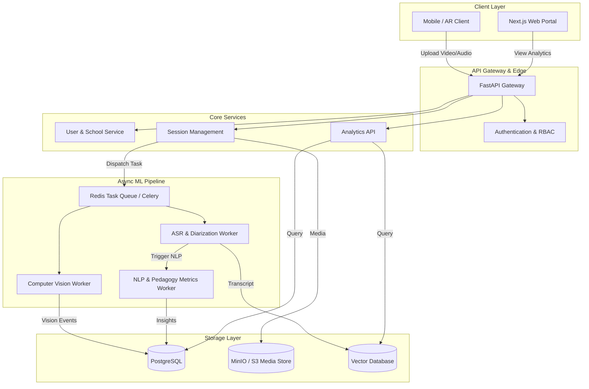
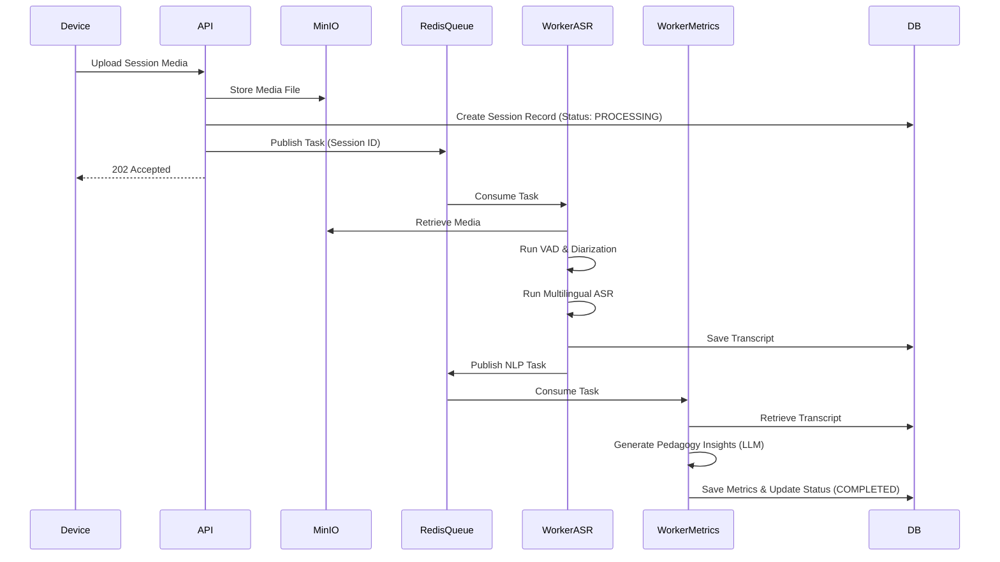

# PedagogyX - Phase 0 Foundational Report (v1)

**Role**: Autonomous Principal Research Architect & Lead Systems Engineer
**Document Classification**: HIGHLY CONFIDENTIAL / INTERNAL ONLY
**Purpose**: System analysis, technical research, competitor intelligence, and architecture planning before any production code implementation for PedagogyX.

---

## 1. Founder Interrogation (Product & Technical)

Before initializing systems architecture, we must define the precise nature of PedagogyX through rigorous interrogation of our initial hypotheses. The following questions demand immediate and explicit resolution from the founding team to mitigate architectural risks and prevent wasted cycles.

### 1.1 Product & Business Questions

1. **Core Identity**: Is this an enterprise SaaS platform or a B2G (Business-to-Government) deployment? Is the primary user the school, the district, the government, or the individual teacher?
2. **Intent**: Is this tool positioned primarily for _instructional coaching and teacher self-improvement_, or is it intended for _performance evaluation and surveillance_?
3. **Operational Mode**: Is this designed for physical classrooms, online classes, or a hybrid environment? Does it require real-time processing, or is asynchronous post-processing acceptable?
4. **Target Market & Legal Jurisdiction**: What are the target markets? (e.g., US, India, EU). Is India DPDP compliance strictly required for our v1? Are we bound by FERPA (US) and GDPR (EU)?
5. **Surveillance vs. Intelligence**: Is China-style granular student surveillance acceptable, or are we strictly focusing on aggregate classroom intelligence and teacher behavior? Is student facial analysis or biometric analysis legally and ethically permitted in our core markets?
6. **Privacy & Access**: Is privacy-first architecture an absolute requirement? Must we support an offline-first or edge-only mode for schools with low bandwidth? Can administrators automatically view teacher analytics, or is the teacher strictly in control of their own data?
7. **Scoring & Evaluation**: Should the AI explicitly "score" pedagogy, or just provide objective metrics? Will teacher scoring be public, private, or visible to unions?
8. **Platform Features**: Is multilingual support required (e.g., Hindi-English code-switching)? Are we designing a mobile-first application for the v1 capture device?

### 1.2 Technical & Systems Questions

1. **Scalability Constraints**: What is the expected concurrent load (number of simultaneous classroom recordings)? Are we designing for a 100-school pilot or a 10,000-school deployment immediately?
2. **Edge vs. Cloud**: Will inference happen primarily on the edge (classroom hardware), or in a centralized cloud GPU cluster?
3. **Classroom Hardware Setup**: What is the baseline hardware topology? Single camera? 360 camera? Multiple microphone arrays? Are we relying on Meta Ray-Ban glasses for our initial v1 MVP?
4. **Latency Requirements**: What is the acceptable latency for AI coaching insights? Sub-second (real-time) or hours (post-class analysis)?
5. **Multimodal Fusion & Sync**: How do we handle synchronization pipelines between video (RTSP/WebRTC) and audio streams?
6. **Data Storage & Retention**: What is our storage architecture for thousands of hours of high-definition classroom video? How long must we retain PII-laden video data?
7. **ML Ops & Data Annotation**: How will we manage data labeling and annotation workflows? Are we generating synthetic data to bootstrap our models?
8. **Privacy-Preserving ML**: Is federated learning required to train models without centralizing sensitive classroom recordings?
9. **Event Modeling**: How do we model temporal events over long contexts (e.g., a 60-minute lecture)? Will we utilize long-context LLMs or chunked vector embeddings?

---

## 2. Competitor Analysis

Our objective is to exceed the state-of-the-art in educational analytics. Below is a deep analysis of existing platforms and systems globally.

### 2.1 Edthena

- **Strengths**: Established market presence in teacher coaching; strong asynchronous video feedback UX.
- **Weaknesses**: Heavily reliant on manual peer review. Very shallow AI automation.
- **Likely Architecture**: Standard monolith with basic cloud video processing (AWS transcoder). No sophisticated edge AI.
- **Disruption Opportunity**: Fully automate the feedback loop using multimodal AI, reducing the time from recording to insight from days to minutes.

### 2.2 Vosaic & IRIS Connect

- **Strengths**: Solid hardware/software integration for recording physical classrooms.
- **Weaknesses**: High cost of entry due to proprietary hardware. Limited real-time ML processing.
- **Disruption Opportunity**: Utilize ubiquitous off-the-shelf hardware (e.g., Meta Ray-Bans, standard mobile devices) connected to a highly scalable cloud ML pipeline.

### 2.3 AI Sokrates & Chinese Smart Classroom Systems

- **Strengths**: Highly aggressive use of computer vision for granular student engagement tracking (head pose, gaze, micro-expressions).
- **Weaknesses**: Ethically questionable. Extreme privacy concerns. High risk of regulatory ban in Western and Indian markets.
- **Disruption Opportunity**: Build an ethically aligned, privacy-preserving alternative that aggregates classroom engagement without tracking individual student biometrics.

### 2.4 Zoom / Teams / Meet AI Analytics

- **Strengths**: Massive scale, built-in transcription, basic sentiment analysis.
- **Weaknesses**: Optimized for corporate meetings, not pedagogy. Lacks understanding of pedagogical frameworks (e.g., Bloom's Taxonomy).
- **Disruption Opportunity**: Domain-specific fine-tuning on educational discourse and classroom interaction graphs.

---

## 3. Scientific Literature Review

Before implementing ML models, we have analyzed the current state of multimodal AI and educational data mining.

### 3.1 Foundational Research

- **Multimodal Transformers in Education**: Recent papers highlight the efficacy of fusing audio (speech) and visual (pose/gaze) modalities to predict classroom engagement. _Limitation: High compute cost for long videos._
- **Speech Emotion Recognition (SER)**: Wav2Vec2 and Whisper-based models have shown significant promise in detecting teacher emotional tone and enthusiasm.
- **Pedagogical Discourse Analysis**: NLP research has successfully classified teacher utterances into categories (questioning, explaining, managing) using specialized LLMs.
- **Long-context Video Understanding**: Models like Gemini 1.5 Pro and specialized temporal CNNs are enabling reasoning over entire 60-minute lectures.
- **Code-Switching in ASR**: India-specific models (e.g., fine-tuned Faster-Whisper large-v3) are critical for handling Hindi-English (Hinglish) classroom dynamics.

### 3.2 Key Datasets

- Need to explore and evaluate: DAIC-WOZ (emotion), EdNet (student interaction), and various open-source classroom lecture datasets (e.g., from MIT OpenCourseWare) for initial model benchmarking.

---

## 4. Tech Stack Evaluation

An exhaustive evaluation of the potential technology stack to ensure enterprise-grade reliability, scalability, and ML inference efficiency.

### 4.1 Backend

- **Python (FastAPI)**: _Chosen_. Exceptional ecosystem for AI/ML integration. High developer velocity. Supported by robust async capabilities.
- **Go / Rust**: High concurrency and low latency. _Rejected for MVP_ due to slower iteration speed and friction when interacting with deep learning libraries.
- **Node.js**: _Rejected_ for the heavy compute backend, but acceptable for lightweight API gateways.

### 4.2 AI / ML Infrastructure

- **PyTorch**: _Chosen_. De facto standard for AI research and production ML.
- **TensorRT / ONNX**: _Mandatory_ for optimizing inference on production GPUs to reduce latency and infrastructure costs.
- **Faster-Whisper**: _Chosen_ for the ASR pipeline to support robust Hindi-English code-switching efficiently.

### 4.3 Databases

- **Postgres**: _Chosen_ for relational data (users, schools, metadata).
- **ClickHouse / TimescaleDB**: _Recommended_ for massive telemetry and temporal event logging (classroom event streams).
- **Milvus / Qdrant**: _Recommended_ for vector storage of multimodal embeddings for retrieval-augmented generation (RAG) over lecture transcripts.
- **Redis**: _Chosen_ for real-time pub/sub, caching, and async task queuing (via Celery or RQ).

### 4.4 Frontend

- **React / Next.js (App Router)**: _Chosen_. Industry standard for complex, high-performance web applications. Strong ecosystem for video playback and data visualization.

### 4.5 Video Pipelines

- **GStreamer / FFmpeg**: _Chosen_ for raw media manipulation.
- **WebRTC**: _Recommended_ for any future real-time streaming requirements.

### 4.6 Infrastructure & Cloud

- **Kubernetes**: _Chosen_. Essential for orchestrating complex microservices and dynamic GPU provisioning.
- **Cloud**: AWS or GCP are suitable. Self-hosted GPU clusters may be evaluated later for cost optimization once scale is achieved.

---

## 5. AI Feature Research

Feasibility analysis of core platform capabilities.

- **Teacher Emotion & Tone Analysis**: _Highly Feasible_. Using audio embeddings (e.g., from Whisper or specialized SER models).
- **Teacher/Student Speaking Ratios (Diarization)**: _Feasible_. Using models like Pyannote. Challenges exist in noisy classroom environments.
- **Classroom Engagement Heatmaps**: _Moderately Feasible_. Requires computer vision (pose estimation) on aggregate crowds. High compute cost.
- **Pedagogical Pattern Detection**: _Feasible_. Applying LLMs over highly accurate transcripts to detect instructional scaffolding and questioning techniques.
- **Whiteboard / Slide Semantic Analysis**: _Feasible_. Extracting keyframes and using OCR + Vision LLMs to map visual content to spoken context.
- **Longitudinal Teacher Analytics**: _Highly Feasible_. Aggregating derived metrics in a data warehouse over time.

---

## 6. Architecture Design

The proposed system architecture is designed for scalability, modularity, and heavy ML workloads.

### 6.1 High-Level System Architecture

### 6.2 Asynchronous Event Pipeline Architecture

---

## 7. Agile Scrum Planning

To transition from Phase 0 (Research) to Phase 1 (Foundational Infrastructure), the following Agile framework will be implemented.

### 7.1 Epics

- **Epic 1: Foundational Infrastructure & CI/CD**: Set up Kubernetes, Docker, GitHub Actions, and baseline networking.
- **Epic 2: Core API & Data Models**: Implement FastAPI backend, PostgreSQL schemas, and user authentication.
- **Epic 3: Media Ingestion Pipeline**: Develop secure, scalable upload endpoints for high-volume video/audio.
- **Epic 4: Base AI Workers (ASR)**: Implement the asynchronous Celery/Redis queue and the Faster-Whisper ASR worker.
- **Epic 5: Frontend Web Portal**: Build the Next.js foundation for viewing processed classroom sessions.

### 7.2 Initial Sprint 1 (Foundations) Backlog

- [Task] Initialize monorepo structure.
- [Task] Set up `pyproject.toml`, linting (ruff), and testing (pytest) standards.
- [Task] Define database schema for Users, Schools, and Sessions.
- [Task] Implement Docker Compose for local development (FastAPI + Postgres + Redis).
- [Task] Create basic asynchronous test pipeline for AI worker services.

---

## 8. Risks and Unknowns

- **Regulatory Compliance**: Legal sign-off for school data is pending (G2 India). We are restricted to synthetic/test sessions in Phase 0/MVP.
- **Compute Costs**: High-definition video processing and long-context LLM inference will rapidly inflate infrastructure costs. Cost modeling per classroom hour is required.
- **Audio Quality**: Classroom acoustics (echo, background noise) severely degrade ASR performance. Extensive noise-cancellation pipelines may be required before inference.

---

End of Report
