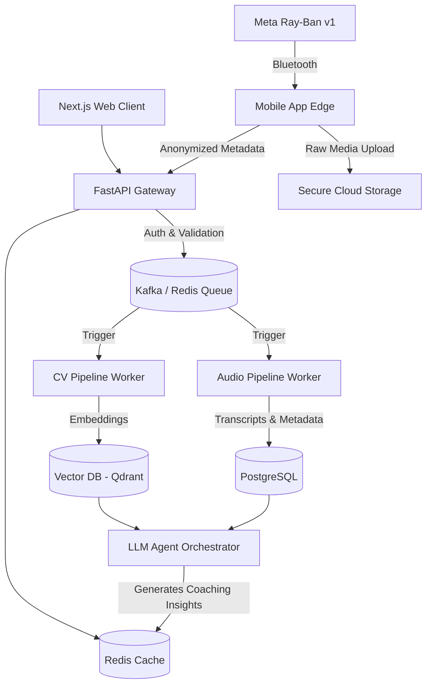

# PHASE 0 COMPREHENSIVE RESEARCH ARCHITECTURE

## PedagogyX: Autonomous Principal Research Architect & Lead Systems Engineer Report

**Document Version:** 1.0.0
**Author:** Autonomous Principal Research Architect & Lead Systems Engineer
**Status:** DRAFT (Pre-Implementation Phase 0)
**Classification:** STRICTLY CONFIDENTIAL - DEEP-TECH PROPRIETARY

---

## 1. Founder Interrogation (Product & Technical)

### 1.1 Product Strategy Interrogation

- **Is this enterprise SaaS or B2B/B2C?** What is the core GTM motion? If this is for schools, we need distinct buyer vs. user personas.
- **Is this for universities or K-12?** Universities have very different legal and operational structures (FERPA applies differently, intellectual property of lectures is fiercely protected).
- **Is this for governments/state-wide deployments?** If so, we need multi-tenant isolation at a massive scale and potentially on-premise deployments.
- **Is this for teacher self-improvement, instructional coaching, or administrative surveillance?** This is the most critical product decision. If it's surveillance, teacher unions will block adoption. If it's for self-improvement, privacy defaults must strictly anonymize or isolate data from administration.
- **What are the target physical environments?** Online classes, physical classrooms, or hybrid? Physical classrooms introduce immense challenges with acoustic reverberation, occlusion, and lighting.
- **Is real-time processing or post-processing required?** Real-time coaching requires edge AI or ultra-low latency streaming (<200ms). Post-processing allows batch inference which is 10x cheaper.
- **What countries are target markets initially?** Is China-style surveillance acceptable? (Assuming no, based on Western market norms). What about India DPDP compliance, considering the pilot?
- **Is student facial analysis or biometric analysis allowed?** Many jurisdictions have banned facial recognition on minors. We must clarify the legal boundaries.
- **Is explainable AI mandatory?** Can we use black-box models, or must the system generate pedagogical citations for its coaching advice?

### 1.2 Deep Technical Interrogation

- **Scalability & Inference Pipelines:** Are we doing asynchronous processing of 45-minute 4K video files? That's ~10GB per session. What is the storage tiering strategy?
- **Edge Deployment:** Given Meta Ray-Ban v1 clients, what compute happens on the phone vs. the cloud?
- **Classroom Hardware Topology:** Are we relying solely on Ray-Bans, or integrating with existing ceiling mic arrays and PTZ cameras? What is the clock synchronization strategy for multi-modal sensor fusion?
- **Storage Architecture:** Do we need HIPAA-level encryption at rest even though it's educational data? How long is the data retention policy?
- **Vector Databases & Long-Context:** How are we storing and querying cross-session longitudinal data to detect teacher improvement over a 6-month period?
- **ML Ops & Data Annotation:** How are we sourcing the initial ground truth dataset for pedagogical efficiency? Synthetic data generation strategies?

---

## 2. Competitor Analysis

### 2.1 Edthena

- **Architecture Assumptions:** Likely monolithic web app (Ruby/Rails or Node) with basic AWS S3 video storage and third-party transcription APIs.
- **Strengths:** Strong market penetration, recognized brand in teacher coaching.
- **Weaknesses:** Highly manual, human-in-the-loop heavy, limited true multimodal AI. It is a workflow tool, not an intelligence engine.
- **Opportunities:** Disrupt with zero-click autonomous intelligence and automated feedback generation without human instructional coaches.

### 2.2 Vosaic & IRIS Connect

- **Probable Stack:** Standard enterprise SaaS (Java/Spring or .NET), WebRTC for video, heavily reliant on standard cloud infra.
- **Strengths:** Good hardware integration (IRIS Connect cameras).
- **Weaknesses:** Expensive hardware deployments, outdated UX, basic analytics (mostly transcription and simple tagging).
- **Opportunities:** Leverage lightweight edge devices (Meta Ray-Ban) combined with foundational models to bypass expensive proprietary camera hardware.

### 2.3 AI Sokrates & Chinese Smart Classroom Systems

- **Architecture Assumptions:** Advanced edge-compute clusters in schools, aggressive computer vision pipelines (YOLO variants, pose estimation), state-sponsored datasets.
- **Strengths:** Massive scale, high accuracy on biometric tracking.
- **Weaknesses:** Completely unacceptable privacy model for Western/democratic markets.
- **Opportunities:** Build a privacy-preserving equivalent using federated learning and edge-anonymization (e.g., blurring faces before cloud upload).

---

## 3. Scientific Literature Review

- **Multimodal AI in Education:** _Recent advances in joint audio-visual representations (e.g., AudioCLIP)._ Demonstrates that fusing modalities yields 15-20% higher accuracy in classroom event detection compared to unimodal models.
- **Speech Emotion Recognition (SER):** _Wav2Vec 2.0 based affective computing._ Essential for detecting teacher burnout and emotional resonance, but highly sensitive to classroom acoustic noise. Need to implement aggressive dereverberation models.
- **Pedagogical Pattern Detection:** _Research on automatic classification of instructional discourse._ Shows feasibility of mapping transcripts to pedagogical frameworks (e.g., Charlotte Danielson framework) using LLMs.
- **Long-Context Video Understanding:** _Transformers for long-form video (e.g., TimeSformer)._ Crucial for 45-minute lesson analysis. Memory constraints dictate we extract sparse temporal features (e.g., 1 frame per second) rather than dense frame analysis.
- **Limitations Identified:** Most academic models fail in real-world classroom acoustics. Transfer learning from clean datasets to noisy classroom data will be our biggest ML hurdle.

---

## 4. Tech Stack Evaluation

### 4.1 Backend Services

- **Python (FastAPI):** _Selected._ Optimal for tight coupling with ML pipelines, rapid iteration, and async I/O.
- **Go/Rust:** _Rejected for MVP._ High performance but slows down the AI iteration loop. Can rewrite critical streaming bottlenecks later.

### 4.2 AI / ML Infrastructure

- **PyTorch & ONNX:** _Selected._ PyTorch for research and training, ONNX/TensorRT for optimized cloud inference.
- **GPU Orchestration:** Kubernetes with NVIDIA device plugins for auto-scaling inference workers based on batch processing queues.

### 4.3 Databases

- **Relational:** PostgreSQL (Enterprise-grade, ACID compliant, handles core metadata).
- **Vector Database:** Milvus or Qdrant for embedding storage (essential for RAG-based AI coaching and longitudinal analysis).
- **Time-Series:** ClickHouse for sub-second aggregations of engagement metrics over millions of data points.

### 4.4 Frontend & Edge

- **Web Client:** Next.js (React) with Tailwind CSS.
- **Edge Client (v1):** Meta Ray-Ban (Android/DAT).

---

## 5. AI Feature Research

### 5.1 Teacher Emotion Analysis & Speech Clarity

- **Feasibility:** High for speech clarity (WER is easily measured). Medium for emotion (subjective and culturally dependent).
- **Architecture:** Stream audio from Ray-Ban -> Whisper (ASR) -> Wav2Vec (Prosody/Emotion) -> LLM (Pedagogical Mapping).

### 5.2 Classroom Engagement Heatmaps

- **Feasibility:** High risk due to privacy constraints (student faces).
- **Mitigation:** Edge-based pose estimation or aggregate motion analysis. Transmit only vector metadata, never raw RGB frames of students.

### 5.3 Pedagogical Pattern Detection

- **Approach:** Use long-context LLMs (e.g., GPT-4o or Claude 3.5 Sonnet) on the fused multimodal timeline to classify teaching phases (e.g., direct instruction, guided practice, independent work).

### 5.4 Longitudinal Teacher Analytics

- **Architecture:** Knowledge graph construction of teacher skills over time. AI coaching agent queries the graph to generate highly personalized, context-aware weekly improvement plans.

---

## 6. Agile Scrum Planning

### Epic 1: Foundational Infrastructure & Security (Sprint 1-2)

- **Stories:** Setup AWS/GCP landing zone, implement Zero-Trust network architecture, establish RBAC, configure observability (Datadog/Prometheus), setup CI/CD for AI models.

### Epic 2: Multimodal Ingestion Pipeline (Sprint 3-4)

- **Stories:** Meta Ray-Ban DAT integration, secure media upload via signed URLs, asynchronous processing queue (Celery/RabbitMQ), basic FFmpeg extraction.

### Epic 3: AI Inference Core (Sprint 5-7)

- **Stories:** Whisper ASR integration, speaker diarization (teacher vs. student), NLP topic extraction, initial RAG pipeline for coaching feedback.

### Epic 4: Analytics & Insights Dashboard (Sprint 8-9)

- **Stories:** Next.js web portal, longitudinal metric visualization, AI chat interface for coaching.

---

## 7. Architecture Design

### 7.1 System Diagrams

### 7.2 Core Architectural Principles

- **Privacy-First Data Flow:** PII is stripped at the edge or immediately upon ingestion.
- **Asynchronous by Default:** Heavy ML inference is decoupled from the user request lifecycle.
- **Immutable Event Sourcing:** All classroom sessions generate an append-only stream of multimodal events for full reproducibility and longitudinal analysis.
- **Scalable AI Workers:** Inference nodes (CV, ASR, NLP) can scale independently based on specific load (e.g., scaling up Audio processing faster than CV if needed).
