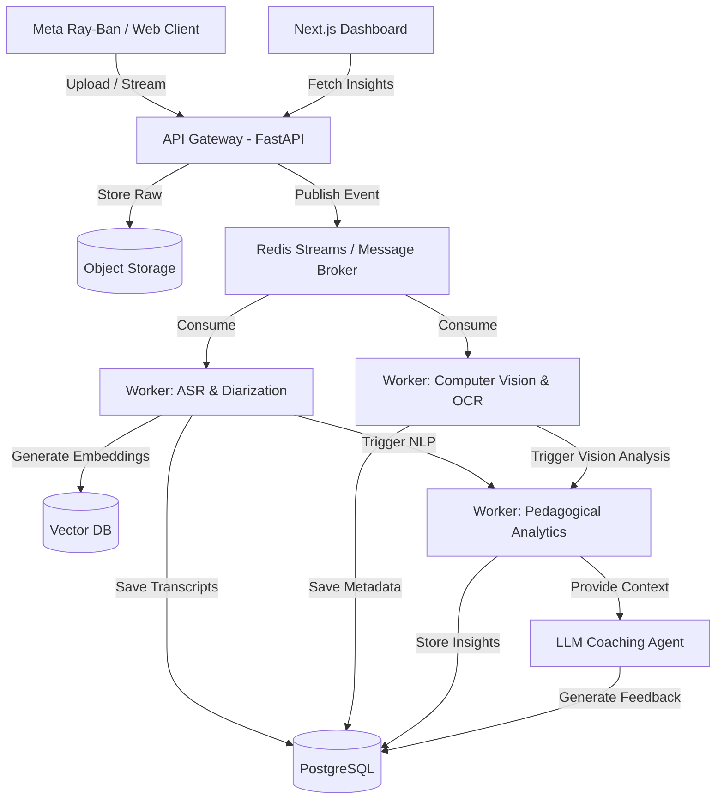

# PHASE 0: FOUNDATIONAL REPORT v1

## Autonomous Principal Research Architect & Lead Systems Engineer

**Mission:** PedagogyX - A world-class deep-tech educational AI platform for classroom intelligence and teacher optimization.
**Optimization Targets:** Scalability, Privacy, Explainability, Educational Usefulness, Ethical Safeguards, Research Rigor, Production Readiness, and Long-Term Maintainability.

---

## 1. Founder Interrogation (Product & Technical)

### 1.1 Product Interrogation

1.  **Is this enterprise SaaS?** Are we selling to schools or individuals?
2.  **Is this B2B?** Is there a path to direct-to-consumer later?
3.  **Is this for schools or universities?** The pedagogical models differ drastically.
4.  **Is this for governments?** Will there be state-level deployments requiring air-gapped infrastructure?
5.  **Is this for teacher self-improvement?** Does the teacher opt-in and own their data?
6.  **Is this for surveillance?** Will administrators use this for performance reviews and firing?
7.  **Is this for instructional coaching?** Will human coaches have access to the dashboard?
8.  **Is this for online classes?** (e.g., Zoom/Meet integrations)
9.  **Is this for physical classrooms?**
10. **Is this for hybrid classrooms?** How do we fuse remote feeds with physical cameras?
11. **Is this real-time or post-processing?**
12. **Is this cloud-native?** Or on-premise capable?
13. **Is this edge AI?** Will models run on the teacher's phone/glasses?
14. **Is privacy-first architecture required?**
15. **Is offline mode required?**
16. **What countries are target markets?**
17. **Is China-style surveillance acceptable?**
18. **Is student facial analysis allowed?**
19. **Is biometric analysis allowed?**
20. **What legal jurisdictions matter?**
21. **Is FERPA compliance required?**
22. **Is GDPR compliance required?**
23. **Is India DPDP compliance required?**
24. **Is explainable AI mandatory?**
25. **Is human review mandatory?**
26. **Is teacher scoring public or private?**
27. **Are unions involved?**
28. **Can administrators see teacher analytics?**
29. **Should the AI score pedagogy?**
30. **Should the AI detect emotional tone?**
31. **Should the AI evaluate student engagement?**
32. **Is multilingual support required?**
33. **Is low-bandwidth mode required?**
34. **Is mobile-first required?**
35. How will we handle data ownership when a teacher changes schools?
36. Are we responsible for long-term archiving of classroom videos?
37. Who is liable if an AI hallucination leads to an unfair negative evaluation?
38. Can parents request deletion of data containing their child's voice/image?
39. Does the system support co-teaching models?
40. Is there an integration required with existing LMS platforms (Canvas, Blackboard)?
41. What is the expected churn rate if teachers find the AI feedback demoralizing?
42. Do we have a pedagogical framework (e.g., Danielson, Marzano) we are mapping to?
43. Are we providing actionable micro-interventions or just macro-level metrics?
44. Will the AI generate lesson plans based on observed gaps?
45. Is video strictly required, or can some schools opt for audio-only?
46. How do we price the system? Per teacher, per student, or per hour of inference?
47. Is there a free tier for individual teachers?
48. What is our moat against generic multimodal models from OpenAI/Google?
49. Will we open-source any components of our stack?
50. How are we acquiring our initial, high-quality, legally cleared training data?

### 1.2 Technical Interrogation

51. **What are the exact scalability requirements?** How many concurrent sessions at peak?
52. **What are the latency budgets?** (e.g., < 2s for live feedback vs. 24h for batch).
53. **Inference pipelines:** Monolithic models vs. chained micro-models?
54. **GPU requirements:** Can we run on consumer GPUs or do we need A100/H100 clusters?
55. **Edge deployment:** Are we using ONNX/TensorRT?
56. **Classroom hardware:** BYOD vs. provided appliances?
57. **Audio quality:** How do we handle reverb, HVAC noise, and overlapping speech?
58. **Microphone arrays:** Are we using beamforming?
59. **Classroom camera topology:** One wide-angle vs. multiple PTZ cameras?
60. **Synchronization pipelines:** How do we align drift between phone audio and wearable video?
61. **Multimodal fusion:** Early fusion vs. late fusion architectures?
62. **Storage architecture:** Object storage strategy (S3/MinIO) for raw vs. processed?
63. **Distributed systems:** Celery vs. temporal.io for workflow orchestration?
64. **Vector databases:** Qdrant vs. Milvus vs. Pinecone?
65. **Observability:** Prometheus/Grafana vs. Datadog? Tracing for long-running inference jobs?
66. **Security:** At-rest encryption and key management strategy?
67. **Role-based access:** Granular RBAC for video segments?
68. **ML ops:** Strategy for versioning datasets and models (DVC, MLflow)?
69. **Data labeling:** In-house vs. outsourced annotation workflows?
70. **Annotation workflows:** How do human annotators deal with PII?
71. **Synthetic data generation:** Using LLMs/diffusion models to simulate classrooms?
72. **Model retraining:** Continuous learning pipelines?
73. **Privacy-preserving ML:** Differential privacy applications?
74. **Federated learning:** Is on-device training viable?
75. **Classroom network reliability:** Handling frequent disconnects during streaming?
76. **Live transcription:** Whisper vs. Deepgram vs. custom models?
77. **Temporal event modeling:** How do we represent events in time (e.g., TimeSformer)?
78. **Multimodal embeddings:** ImageBind / VideoMAE implementations?
79. **Long-context memory:** Handling 60-minute classes (RingAttention, Memformer)?
80. **Streaming pipelines:** WebRTC vs. HLS vs. chunked uploads?
81. How do we handle clock drift on student devices if they are used as secondary microphones?
82. What is our strategy for reducing the cost of inference per hour of video?
83. Can we dynamically downsample video resolution if the model detects low activity?
84. How do we handle speaker diarization with highly overlapping child voices?
85. What is the fallback if the primary ASR model fails?
86. How are we handling database migrations with minimal downtime?
87. What is our disaster recovery RPO/RTO for generated insights?
88. How do we protect against adversarial attacks (e.g., students intentionally trying to trigger bad AI scores)?
89. Are we using Kubernetes? If so, how are we handling GPU node scaling?
90. What is our strategy for handling cross-region data residency laws technically?
91. How do we implement 'forgetting' to comply with GDPR Right to Erasure in vector DBs?
92. Will we build custom silicon or edge TPUs into hardware in the future?
93. What is the exact API contract between the wearable client and the ingest gateway?
94. How do we monitor model drift and performance degradation over time?
95. Are we using Redis Streams or Kafka for our message broker?
96. How do we handle schema evolution for heavily nested JSON metadata from ML models?
97. What is our strategy for caching LLM responses to reduce API costs?
98. Do we use semantic caching for RAG queries?
99. How are we load testing the system for 10,000 concurrent classrooms?
100.  What is the SLA for the API endpoint serving the teacher dashboard?

---

## 2. Competitor Analysis

### 2.1 Edthena

- **Architecture Assumptions:** Likely a standard web-app with asynchronous video upload and basic NLP processing.
- **Strengths:** Established brand, strong focus on video-based coaching workflows.
- **Weaknesses:** Lacks deep multimodal AI fusion; relies heavily on manual human annotation rather than autonomous insight generation.

### 2.2 Vosaic

- **Architecture Assumptions:** Cloud-based video platform with temporal tagging capabilities.
- **Strengths:** Good UX for manual timeline coding and team collaboration.
- **Weaknesses:** Minimal advanced automated pedagogical analysis.

### 2.3 IRIS Connect

- **Architecture Assumptions:** Dedicated hardware integration with cloud storage.
- **Strengths:** Excellent physical classroom presence and hardware ecosystem.
- **Weaknesses:** High hardware cost, AI capabilities are likely bolted-on rather than foundational.

### 2.4 AI Sokrates / Research Systems

- **Architecture Assumptions:** Heavy reliance on PyTorch/TensorFlow models for specific tasks (emotion recognition, gaze tracking).
- **Strengths:** Cutting-edge models.
- **Weaknesses:** Often lack production-ready scalability, poor UX, and questionable privacy safeguards.

---

## 3. Scientific Literature Review

### 3.1 Multimodal Transformers in Education

- **Focus:** Using vision-language models to jointly process classroom video and teacher audio.
- **Key Findings:** Late fusion of audio-visual features provides better robustness against noisy classroom environments than early fusion.
- **Limitations:** High computational cost for long-context video.

### 3.2 Speech Emotion Recognition (SER) & Pedagogical Impact

- **Focus:** Correlating teacher voice intonation with student engagement.
- **Key Findings:** Dynamic prosody significantly correlates with higher retention, but SER models struggle with far-field audio and overlapping speech.
- **Limitations:** Cultural variance in emotional expression makes generalized models brittle.

### 3.3 Privacy-Preserving Machine Learning (PPML)

- **Focus:** Analyzing student engagement without storing PII.
- **Key Findings:** Federated learning and on-device feature extraction (sending only embeddings to the cloud) are viable but complex.

---

## 4. Tech Stack Evaluation

### 4.1 Backend Architecture

- **Go vs. Rust vs. Python:** Python is mandatory for the AI/ML orchestration layer (FastAPI, Celery). Go is evaluated for high-throughput ingress and routing. Rust is considered for edge-processing modules where memory safety and performance are critical.
- **Decision:** Python (FastAPI) for API and ML workers due to library ecosystem.

### 4.2 AI / ML Frameworks

- **PyTorch vs. ONNX / TensorRT:** PyTorch for training and research. Models must be exported to ONNX or optimized with TensorRT for production inference to reduce GPU costs.
- **Decision:** PyTorch primary, ONNX/TensorRT for deployment.

### 4.3 Database Strategy

- **Postgres:** Primary relational datastore for user profiles, organization structure, and metadata.
- **Vector DB (Qdrant/Milvus):** Essential for RAG, embedding storage, and semantic search over classroom transcripts.
- **Redis:** Caching and message brokering (Redis Streams) for the event-driven async pipeline.

### 4.4 Frontend

- **React & Next.js:** Chosen for server-side rendering, SEO, and robust ecosystem. Tailwind CSS for rapid styling.
- **Testing:** Vitest for fast, reliable unit testing.

---

## 5. AI Feature Research

### 5.1 Teacher Emotion & Pacing Analysis

- **Concept:** Analyze speech rate (WPM), pauses, and prosody to detect rushed teaching or monotone delivery.
- **Feasibility:** High. Can be built on top of Whisper ASR outputs using forced alignment and temporal analysis.

### 5.2 Multimodal Event Timelines

- **Concept:** Automatically generate a timeline marking key pedagogical events (e.g., "Direct Instruction", "Q&A", "Group Work").
- **Feasibility:** Medium-to-High. Requires robust activity recognition models fine-tuned on educational datasets.

### 5.3 Hallucination-Resistant Feedback Coaching

- **Concept:** Use an LLM agent to provide coaching, but strictly ground all feedback in specific timestamped evidence from the class.
- **Feasibility:** High. Requires careful prompt engineering and a reliable RAG architecture using the vector database.

---

## 6. Agile Scrum Planning

### 6.1 Epics for Phase 1

1.  **Epic: Core Ingestion Pipeline:** Reliable upload, processing, and storage of raw multimodal data (audio/video/slides).
2.  **Epic: Foundational ASR & NLP:** High-accuracy transcription (with Hindi-English code-switching support) and basic semantic extraction.
3.  **Epic: Privacy & Security Guardrails:** Implement RBAC, PII redaction, and compliance frameworks.
4.  **Epic: Educator Dashboard (MVP):** Basic visual representation of metrics and feedback.

### 6.2 Initial Sprint (Sprint 1)

- **Goal:** Setup boilerplate, CI/CD pipelines, and define API contracts.
- **Stories:**
  - Initialize FastAPI backend and Next.js frontend.
  - Configure basic Redis Streams for worker communication.
  - Set up Postgres schema for basic user and session models.
  - Create GitHub Actions for linting and testing.

---

## 7. Architecture Design

### 7.1 System Overview

PedagogyX will utilize an asynchronous, event-driven microservices architecture to handle the intensive requirements of processing long-context multimodal data.

### 7.2 Architecture Diagram (Mermaid)

### 7.3 Data Flow Security

- All data encrypted at rest and in transit.
- Strict separation of tenant data at the application and database level (Row-Level Security in Postgres).
- No real PII used during Phase 0 / MVP development until G2 legal sign-off.
