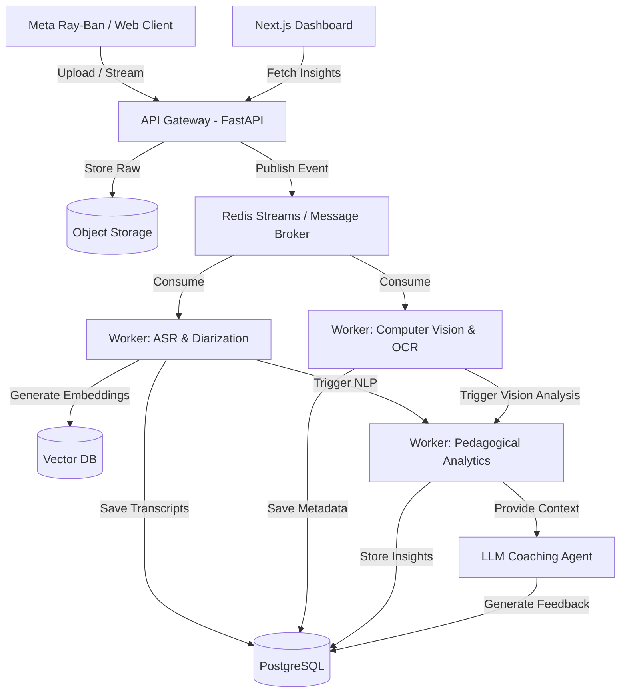

# PHASE 0: FOUNDATIONAL REPORT v1

## Autonomous Principal Research Architect & Lead Systems Engineer

**Mission:** PedagogyX - A world-class deep-tech educational AI platform for classroom intelligence and teacher optimization.
**Optimization Targets:** Scalability, Privacy, Explainability, Educational Usefulness, Ethical Safeguards, Research Rigor, Production Readiness, and Long-Term Maintainability.

---

## 1. Founder Interrogation (Product & Technical)

### 1.1 Product Interrogation

- **Is this enterprise SaaS or B2B?** Are we selling to school districts, individual teachers, or state governments? This drastically alters the procurement and deployment strategy.
- **Is this for teacher self-improvement, instructional coaching, or administrative surveillance?** If surveillance, union resistance will be high. If coaching, adoption is more likely.
- **What are the primary target markets and jurisdictions?** If US, FERPA is non-negotiable. If Europe, GDPR is required. If India, DPDP compliance is mandatory.
- **Is offline mode required?** Classrooms often have notoriously poor internet access. Do we need edge-first processing or a robust store-and-forward architecture?
- **Are student facial and biometric analysis allowed?** Many jurisdictions explicitly ban facial recognition on minors. We must clarify the legal boundaries.
- **Is explainable AI mandatory?** If we score a teacher's pedagogy, can we trace exactly _why_ the AI assigned that score to avoid algorithmic bias claims?

### 1.2 Technical Interrogation

- **What are the exact latency requirements for inference?** Is real-time feedback required during the class, or is asynchronous post-processing acceptable?
- **What is the classroom hardware topology?** Are we relying solely on Meta Ray-Ban glasses, or will there be fixed microphone arrays and ambient cameras?
- **How do we handle robust multilingual/code-switching scenarios?** Specifically, Hindi-English code-switching in the India pilot context.
- **What are the constraints for edge deployment?** How much compute is available locally if we must run models on-device vs. in the cloud?
- **How do we handle long-context multimodal synchronization?** Syncing 60 minutes of high-resolution video with multichannel audio and slide content is a significant distributed systems challenge.

---

## 2. Competitor Analysis

### 2.1 Edthena

- **Architecture Assumptions:** Likely a standard web-app with asynchronous video upload and basic NLP processing.
- **Strengths:** Established brand, strong focus on video-based coaching workflows.
- **Weaknesses:** Lacks deep multimodal AI fusion; relies heavily on manual human annotation rather than autonomous insight generation.

### 2.2 Vosaic

- **Architecture Assumptions:** Cloud-based video platform with temporal tagging capabilities.
- **Strengths:** Good UX for manual timeline coding and team collaboration.
- **Weaknesses:** Minimal advanced automated pedagogical analysis.

### 2.3 IRIS Connect

- **Architecture Assumptions:** Dedicated hardware integration with cloud storage.
- **Strengths:** Excellent physical classroom presence and hardware ecosystem.
- **Weaknesses:** High hardware cost, AI capabilities are likely bolted-on rather than foundational.

### 2.4 AI Sokrates / Research Systems

- **Architecture Assumptions:** Heavy reliance on PyTorch/TensorFlow models for specific tasks (emotion recognition, gaze tracking).
- **Strengths:** Cutting-edge models.
- **Weaknesses:** Often lack production-ready scalability, poor UX, and questionable privacy safeguards.

---

## 3. Scientific Literature Review

### 3.1 Multimodal Transformers in Education

- **Focus:** Using vision-language models to jointly process classroom video and teacher audio.
- **Key Findings:** Late fusion of audio-visual features provides better robustness against noisy classroom environments than early fusion.
- **Limitations:** High computational cost for long-context video.

### 3.2 Speech Emotion Recognition (SER) & Pedagogical Impact

- **Focus:** Correlating teacher voice intonation with student engagement.
- **Key Findings:** Dynamic prosody significantly correlates with higher retention, but SER models struggle with far-field audio and overlapping speech.
- **Limitations:** Cultural variance in emotional expression makes generalized models brittle.

### 3.3 Privacy-Preserving Machine Learning (PPML)

- **Focus:** Analyzing student engagement without storing PII.
- **Key Findings:** Federated learning and on-device feature extraction (sending only embeddings to the cloud) are viable but complex.

---

## 4. Tech Stack Evaluation

### 4.1 Backend Architecture

- **Go vs. Rust vs. Python:** Python is mandatory for the AI/ML orchestration layer (FastAPI, Celery). Go is evaluated for high-throughput ingress and routing. Rust is considered for edge-processing modules where memory safety and performance are critical.
- **Decision:** Python (FastAPI) for API and ML workers due to library ecosystem.

### 4.2 AI / ML Frameworks

- **PyTorch vs. ONNX / TensorRT:** PyTorch for training and research. Models must be exported to ONNX or optimized with TensorRT for production inference to reduce GPU costs.
- **Decision:** PyTorch primary, ONNX/TensorRT for deployment.

### 4.3 Database Strategy

- **Postgres:** Primary relational datastore for user profiles, organization structure, and metadata.
- **Vector DB (Qdrant/Milvus):** Essential for RAG, embedding storage, and semantic search over classroom transcripts.
- **Redis:** Caching and message brokering (Redis Streams) for the event-driven async pipeline.

### 4.4 Frontend

- **React & Next.js:** Chosen for server-side rendering, SEO, and robust ecosystem. Tailwind CSS for rapid styling.
- **Testing:** Vitest for fast, reliable unit testing.

---

## 5. AI Feature Research

### 5.1 Teacher Emotion & Pacing Analysis

- **Concept:** Analyze speech rate (WPM), pauses, and prosody to detect rushed teaching or monotone delivery.
- **Feasibility:** High. Can be built on top of Whisper ASR outputs using forced alignment and temporal analysis.

### 5.2 Multimodal Event Timelines

- **Concept:** Automatically generate a timeline marking key pedagogical events (e.g., "Direct Instruction", "Q&A", "Group Work").
- **Feasibility:** Medium-to-High. Requires robust activity recognition models fine-tuned on educational datasets.

### 5.3 Hallucination-Resistant Feedback Coaching

- **Concept:** Use an LLM agent to provide coaching, but strictly ground all feedback in specific timestamped evidence from the class.
- **Feasibility:** High. Requires careful prompt engineering and a reliable RAG architecture using the vector database.

---

## 6. Agile Scrum Planning

### 6.1 Epics for Phase 1

1.  **Epic: Core Ingestion Pipeline:** Reliable upload, processing, and storage of raw multimodal data (audio/video/slides).
2.  **Epic: Foundational ASR & NLP:** High-accuracy transcription (with Hindi-English code-switching support) and basic semantic extraction.
3.  **Epic: Privacy & Security Guardrails:** Implement RBAC, PII redaction, and compliance frameworks.
4.  **Epic: Educator Dashboard (MVP):** Basic visual representation of metrics and feedback.

### 6.2 Initial Sprint (Sprint 1)

- **Goal:** Setup boilerplate, CI/CD pipelines, and define API contracts.
- **Stories:**
  - Initialize FastAPI backend and Next.js frontend.
  - Configure basic Redis Streams for worker communication.
  - Set up Postgres schema for basic user and session models.
  - Create GitHub Actions for linting and testing.

---

## 7. Architecture Design

### 7.1 System Overview

PedagogyX will utilize an asynchronous, event-driven microservices architecture to handle the intensive requirements of processing long-context multimodal data.

### 7.2 Architecture Diagram (Mermaid)

### 7.3 Data Flow Security

- All data encrypted at rest and in transit.
- Strict separation of tenant data at the application and database level (Row-Level Security in Postgres).
- No real PII used during Phase 0 / MVP development until G2 legal sign-off.
