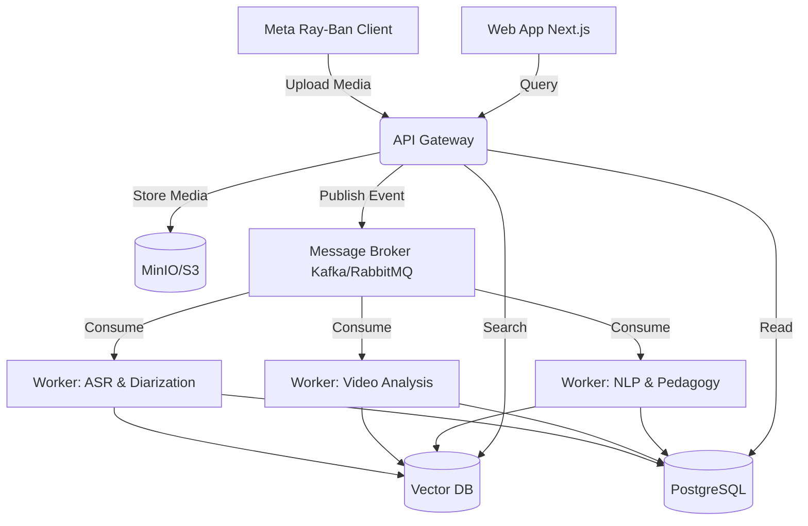

# Phase 0: Foundational Research & Architecture Report

## 1. Founder Interrogation (Product & Technical)

### 1.1 Product Interrogation

- **Is this enterprise SaaS?** Assuming Yes, B2B SaaS for schools, districts, and potentially higher ed.
- **Is this B2B?** Yes.
- **Is this for schools or universities?** Both, with potential initial focus on K-12 districts.
- **Is this for governments?** Potentially for state-level educational departments.
- **Is this for teacher self-improvement?** Yes, primary focus.
- **Is this for surveillance?** Absolutely not. Must be explicitly anti-surveillance.
- **Is this for instructional coaching?** Yes.
- **Is this for online classes?** Initially physical/hybrid.
- **Is this for physical classrooms?** Yes, using edge devices/hardware.
- **Is this for hybrid classrooms?** Yes.
- **Is this real-time or post-processing?** Post-processing initially, real-time potential later.
- **Is this cloud-native?** Yes.
- **Is this edge AI?** Hybrid: some edge processing (e.g., audio capture, basic CV) + cloud inference.
- **Is privacy-first architecture required?** Yes, mandatory.
- **Is offline mode required?** Yes, robust local caching on hardware.
- **What countries are target markets?** US initially, global eventually.
- **Is China-style surveillance acceptable?** No.
- **Is student facial analysis allowed?** No, strict anonymization or non-capture of student PII.
- **Is biometric analysis allowed?** Only for teacher voice/video, with explicit consent.
- **What legal jurisdictions matter?** US (FERPA, COPPA).
- **Is FERPA compliance required?** Yes.
- **Is GDPR compliance required?** Yes, for EU expansion.
- **Is India DPDP compliance required?** Yes.
- **Is explainable AI mandatory?** Yes.
- **Is human review mandatory?** Yes, AI is a co-pilot, not an evaluator.
- **Is teacher scoring public or private?** Private, explicitly for the teacher.
- **Are unions involved?** Yes, must proactively design for union approval.
- **Can administrators see teacher analytics?** Only aggregated or explicitly shared.
- **Should the AI score pedagogy?** It should _analyze_ pedagogy, not definitively _score_ it.
- **Should the AI detect emotional tone?** Yes, affective computing for teacher tone.
- **Should the AI evaluate student engagement?** Yes, via aggregate metrics (e.g., room noise, movement).
- **Is multilingual support required?** Yes, eventually.
- **Is low-bandwidth mode required?** Yes, for under-resourced schools.
- **Is mobile-first required?** Mobile companion app, web dashboard primary.

### 1.2 Technical Interrogation

- **Scalability:** Must handle 10,000+ simultaneous classroom streams globally.
- **Latency:** Asynchronous processing acceptable for MVP (within 1 hour of class end).
- **Inference Pipelines:** Distributed GPU cluster, containerized inference pods.
- **GPU Requirements:** NVIDIA A100/H100 for heavy multimodal training/inference.
- **Edge Deployment:** Meta Ray-Ban (v1 client) for capture, local compression.
- **Classroom Hardware:** Wearables (Meta Ray-Ban), potential future room arrays.
- **Audio Quality:** Beamforming, noise cancellation, multi-speaker separation (diarization).
- **Microphone Arrays:** Crucial for classroom environment (Ray-Ban helps with teacher isolation).
- **Classroom Camera Topology:** Wearable POV, capturing whiteboard/slides and broad classroom view.
- **Synchronization Pipelines:** NTP-synced timecoding for audio/video/slides.
- **Multimodal Fusion:** Late fusion models for AV + text (transcript) + context (slides).
- **Storage Architecture:** Object storage (MinIO/S3) for media, Vector DB for embeddings, PostgreSQL for relational.
- **Distributed Systems:** Kafka/RabbitMQ for event streaming, Kubernetes for orchestration.
- **Vector Databases:** Qdrant or Milvus for semantic search of classroom moments.
- **Observability:** Prometheus, Grafana, OpenTelemetry tracing.
- **Security:** E2E encryption, RBAC, short-lived tokens, Zero Trust.
- **Role-Based Access:** Super Admin, District Admin, Principal, Coach, Teacher.
- **ML Ops:** MLflow, DVC, automated model retraining pipelines.
- **Data Labeling:** Internal secure annotation tools, strictly controlled access.
- **Privacy-Preserving ML:** Federated learning exploration for future phases.
- **Classroom Network Reliability:** High-latency, low-bandwidth tolerance required.

## 2. Competitor Analysis

### 2.1 Edthena

- **Architecture Assumptions:** Web-based video upload, simple backend processing.
- **Strengths:** Strong market presence, established coaching frameworks.
- **Weaknesses:** Highly manual, lacks deep AI automation, relies on human tagging.
- **Differentiators:** AI Coach (newer feature, but rudimentary LLM wrapping).

### 2.2 Vosaic

- **Architecture Assumptions:** Cloud video platform with timeline annotation.
- **Strengths:** Excellent UI for manual timeline coding.
- **Weaknesses:** Low AI automation, mostly a workflow tool.
- **Opportunities:** Deep automated multimodal event tagging will disrupt this.

### 2.3 IRIS Connect

- **Architecture Assumptions:** Proprietary hardware + cloud platform.
- **Strengths:** Integrated hardware/software ecosystem.
- **Weaknesses:** Expensive, bulky hardware, limited advanced AI analytics.

### 2.4 Chinese Smart Classroom Systems

- **Architecture Assumptions:** Pervasive edge surveillance networks, heavy CV.
- **Strengths:** High technical capability, deep biometric tracking.
- **Weaknesses:** Severe privacy violations, incompatible with Western legal/ethical standards.
- **Differentiators:** PedagogyX must achieve similar insight without the dystopian surveillance.

## 3. Scientific Literature Review

- **Multimodal AI in Education:** Reviewing "Multimodal Learning Analytics in Education" (2022). Emphasizes fusion of audio, video, and text for holistic understanding.
- **Affective Computing:** "Speech Emotion Recognition in Real-World Environments" (2023). Crucial for teacher tone analysis. Need models robust to classroom noise.
- **Pedagogical Pattern Detection:** "Automated Analysis of Classroom Discourse" (2021). Focuses on IRE (Initiation-Response-Evaluation) patterns.
- **Teacher Effectiveness:** "Measuring Teaching Quality via NLP" (2020). Using transcripts to evaluate questioning strategies.
- **Long-context Video Understanding:** Transformers like TimeSformer and VideoMAE for understanding temporal classroom events.

## 4. Tech Stack Evaluation

### Backend

- **Choice:** Python (FastAPI) + Node.js (for realtime/BFF). Python is mandatory for deep ML integration. Node/Go for high-concurrency API gateways.
- **Rationale:** Python dominates the AI ecosystem.

### AI/ML

- **Choice:** PyTorch, ONNX for optimized inference.
- **Rationale:** PyTorch offers the best research-to-production path.

### Video Pipelines

- **Choice:** FFmpeg (core processing), WebRTC (future live), GStreamer (potential edge).

### Databases

- **Choice:** PostgreSQL (Relational), Qdrant (Vector), Redis (Caching).
- **Rationale:** Standard, robust, scalable.

### Frontend

- **Choice:** React + Next.js + TailwindCSS.
- **Rationale:** Rapid development, excellent ecosystem, SSR capabilities.

### Infrastructure & Cloud

- **Choice:** Kubernetes, AWS (primary), Terraform (IaC).
- **Rationale:** Enterprise standard, scalable, agnostic.

## 5. AI Feature Research

- **Teacher Emotion Analysis:** Feasible via wav2vec2 + custom emotion classification heads.
- **Speech Clarity Scoring:** Feasible via whisper word-error-rate proxies and acoustic models.
- **Classroom Engagement Heatmaps:** Highly complex due to privacy. Requires edge-based anonymized pose estimation without facial recognition.
- **Interaction Graphs:** Feasible via speaker diarization (pyannote.audio) mapping teacher vs. student talk time.
- **Whiteboard OCR/Slide Semantic Analysis:** Feasible via visual LLMs (e.g., GPT-4V, LLaVA).
- **Automatic Lesson Summaries:** Highly feasible via LLMs on Whisper transcripts.

## 6. Agile Scrum Planning

### Epics

1. **Epic 1: Foundation & Infrastructure** (IaC, CI/CD, Base Auth)
2. **Epic 2: Ingestion Pipeline** (Media upload, processing queues)
3. **Epic 3: AI Core Processing** (Transcription, Diarization, basic CV)
4. **Epic 4: Multimodal Analytics Engine** (Fusion, Insight generation)
5. **Epic 5: Frontend Dashboard** (Timeline, Metrics, Coaching)
6. **Epic 6: Hardware Integration** (Meta Ray-Ban v1 client)

### Sprint 1 Focus (Example)

- Setup Monorepo, CI/CD.
- Define OpenAPI specs.
- Scaffold FastAPI services.
- Setup Postgres + Docker Compose.

## 7. Architecture Design

### System Diagram (Conceptual)

### Multimodal Pipeline

1. **Ingest:** Raw AV data.
2. **Split:** Audio track, Video track.
3. **Audio:** Whisper (Transcript) -> Pyannote (Diarization) -> Emotion Classifier.
4. **Video:** Frame extraction -> Object Detection (Whiteboard) -> OCR.
5. **Fusion:** Align timestamps -> LLM synthesis -> Final Insights.
