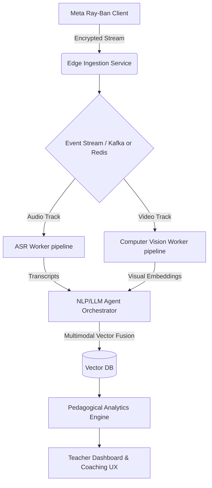

# PHASE 0: PRINCIPAL ARCHITECT & SYSTEM ENGINEER MASTER REPORT

## Executive Summary

This document serves as the foundational Phase 0 research, system architecture, and technical interrogation plan for **PedagogyX**. Our goal is not a hasty MVP but the creation of one of the world's most advanced AI-powered classroom intelligence and teacher optimization platforms. This system will combine computer vision, speech intelligence, multimodal transformers, NLP, educational analytics, behavioral intelligence, knowledge graphs, LLM agents, long-context analysis, and teaching effectiveness modeling.

---

## Part I: Exhaustive Founder Interrogation

Before any production code is written, the following critical questions must be definitively answered to shape our legal, technical, and product architecture.

### Product Questions

1. **Target Market & Persona:**
   - Is this enterprise SaaS or consumer/B2C?
   - Is this B2B (District-level sales) or B2C (individual teachers)?
   - Are we targeting primary schools, secondary schools, universities, or corporate training environments?
   - Is this for governments and state-wide implementations?
   - Is this primarily for teacher self-improvement, instructional coaching, or administrative surveillance?
   - Is this for online classes, physical classrooms, or hybrid models?
2. **Execution Context:**
   - Is this real-time inference (live feedback) or post-processing (batch analysis)?
   - Does this need to be cloud-native, or is edge AI mandatory due to bandwidth constraints?
   - Is privacy-first architecture required?
   - Is offline mode required for low-bandwidth environments?
3. **Legal & Compliance:**
   - What specific countries are target markets?
   - Is China-style student surveillance acceptable or explicitly prohibited?
   - Is student facial analysis and biometric analysis legally allowed?
   - What legal jurisdictions matter most initially?
   - Is FERPA compliance (US) strictly required from Day 1?
   - Is GDPR compliance (EU) required?
   - Is India DPDP compliance required (given G2 legal sign-off block)?
4. **AI Output & Ethics:**
   - Is explainable AI mandatory for all pedagogical feedback?
   - Is human-in-the-loop review mandatory before teacher feedback is sent?
   - Is teacher scoring public, private to the teacher, or available to administration?
   - Are teachers' unions involved in the pilot programs?
   - Should the AI score pedagogy directly, or act merely as a mirror?
   - Should the AI detect emotional tone of teachers and students?
   - Should the AI evaluate student engagement metrics?
5. **Localization & UI:**
   - Is multilingual support required immediately (e.g., Hindi-English code-switching)?
   - Is mobile-first required for the analytics dashboard?
   - What are the bandwidth constraints of pilot schools?

### Technical Questions

1. **Scale & Infrastructure:**
   - What are our latency constraints for real-time loops?
   - What is our expected concurrent session volume during peak school hours?
   - Are we running dedicated GPU clusters, or utilizing serverless inference?
   - Is edge deployment on the Meta Ray-Ban glasses planned beyond capture?
2. **Hardware Topology:**
   - What classroom hardware exists? (Microphone arrays, 360 cameras, Meta Ray-Bans)
   - What is the expected audio quality (SNR) and reverberation index?
   - How are we handling synchronization pipelines between multiple video/audio streams?
3. **Data & AI Pipelines:**
   - How are we fusing multimodal temporal data (video frames + ASR transcripts)?
   - What is the storage architecture for long-context video and vector embeddings?
   - How are we handling distributed systems state for long-running batch jobs?
   - What vector databases will handle our educational knowledge graphs?
4. **Security & MLOps:**
   - What is our observability stack for tracking hallucination rates?
   - How granular must role-based access control (RBAC) be?
   - What is the data labeling and annotation workflow for edge cases?
   - Are we utilizing synthetic data generation for early ML models?
   - How are we approaching privacy-preserving ML and federated learning?
   - How resilient must the streaming pipelines be to classroom network dropouts?

---

## Part II: Competitor Analysis

A deep dive into existing systems to identify architectural weaknesses and market gaps.

### 1. Edthena

- **Architecture Assumptions:** Cloud-based video upload, asynchronous processing, likely monolithic or microservices backend via AWS.
- **Strengths:** Strong market penetration, coaching-focused UX, high trust among teachers.
- **Weaknesses:** Heavy reliance on manual tagging, limited real-time AI, slow turnaround time.
- **Differentiators:** AI Coach module but heavily scripted.

### 2. Vosaic

- **Architecture Assumptions:** Standard web video processing pipeline, heavily reliant on timeline-based annotation databases.
- **Strengths:** Excellent timeline interaction, robust video player.
- **Weaknesses:** Limited advanced multimodal AI; primarily a video management tool.
- **Opportunities:** Disruption via automated temporal event modeling instead of manual markup.

### 3. IRIS Connect

- **Architecture Assumptions:** Hardware-software bundle, proprietary camera edge-processing to cloud sync.
- **Strengths:** Secure hardware kits, established in the UK market.
- **Weaknesses:** Hardware logistics, high deployment cost.
- **Differentiators:** Strong emphasis on collaborative reflection.

### 4. AI Sokrates / TeachFX

- **Architecture Assumptions:** Audio-first processing, NLP and ASR pipelines.
- **Strengths:** Talk-time analytics (Teacher vs Student).
- **Opportunities:** Lack of deep visual multimodal fusion (pose, gaze, whiteboard semantic analysis).

### 5. Chinese Smart Classroom Systems

- **Architecture Assumptions:** High-density camera networks, heavy edge-compute (NVIDIA Jetson), massive centralized datalakes.
- **Strengths:** Unmatched data density, real-time engagement and pose tracking.
- **Weaknesses:** Severe privacy issues, unacceptable in Western markets.
- **Opportunities:** Develop privacy-preserving edge models that achieve 80% of the accuracy without raw biometric cloud uploads.

---

## Part III: Research Papers & Literature Review

_A living library of required reading before architecture finalization._

1. **"Multimodal Machine Learning: A Survey and Taxonomy" (Baltrušaitis et al., 2018)**
   - _Focus:_ Foundations of multimodal fusion.
   - _Application:_ Fusing ASR transcripts with video pose data for engagement metrics.
2. **"Affective Computing in Education" (Picard et al.)**
   - _Focus:_ Emotion detection in learning environments.
   - _Limitations:_ Cultural bias in facial emotion recognition. Must mitigate with local datasets.
3. **"Teacher-Student Discourse Analysis using NLP" (Various NLP conferences)**
   - _Focus:_ Analyzing pedagogical questioning techniques (e.g., Bloom's Taxonomy classification via LLMs).
4. **"Long-Context Video Understanding with Transformers" (Recent ArXiv 2023/2024)**
   - _Focus:_ Analyzing full 45-minute lectures without chunking loss.
   - _Architecture:_ Memory-augmented transformers and temporal vector retrieval.
5. **"Privacy-Preserving Federated Learning in EdTech"**
   - _Focus:_ Training models across district silos without centralizing PII.

---

## Part IV: Architecture Phase

### System Architecture Guidelines

The architecture must be modular, scalable, event-driven, and highly observable.

#### 1. Multimodal Inference Pipeline (High Level)

#### 2. Tech Stack Exhaustive Comparison

**Backend:**

- **Python (FastAPI):** Selected for ML ecosystem synergy, fast iteration, high developer availability. (Current codebase).
- **Go/Rust:** Evaluated for high-throughput edge ingestion. Will reserve Rust for critical video processing bottlenecks if encountered.
- **Node.js:** Not suitable for heavy compute orchestration.

**AI/ML Frameworks:**

- **PyTorch:** Primary for research and model training.
- **TensorRT / ONNX:** Mandatory for deployment inference optimization (especially for edge / GPU efficiency).

**Video Pipelines:**

- **FFmpeg / GStreamer:** Standard. GStreamer preferred for complex edge pipelines.
- **WebRTC:** Required for any future real-time streaming features.

**Databases:**

- **Relational:** PostgreSQL (Primary transactional store).
- **Vector DB:** Qdrant or Milvus (High performance, scalability for multimodal embeddings).
- **Cache/Events:** Redis Streams (currently in MVP), transitioning to Kafka for enterprise scale.

**Frontend:**

- **Next.js / React:** Primary web dashboard (current codebase). Tailwind for styling.
- **Tauri/Electron:** Future consideration for offline-first desktop sync tools.

**Infrastructure & Cloud:**

- **Containerization:** Docker & Kubernetes.
- **Cloud:** Hybrid. GCP/AWS for global infrastructure. Given pilot budget (RTX 5070 dev nodes), self-hosted or bare-metal GPU clusters (e.g., Lambda Labs, CoreWeave) for inference to manage costs.

---

## Part V: AI Features to Research & Implement

1. **Teacher Emotion Analysis:** Voice prosody + facial micro-expressions.
2. **Speech Clarity Scoring:** Acoustic analysis of reverberation and enunciation.
3. **Classroom Engagement Heatmaps:** Anonymized spatial tracking of student attention.
4. **Interaction Graphs:** Mapping teacher-student interaction frequencies.
5. **Teacher/Student Speaking Ratios (Talk-Time):** Essential pedagogical metric.
6. **Pedagogical Pattern Detection:** Identifying IRE (Initiate-Respond-Evaluate) cycles via LLMs.
7. **Whiteboard OCR & Slide Semantic Analysis:** Contextualizing what is being taught.
8. **Hallucination-Resistant Feedback:** Grounding LLM coaching exclusively in retrieved temporal events.

---

## Part VI: Scrum & Agile Requirements

To maintain execution velocity and rigor, we will mandate:

1. **Strict Backlogs:** Epics (e.g., "Multimodal Ingestion"), Stories, Sub-tasks.
2. **RFC & ADR Driven:** No major architectural change without an Architectural Decision Record.
3. **Risk Scoring:** Every epic must evaluate privacy, latency, and cost risks.
4. **Milestone Tracking:** Phase 0 (Research) -> Phase 1 (Data Capture) -> Phase 2 (Offline Analytics) -> Phase 3 (Real-time AI).

---

## Part VII: Implementation Rules & Documentation Requirements

1. **Architecture Before Code:** Stabilize schemas, contracts, and APIs before implementation.
2. **Observability First:** Logging, tracing (OpenTelemetry), and metrics must exist from Day 1.
3. **Security by Design:** RBAC, PII encryption at rest, and strict data governance policies.
4. **Testing & Eval Pipelines First:** 85% coverage minimum. CI/CD must run prompt evaluations and regression tests on synthetic classroom data.
5. **No Random UI:** Build infrastructure, databases, and ML pipelines before connecting frontend interfaces.

---

_This document serves as the master blueprint. We will iterate on this architecture continuously based on findings, patents, global competitor updates, and direct founder feedback._
