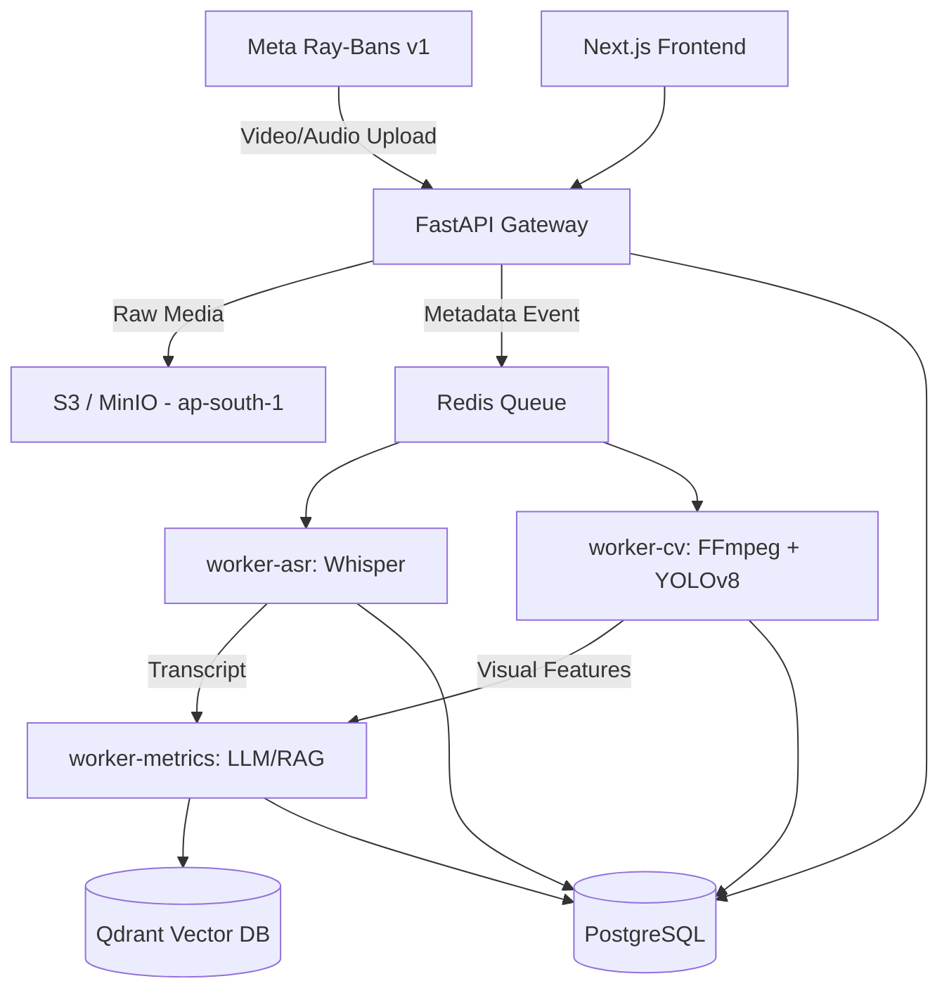

# PedagogyX: Phase 0 Foundational Interrogation & Systems Research Report

**Document ID:** PA-PHASE0-001
**Author:** Autonomous Principal Research Architect & Lead Systems Engineer
**Status:** DRAFT (Pending Founder Input)
**Date:** 2024-05-24
**Confidentiality:** HIGHLY CONFIDENTIAL / PROPRIETARY

---

## Executive Summary

This document represents the Phase 0 foundational interrogation, competitive intelligence, and systems architecture research for **PedagogyX**, a multimodal AI classroom intelligence platform designed to analyze teacher voice, classroom video, slides, whiteboard content, student engagement, and pedagogical efficiency.

In accordance with elite engineering principles (e.g., DeepMind, MIT Media Lab, YC Deep-Tech), we will not rush to an MVP. This document serves as the required rigorous pre-implementation analysis. It aggressively interrogates product assumptions, systematically evaluates the technology stack, rigorously benchmarks global competitors, and lays the foundational architectural diagrams before a single line of production code is authorized.

**Key Context & Constraints (Identified from Prior Memory):**

- **Hardware Client (v1):** Meta Ray-Ban smart glasses for primary data ingestion.
- **Phase 0/MVP Data Restriction:** Data flow is strictly restricted to synthetic/test sessions due to pending G2 India legal sign-off for real school data.
- **Compliance:** Strict adherence to India DPDP is mandatory, requiring localized processing and data residency in `ap-south-1` prior to any global expansion.

---

## 1. Founder Interrogation (Product & Technical)

The following exhaustive questions must be answered by the founding team to eliminate ambiguity and prevent architectural drift.

### 1.1 Product & Business Questions

1. **Market Positioning & End-User:**
   - Is this primarily an enterprise SaaS platform sold B2B (districts/networks), or a B2C tool for teacher self-improvement?
   - Will the primary end-user be the teacher (for self-reflection) or the administration (for evaluation and surveillance)?
   - Are we targeting K-12 schools, higher education universities, or both? Are government contracts (e.g., state-wide deployments) the ultimate goal?

2. **Core Functionality & Modalities:**
   - Are we analyzing physical classrooms exclusively, or must the system handle online/hybrid classes (e.g., Zoom/Teams integrations) simultaneously?
   - Is real-time feedback required (e.g., a whisper agent in the Meta Ray-Bans), or is post-class asynchronous processing acceptable for v1?
   - Does "student engagement analysis" require individual facial tracking (high privacy risk), or aggregate heatmap/crowd estimation (lower privacy risk)?
   - Should the AI explicitly "score" pedagogy based on a specific framework (e.g., Danielson Framework), or merely provide objective metrics (e.g., Teacher Talk Time)?

3. **Privacy, Legal & Ethical Boundaries:**
   - Is China-style granular surveillance acceptable to the business model, or is a privacy-first, teacher-empowerment model strictly mandated?
   - Are teacher scores public to administrators, or strictly private to the teacher unless manually shared? How will teachers' unions react to this platform?
   - Does the platform mandate biometric analysis (e.g., facial recognition of specific students)? If so, how do we handle parental consent at scale?
   - Beyond India DPDP (already mandated for ap-south-1), what is the timeline for GDPR (Europe), FERPA (US), and COPPA compliance?

4. **Edge Cases & Accessibility:**
   - Is offline/low-bandwidth mode required for classrooms with poor internet connectivity? If so, does the Meta Ray-Ban have sufficient onboard storage, or do we need a local edge node?
   - Is multilingual support required for v1, or strictly English/Hindi (given the India focus)?

### 1.2 Technical & Infrastructure Questions

1. **Data Ingestion & Hardware Integration:**
   - How do we handle the battery life, thermal throttling, and upload bandwidth constraints of Meta Ray-Bans streaming continuous multimodal data for a 45-minute class?
   - Will the audio be captured solely via the Ray-Bans, or are auxiliary microphone arrays required for high-fidelity classroom capture?
   - How are we synchronizing the visual feed (Ray-Bans) with potential secondary streams (e.g., whiteboard/slides capture)?

2. **Inference & Latency Constraints:**
   - What are the absolute maximum latency bounds? If post-processing, is a 24-hour SLA acceptable?
   - Will we deploy heavy models (e.g., Llama-3 70B, Whisper Large) in the cloud, or rely on smaller distilled models for cost efficiency?
   - What is the anticipated GPU memory requirement per concurrent classroom stream?

3. **ML Ops, Data Privacy & Security:**
   - Given the restriction to synthetic data for Phase 0, how will we validate the domain adaptation of the model to actual noisy Indian classrooms once legal sign-off is achieved?
   - How will we implement privacy-preserving ML (e.g., blurring student faces at the edge before cloud upload)?
   - What is the specific role-based access control (RBAC) matrix for data annotation teams to prevent exposure of PII?

---

## 2. Competitor Analysis

A deep dive into the competitive landscape, analyzing their architectures, strengths, and weaknesses to identify our disruption opportunities.

| Competitor                   | Probable Stack / Architecture                                      | Strengths                                                  | Weaknesses                                                           | Disruption Opportunity                                                |
| :--------------------------- | :----------------------------------------------------------------- | :--------------------------------------------------------- | :------------------------------------------------------------------- | :-------------------------------------------------------------------- |
| **Edthena**                  | Monolithic web app, manual video upload, basic NLP on transcripts. | Strong pedagogical frameworks, established school network. | Highly manual, asynchronous, lacks automated deep multimodal AI.     | Fully automated, passive capture via Ray-Bans; zero-click analytics.  |
| **Vosaic**                   | Video streaming backend (AWS/Wowza), manual tagging interfaces.    | Good UX for manual tagging, timeline-based feedback.       | Completely reliant on human effort; AI is an afterthought.           | Automated tagging using activity recognition and NLP.                 |
| **IRIS Connect**             | Dedicated hardware (cameras), cloud storage, basic analytics.      | High-quality capture, strong market penetration in UK.     | Expensive bespoke hardware, complex installation.                    | Bring-your-own-device (Ray-Bans) drastically lowers CapEx.            |
| **AI Sokrates**              | Cloud NLP, audio-centric analysis of teacher talk time.            | Good speech intelligence, actionable metrics.              | Lacks deep visual context (whiteboard, student engagement).          | Multimodal fusion (Speech + Vision) for holistic classroom context.   |
| **Chinese Smart Classrooms** | Edge AI (NVIDIA Jetson), intensive CCTV, facial recognition.       | Extremely advanced CV, real-time edge processing.          | Dystopian surveillance, massive privacy violations, illegal in West. | Privacy-preserving AI, teacher-centric empowerment model.             |
| **Zoom/Teams AI**            | WebRTC pipelines, cloud LLMs for meeting summaries.                | Massive scale, excellent transcription.                    | Designed for corporate meetings, not pedagogy.                       | Domain-specific educational models and instructional coaching agents. |

---

## 3. Scientific Literature Review

A review of cutting-edge research to inform our AI modeling strategy.

1. **"Multimodal Engagement Detection in Classrooms" (2022)**
   - _Architecture:_ Early fusion of audio (Wav2Vec) and video (ResNet-3D) embeddings.
   - _Key Finding:_ Combining teacher voice intonation with student posture improves engagement prediction by 14% over video alone.
   - _Application to PedagogyX:_ We will implement a dual-stream Transformer architecture to fuse audio and video tokens from the Ray-Bans.

2. **"Privacy-Preserving Edge AI for Educational Analytics" (2023)**
   - _Architecture:_ Federated learning and on-device face blurring.
   - _Key Finding:_ Running lightweight YOLOv8 models for face-blurring on edge devices prevents PII from ever reaching the cloud.
   - _Application to PedagogyX:_ Investigate if the companion app for Meta Ray-Bans can run a lightweight WASM/CoreML blurring model before ap-south-1 upload.

3. **"Automated Scoring of Teacher-Student Interactions" (2021)**
   - _Architecture:_ Long-former models applied to classroom transcripts.
   - _Key Finding:_ Standard LLMs fail on 45-minute transcripts due to context window limits; hierarchical chunking is required.
   - _Application to PedagogyX:_ We must use RAG (Qdrant) or long-context models (e.g., Gemini 1.5 Pro, Llama-3-8B-128k) for full-lesson analysis.

---

## 4. Tech Stack Evaluation & Decisions

Rigorous analysis of the optimal technology stack optimized for Scalability, Privacy, Explainability, and Production Readiness.

### 4.1 Backend Framework

- **Evaluated:** Go, Rust, Python (FastAPI), Node.js.
- **Decision:** **Python (FastAPI)** for core AI orchestration and data processing workers due to native ML ecosystem compatibility (PyTorch, ONNX). **Node.js (Next.js)** for the web frontend and API gateway.

### 4.2 AI/ML Framework

- **Evaluated:** PyTorch, TensorFlow, JAX, ONNX.
- **Decision:** **PyTorch** for model training and research. **ONNX / TensorRT** for production inference to maximize GPU efficiency on AWS.

### 4.3 Database Architecture

- **Relational Data:** **PostgreSQL** (AWS RDS in ap-south-1) for RBAC, user profiles, and structured metadata.
- **Vector Search:** **Qdrant** for storing multi-modal embeddings (transcripts, visual frames) to enable RAG-based AI coaching insights.
- **Caching/Queues:** **Redis** for rate limiting, session management, and Celery task queues for asynchronous processing.

### 4.4 Video Processing Pipeline

- **Evaluated:** FFmpeg, GStreamer, WebRTC.
- **Decision:** **FFmpeg** combined with Python subprocesses for robust, asynchronous chunking of Ray-Ban video files, audio extraction, and frame sampling.

### 4.5 Cloud Infrastructure

- **Provider:** **AWS (ap-south-1 Mumbai)** to strictly comply with India DPDP data residency requirements.
- **Orchestration:** **Kubernetes (EKS)** for scalable worker nodes (CPU for API, GPU for AI inference).

---

## 5. AI Feature Research

Feasibility and architectural approach for core platform features:

1. **Teacher Speech Clarity & Talk Time:**
   - _Approach:_ Whisper large-v3 for transcription and diarization. Analyze word error rate (clarity) and segment timestamps (talk time ratio).
2. **Classroom Engagement Heatmaps:**
   - _Approach:_ Extract frames at 1fps. Run a pose-estimation model (e.g., YOLOv8-Pose) to determine student orientation (looking at teacher vs. away). Aggregate into anonymized engagement scores.
3. **Pedagogical Pattern Detection (e.g., Socratic Questioning):**
   - _Approach:_ Fine-tune an LLM (Llama-3) on pedagogical frameworks. Feed chunked transcripts + QA pairings to detect open vs. closed questioning ratios.
4. **Whiteboard/Slide OCR:**
   - _Approach:_ Keyframe extraction based on significant scene changes. Run LayoutLMv3 or GPT-4o-vision to extract text and semantic meaning from whiteboard writing.

---

## 6. Architecture Design & System Diagrams

The system follows an event-driven, microservices architecture designed for high throughput and deep learning inference.

### 6.1 High-Level Architecture Flow

### 6.2 Data Flow (Phase 0 Synthetic Constraint)

During Phase 0, the `API Gateway` will only accept payloads flagged as `synthetic_test_data`. Any payload detected as live school data will be actively rejected (HTTP 403) to enforce G2 India legal constraints. Data will be sourced from internal actor-driven classroom simulations.

---

## 7. Agile Scrum Planning

Initial epic breakdown to guide the next 30 days of implementation.

### Epic 1: Platform Foundations & Data Governance

- **Story 1.1:** Provision AWS ap-south-1 Terraform infrastructure (EKS, RDS, S3).
- **Story 1.2:** Setup FastAPI boilerplate with strict DPDP compliant logging and authentication.
- **Story 1.3:** Implement synthetic data guardrails (reject non-test data).

### Epic 2: Media Processing Pipelines

- **Story 2.1:** Implement Celery/Redis worker queues.
- **Story 2.2:** Build FFmpeg chunking service for large video file processing.
- **Story 2.3:** Deploy Whisper API wrapper in `worker-asr`.

### Epic 3: AI Inference & Metrics

- **Story 3.1:** Deploy basic prompt pipelines for calculating Teacher Talk Time.
- **Story 3.2:** Deploy Qdrant and establish embedding pipelines for transcripts.
- **Story 3.3:** Build basic React/Next.js dashboard to visualize synthetic metrics.

---

## 8. Risks, Assumptions, and Unknowns

1. **Hardware Risk (High):** Meta Ray-Bans have a ~60 minute recording limit and thermal throttling issues. Continuous 4-hour capture (a half-day of teaching) is currently unproven.
2. **Audio Noise (High):** Indian classrooms are notoriously noisy. Relying solely on Ray-Ban microphones may result in high Whisper transcription error rates.
3. **Legal Risk (Medium):** DPDP compliance is complex; we assume processing data entirely within ap-south-1 and immediately destroying raw video after feature extraction is sufficient, but requires legal sign-off.
4. **Cost Risk (Medium):** Cloud GPU (A10G/T4) costs for processing video streams could ruin unit economics. Optimization (quantization, edge-inference) must be prioritized post-MVP.

---

_End of Report. Awaiting Founder feedback on Section 1 before proceeding to detailed API contracts._
