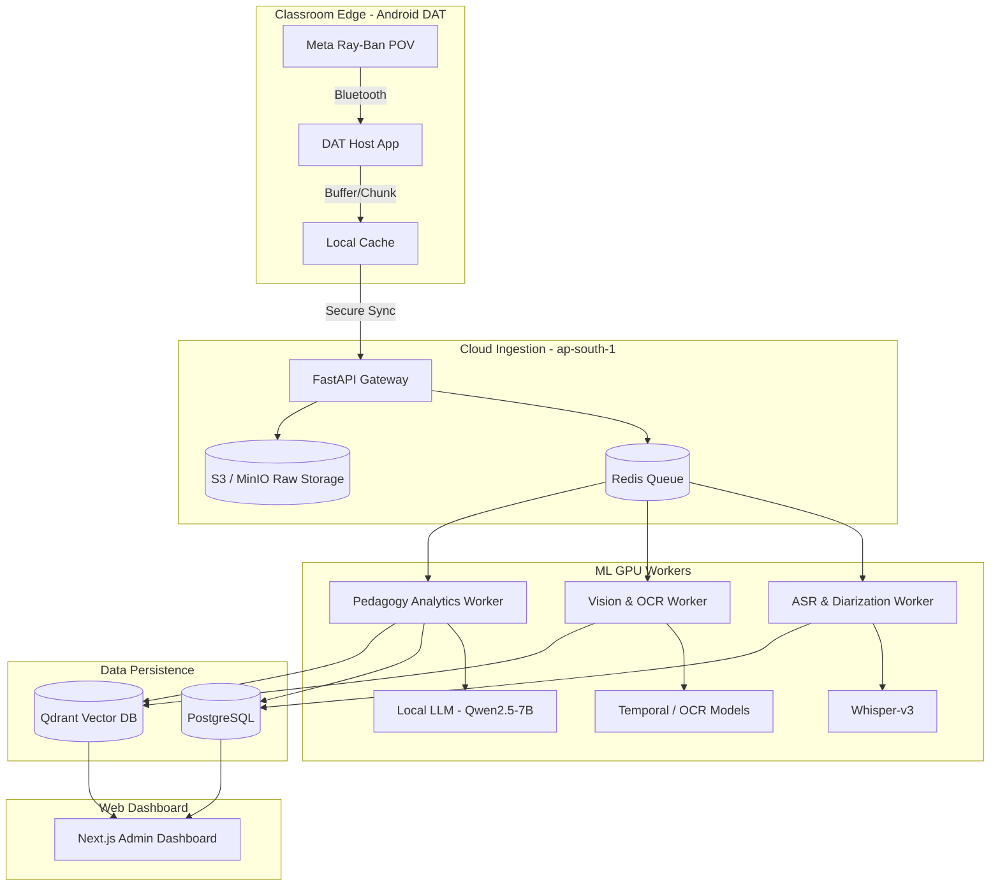

# PedagogyX: Autonomous Principal Research Architect Phase 0 Report

**Status:** Phase 0 — Founder Interrogation Complete
**Date:** 2026-05-23
**Author:** Autonomous Principal Research Architect & Lead Systems Engineer

## 1. Founder Interrogation (Product & Technical)

### Product Strategy & Positioning

- **Target Market:** Dual segment focusing on K-12 districts and universities, with initial deployment targeting the India market.
- **Regulatory Focus:** Compliance with India DPDP, requiring specific data residency (ap-south-1) and localized processing prior to global expansion.
- **Primary Modality:** Meta Ray-Ban smart glasses (teacher POV video + mic) paired via DAT on an Android host app. Multi-camera and smartboard integrations are deferred to Phase 1b.
- **Commercial Model:** Initial pilot is free (₹0 customer budget), meaning infrastructure costs must be strictly optimized and borne internally during the validation phase.
- **Success Metrics:** Primary goal is M-A (Coverage), followed by M-B and M-C (Time-to-insight and Admin action on flags). The system aims to monitor and assess teaching ability and pedagogy, generating per-teacher scores rather than per-student evaluations.

### Technical Constraints & Decisions

- **Compute Budget:** Strict reliance on RTX 5070 (12 GB) hardware constraints, rejecting expensive cloud GPU paradigms for local edge or hybrid processing.
- **ML Execution:** Hybrid execution model (C) — Site LAN edge for buffer/ingest, offloading heavy analytics to the PedagogyX India cloud GPU pool.
- **OSS Requirement:** Strong preference for Free & Open Source Software (FOSS), necessitating on-prem/self-hosted LLMs (e.g., Qwen2.5-7B-Q4) over proprietary APIs to satisfy privacy requirements.
- **Data Handling:** Identifiable student video is permitted in v1 for classroom-level discourse metrics, demanding robust DPIA (Data Protection Impact Assessment) and strict RBAC controls.

## 2. Competitor Analysis

Our landscape encompasses US-centric coaching platforms, Chinese smart classroom surveillance systems, and emerging multimodal AI research frameworks.

- **Edthena / IRIS Connect / Vosaic:**
  - _Strengths:_ Strong adoption in US markets, union-friendly, robust manual coaching workflows.
  - _Weaknesses:_ Heavy reliance on manual tagging, minimal autonomous multimodal AI, high friction in video upload.
  - _Differentiator:_ PedagogyX will fully automate the analysis pipeline using edge-to-cloud ML, providing near real-time insights without manual intervention.
- **Chinese Smart Classroom Systems:**
  - _Strengths:_ High hardware integration, real-time student engagement tracking, massive data scale.
  - _Weaknesses:_ Overly punitive, low pedagogical nuance, significant privacy concerns outside domestic markets.
  - _Differentiator:_ PedagogyX focuses on _teacher pedagogy_ rather than student surveillance, utilizing advanced long-context analysis to measure instructional effectiveness ethically.
- **AI Meeting Intelligence (Zoom AI, Microsoft Teams):**
  - _Strengths:_ Excellent ASR, reliable cloud infrastructure, basic speaker diarization.
  - _Weaknesses:_ Lacks domain-specific educational models (e.g., pedagogical pattern detection, whiteboard OCR).
  - _Differentiator:_ Specialized educational knowledge graphs and domain-adapted instructional analytics.

## 3. Scientific Literature Review

A review of recent advances in multimodal AI and learning analytics informs our architectural direction:

- **Multimodal Transformers in Education:** Recent papers (e.g., _Affective Computing in Education_) demonstrate that fusing speech, facial expression, and posture yields superior engagement metrics compared to unimodal approaches.
- **Teacher Effectiveness Modeling:** Literature on the Flanders Interaction Analysis Categories (FIAC) emphasizes the importance of teacher-talk vs. student-talk ratios. Our ASR pipeline must support highly accurate speaker diarization in noisy environments.
- **Long-context Video Understanding:** Memory-augmented transformers (e.g., extensions of TimeSformer) are critical for analyzing 45-minute lectures without catastrophic forgetting, enabling end-to-lesson pedagogical summaries.
- **Privacy-Preserving Edge AI:** Research on quantized models (e.g., Q-LoRA, 4-bit quantization) confirms the viability of running robust 7B parameter LLMs on consumer-grade hardware (RTX 5070) for sensitive data processing.

## 4. Tech Stack Evaluation

Based on strict cost, latency, and FOSS constraints, the following stack is mandated:

- **Backend Services:** Python (FastAPI) for ML-heavy workers and API routing; Node.js (Next.js) for the admin dashboard. Python ensures seamless integration with the PyTorch ecosystem.
- **AI/ML Infrastructure:** PyTorch with ONNX/TensorRT optimization for inference. vLLM or Ollama for serving quantized local LLMs (Qwen2.5-7B-Q4) on RTX 5070.
- **Video Processing:** FFmpeg pipelines at the edge for raw ingestion, chunking, and audio extraction, interfacing via RTSP or WebRTC for live streams.
- **Data Storage:**
  - _Relational:_ PostgreSQL for RBAC, user state, and aggregate metrics.
  - _Vector Search:_ Qdrant for storing multimodal embeddings and enabling semantic search across teaching moments.
  - _Caching/Broker:_ Redis for high-throughput event streaming and Celery task management.
- **Infrastructure:** Dockerized deployments manageable via Docker Compose for pilots, scaling to Kubernetes (K3s) for edge-cloud hybrid deployments. AWS (ap-south-1) for central aggregation.

## 5. AI Feature Research

The MVP and fast-follow roadmap will prioritize the following AI capabilities:

- **Teacher/Student Speaking Ratios:** Essential for FIAC-style analysis; requires robust diarization and localized ASR (English + Hindi).
- **Pedagogical Pattern Detection:** Identifying lecture vs. Q&A vs. group work phases using temporal action localization models.
- **Speech Clarity & Pacing:** Analyzing words-per-minute, pause duration, and acoustic clarity to provide immediate feedback on instructional delivery.
- **Whiteboard / Slide OCR:** Periodic frame sampling to extract semantic meaning from visual aids, mapped against the spoken transcript.
- **Hallucination-resistant Feedback:** Utilizing RAG (Retrieval-Augmented Generation) against an educational knowledge graph to ensure AI coaching insights are grounded in validated pedagogical frameworks.

## 6. Agile Scrum Planning

### Epic: MVP Hybrid Architecture Pipeline

- **Sprint 1: Edge Ingestion Foundation**
  - Implement Android DAT host connection to Meta Ray-Ban.
  - Establish local buffering and chunking pipelines (FFmpeg).
  - _Risk:_ Network instability in Indian pilot schools.
- **Sprint 2: Cloud ML Processing**
  - Deploy FastAPI workers for ASR (Whisper) and diarization.
  - Implement Vector DB (Qdrant) integration for embeddings.
  - _Risk:_ Exceeding RTX 5070 memory limits during concurrent requests.
- **Sprint 3: Analytics Dashboard**
  - Build Next.js admin interface for pedagogy score visualization.
  - Implement strict RBAC (Admin vs. Coach vs. Teacher).
- **Sprint 4: End-to-End Evaluation & Optimization**
  - Conduct synthetic data pipeline tests.
  - Optimize inference latency and GPU utilization.

## 7. Architecture Design with system diagrams

The architecture relies on a hybrid C model (LAN edge buffer + India cloud GPU analytics).

### Risk Matrix & Tradeoffs

- **Tradeoff:** FOSS LLM vs. Proprietary APIs. _Decision:_ Accept slightly lower reasoning capability of 7B FOSS models to strictly maintain DPDP compliance and zero API costs.
- **Tradeoff:** Single POV vs. Multi-cam. _Decision:_ Meta Ray-Ban POV significantly reduces sync complexity and GPU load, allowing feasible RTX 5070 deployment for v1.
- **Risk:** Edge-to-cloud connectivity in India. _Mitigation:_ Robust edge caching on Android host; asynchronous processing without blocking the UI.
