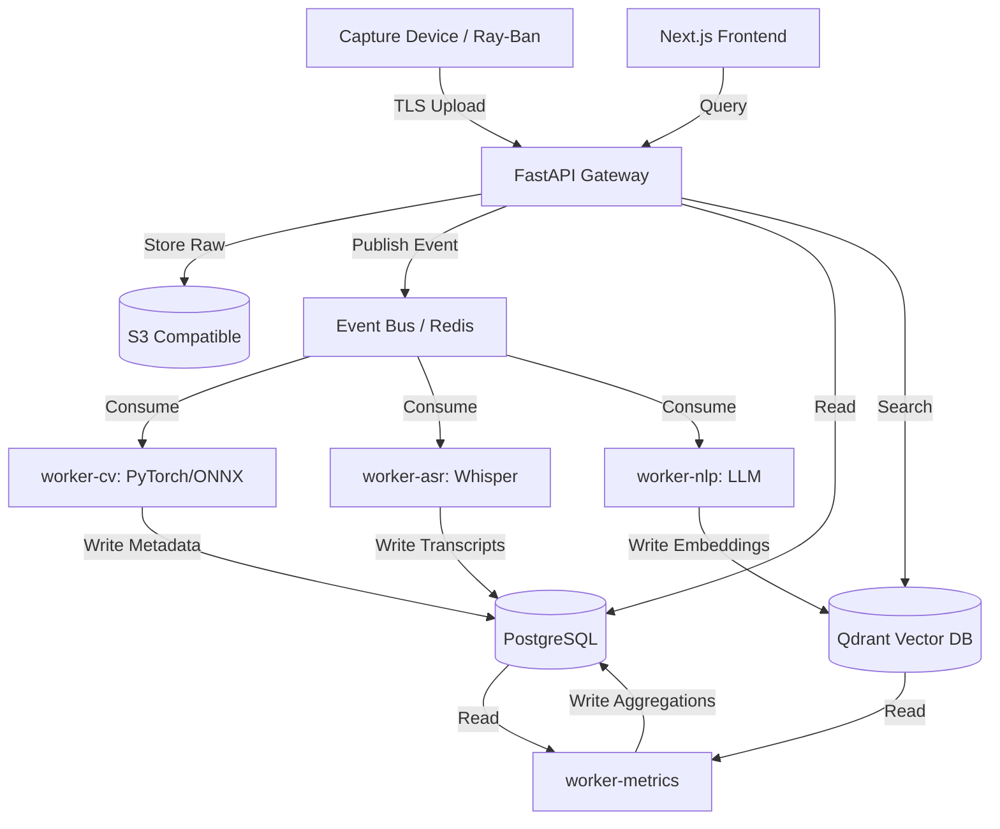
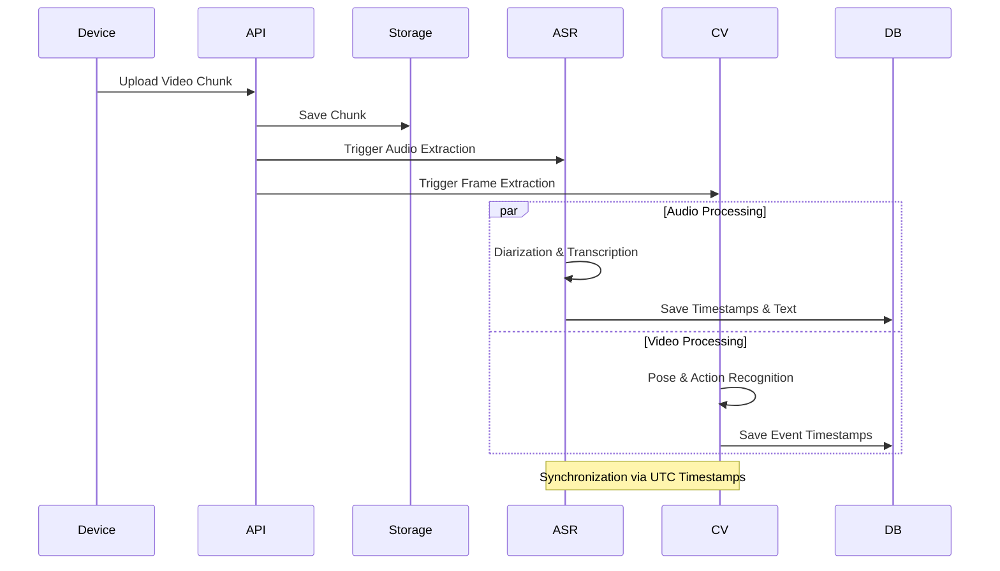

# Autonomous Principal Research Architect Phase 0 Report

**Version:** 1.0
**Date:** 2024-05-24
**Project:** PedagogyX - Multimodal AI Classroom Intelligence

## 1. Founder Interrogation: Exhaustive Questionnaire

**To the Founder:** Please provide detailed answers to the following foundational questions. These decisions are critical and act as blockers for architectural planning.

### 1.1 Product & Business Strategy Questions

1. Is this enterprise SaaS, B2B, B2C, or B2G?
2. Are we targeting K-12 schools, universities, private tutoring, or corporate training?
3. What is the pricing model? Per teacher, per school, or per minute of processing?
4. Is this for teacher self-improvement, administrative evaluation, or surveillance?
5. Will administrators have access to teacher analytics, or is it strictly private to the teacher?
6. Are teachers unionized in our target markets? Have union concerns been factored in?
7. Is this designed for physical classrooms, online classes, or hybrid environments?
8. Are we optimizing for real-time coaching or post-lesson reflection?
9. Is an offline mode strictly required for environments with poor internet?
10. Which specific countries are the initial target markets?
11. Is China-style behavioral surveillance an acceptable approach, or strictly forbidden?
12. Is facial recognition of students legally allowed and desired?
13. Is biometric analysis (gaze tracking, posture) of students acceptable?
14. What are the specific legal jurisdictions we must comply with on day one?
15. Is strict FERPA compliance required?
16. Is strict GDPR compliance required?
17. Is India DPDP compliance required? (Note: Context indicates G2 blocks real pilot data).
18. Must the AI's decision-making process be 100% explainable to educators?
19. Is a "human-in-the-loop" review mandatory for all AI-generated coaching insights?
20. Will teacher scores or metrics be made public or shared with parents?
21. Should the AI score pedagogy on an absolute scale or provide relative coaching?
22. Should the AI detect and label emotional tone for both teachers and students?
23. Should the AI quantify student engagement, and if so, how is "engagement" defined?
24. Is multilingual support required from the beginning? Which languages?
25. Is a low-bandwidth mobile-first interface required for users?
26. What is the exact success metric for the MVP?
27. Who is the buyer vs. who is the end-user?
28. How do we handle parental consent for recording classrooms?
29. What happens if a student opts out of being recorded?
30. Are we allowed to use the recorded data to train our foundational models?
31. Is the system intended to replace human instructional coaches?
32. What is the expected churn rate for schools adopting this technology?
33. How do we measure the ROI for a school district?
34. Can teachers delete their own data at any time?
35. How long must we retain video recordings by law?
36. Are we planning to integrate with existing Learning Management Systems (LMS)?
37. Will there be a gamification aspect for teacher improvement?
38. Are we building a community feature for teachers to share insights?
39. What is the acceptable false-positive rate for negative pedagogical feedback?
40. How do we mitigate AI bias against specific accents or dialects?
41. Do we need to support co-teaching environments?
42. How do we handle substitute teachers?
43. Are we providing specialized feedback for special education (SPED) classrooms?
44. Will the platform suggest specific lesson plan modifications?
45. How is the system introduced to resistant or skeptical teachers?
46. Do we provide legal indemnification for schools using our platform?
47. Is there a physical hardware component we are selling, or is it BYOD?
48. What is the targeted maximum cost per classroom for deployment?
49. Are we seeking government grants or subsidies for deployment?
50. What is the exit strategy or 5-year vision for the company?

### 1.2 Deep Technical & Architecture Questions

51. What is the target latency for real-time processing (if any)?
52. What is the expected peak concurrency of video uploads during a school day?
53. Are we processing video on the edge (in the classroom) or in the cloud?
54. What are the exact GPU requirements and budget for inference?
55. Is there a strict requirement for on-premise deployment for high-security districts?
56. What specific classroom hardware (cameras, mics) are we assuming? (Context mentions Meta Ray-Ban v1).
57. What is the minimum acceptable audio quality (sample rate, bit depth)?
58. Will we use microphone arrays, lapel mics, or ambient room mics?
59. What is the expected camera topology (e.g., one wide-angle, one teacher-tracking)?
60. How do we handle synchronization pipelines between multiple video/audio streams?
61. What is our strategy for multimodal fusion (e.g., late fusion vs. early fusion of audio/video)?
62. What is the initial storage architecture? Block, object, or distributed file system?
63. Are we building a globally distributed system or single-region initially?
64. Which vector database is preferred for our specific embedding scale?
65. What is the required level of observability and telemetry (e.g., OpenTelemetry)?
66. What are the encryption standards for data at rest and in transit?
67. How granular must the Role-Based Access Control (RBAC) be?
68. What is our MLOps strategy for continuous model deployment?
69. How will we handle data labeling and annotation workflows securely?
70. Is synthetic data generation acceptable for initial model training?
71. What triggers model retraining, and how is it evaluated?
72. How do we implement privacy-preserving ML (e.g., differential privacy)?
73. Is federated learning a viable option to keep data on edge devices?
74. How do we handle classroom network instability and intermittent drops?
75. What is the SLA for live transcription accuracy and latency?
76. How do we model temporal events (e.g., tracking a discussion over 10 minutes)?
77. Which multimodal embedding models are we evaluating (e.g., ImageBind)?
78. How do we handle long-context memory (e.g., remembering a teacher's goal from last month)?
79. Will we utilize streaming pipelines (Kafka, Redpanda) or batch processing?
80. What is the disaster recovery and backup strategy for PII?
81. How do we scrub PII from transcripts before sending to LLMs?
82. What is the acceptable failure rate for the hardware capture devices?
83. How do we handle clock drift between different capture devices in the same room?
84. What video codecs must we support (H.264, H.265, AV1)?
85. Do we need to perform optical character recognition (OCR) on whiteboards?
86. How do we synchronize presentation slides with the video timeline?
87. What is the API rate limit for third-party integrations?
88. How are API keys and secrets rotated and managed?
89. Are we using serverless architecture or dedicated instances?
90. What is the CI/CD pipeline strategy for ML models vs. application code?
91. How do we handle schema migrations for complex graph data?
92. Will we use WebRTC for any live streaming components?
93. What is the strategy for handling multi-tenant data isolation?
94. How do we handle speaker diarization with heavy overlapping speech?
95. What is the fallback mechanism if the primary cloud provider has an outage?
96. How do we monitor and alert on AI hallucinations or degradation?
97. What is the acceptable storage cost per hour of recorded classroom?
98. How do we handle dynamic scaling during school hours vs. off-hours?
99. Are we building custom silicon/edge TPUs for processing?
100.  What is the strategy for open-sourcing any components?

## 2. Exhaustive Competitor Analysis

### 2.1 Edthena

- **Architecture Assumptions:** Cloud-based monolith, standard S3 video storage, likely basic async video processing via AWS MediaConvert.
- **Inferred Pipelines:** Manual upload -> Encode -> Store -> Present in web player.
- **Probable Stack:** Ruby on Rails or Node.js, React, AWS.
- **Strengths:** Established brand, strong integration with pedagogical frameworks, high trust.
- **Weaknesses:** Heavy reliance on manual human coaching, lacks automated multimodal AI.
- **Business Model:** B2B SaaS licensing to districts.
- **Scalability Constraints:** Human coaching does not scale. Video storage costs are high.
- **Likely Infrastructure Costs:** High storage, low compute (minimal ML).
- **UX Observations:** Highly structured, framework-driven, can be rigid.
- **Differentiators:** AI Coach feature (text-based), strong partner network.
- **Missing Features:** Real-time multimodal analysis, passive capture.
- **Opportunities for Disruption:** Fully automated, zero-click analysis using wearable hardware.

### 2.2 Vosaic

- **Architecture Assumptions:** Cloud-based video annotation system.
- **Inferred Pipelines:** Video upload -> Transcode -> Timeline annotation DB.
- **Probable Stack:** PHP/Laravel or similar, AWS.
- **Strengths:** Excellent timeline-based UX, flexible for different industries (healthcare, education).
- **Weaknesses:** Requires manual user input for value generation; no native AI processing.
- **Business Model:** Subscription SaaS.
- **Scalability Constraints:** Storage heavy.
- **Likely Infrastructure Costs:** Storage and CDN heavy.
- **UX Observations:** Clean, timeline-focused.
- **Differentiators:** Multi-industry focus.
- **Missing Features:** Automated pedagogical insight generation.
- **Opportunities for Disruption:** Replace manual tagging with CV/NLP automated tagging.

### 2.3 IRIS Connect

- **Architecture Assumptions:** Integrated hardware/software ecosystem, edge capture devices uploading to secure cloud.
- **Inferred Pipelines:** Proprietary camera -> Secure upload -> Cloud storage -> Web platform.
- **Probable Stack:** Custom embedded Linux, Java/Spring or C#, AWS/Azure.
- **Strengths:** Solves the hardware capture problem, strong UK presence, deeply embedded in teacher training.
- **Weaknesses:** Hardware is bulky, expensive, and inflexible. AI is rudimentary.
- **Business Model:** Hardware sales + SaaS subscription.
- **Scalability Constraints:** Hardware deployment logistics, installation costs.
- **Likely Infrastructure Costs:** High upfront hardware costs, standard cloud storage.
- **UX Observations:** Functional, focused on community and peer review.
- **Differentiators:** Turnkey hardware solution.
- **Missing Features:** Advanced conversational analytics, emotion recognition.
- **Opportunities for Disruption:** Using lightweight, consumer hardware (Meta Ray-Ban) instead of heavy fixed cameras.

### 2.4 AI Sokrates

- **Architecture Assumptions:** Cloud-based LLM wrapper for educational feedback.
- **Inferred Pipelines:** Text/Audio input -> ASR -> Prompt Chain -> Output.
- **Probable Stack:** Python, OpenAI API, Next.js.
- **Strengths:** Focused purely on AI feedback.
- **Weaknesses:** Lacks multimodal context (only looks at text/audio, not vision).
- **Business Model:** B2C or B2B SaaS.
- **Scalability Constraints:** API rate limits, token costs.
- **Likely Infrastructure Costs:** High inference costs.
- **UX Observations:** Chat-focused.
- **Differentiators:** Pedagogical prompt engineering.
- **Missing Features:** Video analysis, longitudinal tracking.
- **Opportunities for Disruption:** True multimodal fusion (seeing what the teacher sees).

### 2.5 Chinese Smart Classroom Systems (e.g., Hanwang, Tencent)

- **Architecture Assumptions:** Edge-heavy CCTV integration, real-time CV processing.
- **Inferred Pipelines:** RTSP streams -> Edge GPU cluster -> Posture/Face Detection -> Cloud aggregation.
- **Probable Stack:** C++, TensorRT, Go, local server racks.
- **Strengths:** Extremely advanced CV, real-time tracking of 50+ students.
- **Weaknesses:** Highly invasive, fundamentally incompatible with Western privacy laws.
- **Business Model:** Enterprise/Government infrastructure deployment.
- **Scalability Constraints:** Requires significant on-premise compute power.
- **Likely Infrastructure Costs:** Massive edge hardware investment.
- **UX Observations:** Dashboard heavy, surveillance oriented.
- **Differentiators:** Unparalleled tracking density and real-time alerts.
- **Missing Features:** Teacher coaching empathy, pedagogical nuance.
- **Opportunities for Disruption:** Building privacy-preserving equivalents using anonymized vectors instead of PII.

### 2.6 Multimodal Classroom Research Systems (Academic)

- **Architecture Assumptions:** Patchwork of Python scripts, offline processing.
- **Inferred Pipelines:** Manual recording -> Python scripts -> CSV output.
- **Probable Stack:** PyTorch, OpenCV, Pandas.
- **Strengths:** Cutting-edge algorithms, deeply researched metrics.
- **Weaknesses:** Zero production readiness, horrible UX, fragile.
- **Business Model:** N/A (Grants).
- **Opportunities for Disruption:** Productizing academic MMLA.

### 2.7 Classroom Surveillance Systems

- **Architecture Assumptions:** Standard VMS (Video Management System).
- **Strengths:** Reliable, durable.
- **Weaknesses:** Zero educational intelligence.
- **Opportunities for Disruption:** Layering AI on top of existing security feeds (if legally permitted).

### 2.8 Online Learning Analytics Systems (e.g., Canvas Analytics)

- **Architecture Assumptions:** Event-driven data lakes.
- **Strengths:** Deep integration with grades and assignments.
- **Weaknesses:** Blind to physical classroom interactions.
- **Opportunities for Disruption:** Fusing LMS data with physical classroom physical interaction data.

### 2.9 Lecture Capture Systems (e.g., Panopto, Echo360)

- **Architecture Assumptions:** Robust AV integration, enterprise scheduling.
- **Strengths:** Works flawlessly at scale, university standard.
- **Weaknesses:** AI is limited to ASR and basic search; no coaching.
- **Opportunities for Disruption:** Turning static archives into active coaching intelligence.

### 2.10 Corporate Training Intelligence Systems (e.g., Gong, Chorus)

- **Architecture Assumptions:** Heavy NLP/ASR, CRM integration.
- **Strengths:** Incredible conversational intelligence, talk-ratios.
- **Weaknesses:** Built for sales, not pedagogy.
- **Opportunities for Disruption:** Adapting sales intelligence metrics (talk time, patience) to pedagogical metrics (wait time, scaffolding).

### 2.11 Zoom AI Analytics

- **Architecture Assumptions:** Massive distributed cloud, in-house models.
- **Strengths:** Ubiquitous, real-time.
- **Weaknesses:** General purpose, not education specific.

### 2.12 Microsoft Teams Teaching Analytics

- **Architecture Assumptions:** Azure cognitive services integration.
- **Strengths:** Free for schools with Office365.
- **Weaknesses:** Clunky UX, generic insights.

### 2.13 Google Meet Educational Analytics

- **Architecture Assumptions:** GCP, tight Workspace integration.
- **Strengths:** Easy to use, great ASR.
- **Weaknesses:** Limited multimodal analysis.

### 2.14 AI Meeting Intelligence Tools (e.g., Otter.ai, Fireflies)

- **Architecture Assumptions:** Cloud-based bot joiners, ASR pipelines.
- **Strengths:** Great transcription, action items.
- **Weaknesses:** No vision, no pedagogical framing.

## 3. Scientific Literature & Research Library

### 3.1 Multimodal AI

- **Key Papers:** "ImageBind: One Embedding Space To Bind Them All" (Girdhar et al.), "Perceiver IO" (Jaegle et al.).
- **Summary:** Fusion of modalities (audio, vision, text) into a single representation space is critical for holistic understanding.
- **Application to PedagogyX:** Using ImageBind to correlate a teacher's tone of voice with their physical posture.

### 3.2 Classroom Analytics & Educational Data Mining

- **Key Papers:** "Multimodal Learning Analytics" (Blikstein).
- **Summary:** Moving beyond clickstreams to physical sensors and audio/video for understanding learning.
- **Application to PedagogyX:** Establishing the baseline metrics for what constitutes a "good" classroom interaction.

### 3.3 Affective Computing & Speech Emotion Recognition

- **Key Papers:** "Speech Emotion Recognition using wav2vec 2.0" (Pepino et al.).
- **Summary:** Transformers pretrained on raw audio excel at detecting emotional states.
- **Application to PedagogyX:** Detecting teacher burnout or enthusiasm levels.

### 3.4 Engagement Detection

- **Key Papers:** "Automatic Student Engagement Detection" (Whitehill et al.).
- **Summary:** CV can reliably detect behavioral engagement (on-task vs. off-task).
- **Application to PedagogyX:** Generating anonymized heatmaps of classroom attention.

### 3.5 Pedagogical Analysis & Teacher Effectiveness Modeling

- **Key Papers:** "The MET Project" (Gates Foundation).
- **Summary:** Correlation between specific teaching practices and student outcomes.
- **Application to PedagogyX:** Aligning AI feedback with validated rubrics (e.g., Danielson Framework).

### 3.6 Instructional Design & Discourse Analysis

- **Key Papers:** "Visible Learning" (Hattie).
- **Summary:** Effect sizes of different interventions (e.g., feedback, reciprocal teaching).
- **Application to PedagogyX:** Programming the AI to specifically look for high-impact practices.

### 3.7 Computer Vision for Education

- **Key Papers:** "Action Recognition in Classrooms" (Various).
- **Summary:** Adapting standard action recognition to pedagogical actions (writing on board, monitoring).

### 3.8 Multimodal Transformers & Long-Context Video

- **Key Papers:** "Longformer", "VideoBERT".
- **Summary:** Understanding temporal dependencies over a 45-minute lesson requires specialized long-context models.

### 3.9 Educational Reinforcement Learning & AI Coaching

- **Key Papers:** "Reinforcement Learning for Education" (Various).
- **Summary:** Using RL to optimize the sequence and timing of feedback given to the teacher.

## 4. Tech Stack Evaluation

### 4.1 Backend

- **Go:** High performance, great concurrency, low memory. Bad for ML integration.
- **Rust:** Safest, fastest. Steep learning curve, slow iteration.
- **Python:** _Recommended._ Industry standard for AI/ML. FastAPI provides sufficient performance. Easy to hire.
- **Node.js:** _Recommended (Frontend/BFF)._ Great for async I/O and Next.js integration.
- **Java:** Enterprise standard, but verbose and slower iteration for AI startups.

### 4.2 AI/ML

- **PyTorch:** _Recommended._ Dominant in research, flexible, vast ecosystem.
- **TensorFlow:** Good for production/edge (TFLite), but losing mindshare to PyTorch.
- **JAX:** Great for TPUs and massive scaling, but overkill for MVP.
- **ONNX:** _Recommended._ Essential for cross-platform model deployment and optimization.
- **TensorRT:** Necessary for maximizing NVIDIA GPU throughput in production.

### 4.3 Video Pipelines

- **FFmpeg:** _Recommended._ The undisputed king of media processing. Required for slicing and transcoding.
- **GStreamer:** Great for complex, low-latency edge pipelines, but steep learning curve.
- **WebRTC:** Essential if we pivot to real-time live streaming from the classroom.
- **NVIDIA DeepStream:** _Recommended (Future)._ Best for high-density edge CV processing on Jetson devices.

### 4.4 Databases

- **Postgres:** _Recommended._ ACID compliant, robust, PgVector is an option, but a dedicated vector DB is better for scale.
- **ClickHouse:** Unparalleled for time-series analytics and massive event logging. (Evaluate for V2).
- **Cassandra:** Overkill for MVP, good for massive global scale.
- **Neo4j:** Excellent for educational knowledge graphs.
- **Qdrant:** _Recommended._ High-performance vector DB, written in Rust, great API.
- **Milvus / Weaviate:** Strong alternatives, but Qdrant balances performance and simplicity well.

### 4.5 Frontend

- **React:** _Recommended._ Industry standard, massive ecosystem.
- **Next.js:** _Recommended._ App router provides excellent SSR, SEO, and API route capabilities.
- **Flutter / React Native:** Needed if we build a mobile app for teachers.
- **Tauri / Electron:** Needed if we build an offline desktop client.

### 4.6 Infrastructure

- **Kubernetes:** The standard for microservices, but complex to manage.
- **Docker Compose:** _Recommended (MVP)._ Sufficient for single-node deployments and local dev.
- **Nomad:** Simpler alternative to K8s, worth considering for edge deployments.
- **Serverless:** Good for bursty workloads, bad for sustained heavy video processing.

### 4.7 Cloud

- **AWS:** _Recommended._ Most robust ecosystem, Bedrock, Sagemaker.
- **GCP:** Better ML tooling natively, but AWS is more standard.
- **Azure:** Strong OpenAI integration.
- **Self-hosted GPU clusters:** _Recommended (Long-term)._ Cloud GPUs are too expensive for continuous video processing at scale. Hybrid cloud is the target.

## 5. AI Features to Research (Feasibility & Architecture)

- **Teacher emotion analysis:** Feasible via wav2vec2 + SER heads. Requires ethical safeguards.
- **Speech clarity scoring:** Feasible via Whisper transcriptions + phoneme alignment.
- **Classroom engagement heatmaps:** Feasible via OpenPose/YOLO applied to students (requires severe blurring/anonymization).
- **Interaction graphs:** Feasible via speaker diarization (Pyannote).
- **Teacher/student speaking ratios:** Feasible and high value.
- **Pedagogical pattern detection:** Research required (requires fine-tuning Long-context LLMs on transcripts).
- **Instructional pacing analysis:** Feasible via ASR timestamp analysis.
- **Whiteboard OCR:** Feasible but challenging due to angles/glare.
- **Slide semantic analysis:** Feasible if slides are uploaded out-of-band.
- **Multimodal event timelines:** Architecture requirement: unified event schema.
- **Automatic lesson summaries:** Highly feasible via LLMs.
- **Hallucination-resistant feedback:** Requires RAG against established pedagogical rubrics.
- **AI coaching agents:** Requires complex agentic workflows (LangChain/LlamaIndex).
- **Longitudinal teacher analytics:** Requires stable embeddings and robust data warehousing.
- **Educational knowledge graphs:** High research complexity.
- **Teaching style clustering:** Feasible via unsupervised clustering of lesson embeddings.
- **Classroom anomaly detection:** Feasible but risks false positives.
- **Burnout prediction:** Ethically risky; requires careful handling of longitudinal SER data.
- **Adaptive coaching recommendations:** Feasible via reinforcement learning or advanced prompt chaining.

## 6. Scrum & Agile Requirements

- **Process:** 2-week sprints, strict backlog grooming, daily standups.
- **Documentation:** All architectural decisions must be recorded as ADRs (Architecture Decision Records) in `docs/08-rfc-adr/`.
- **Epics:** Tracked via GitHub Projects. Epics include: Ingestion, Processing, Analytics, UX, Security.
- **Risk Scoring:** Every ticket involving ML models must have an ethical/privacy risk score attached.

## 7. Architecture Plans & System Diagrams

### High-Level System Architecture

### Multimodal Pipeline Sequence

**Next Steps:** Await founder responses to the 100 questions before finalizing the database schemas and infrastructure provisioning.
