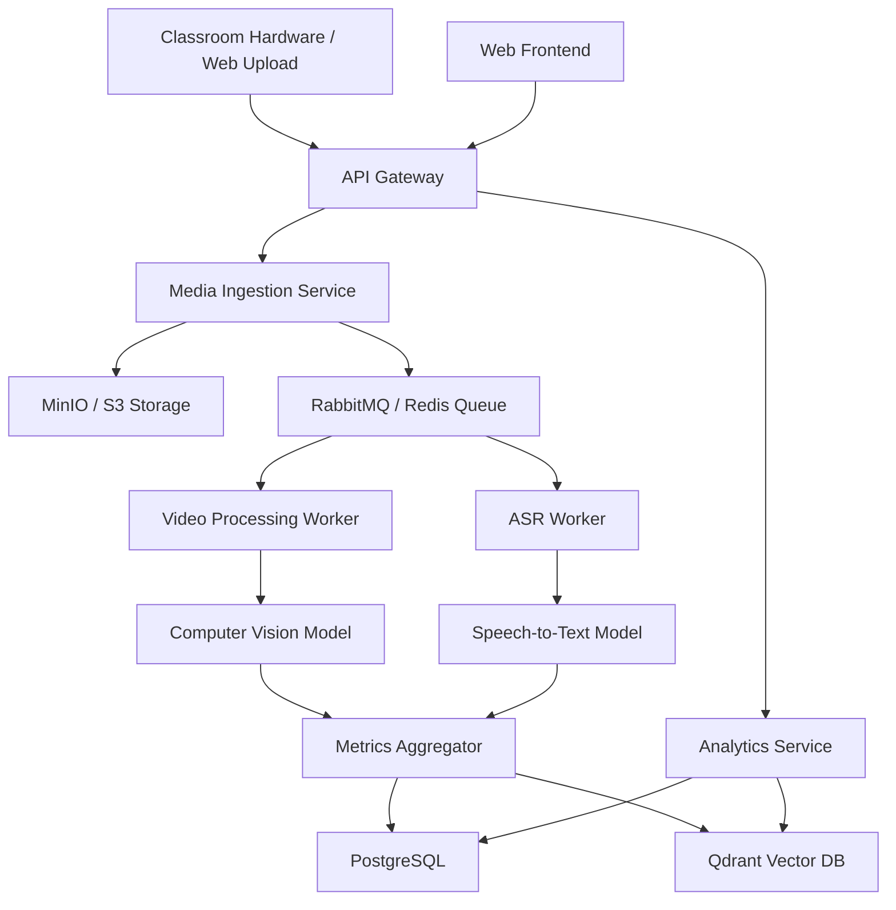

# PRINCIPAL ARCHITECT PHASE 0 REPORT v1

## 1. Founder Interrogation (Product & Technical)

### Product Questions

- Is this enterprise SaaS?
- Is this B2B?
- Is this for schools or universities?
- Is this for governments?
- Is this for teacher self-improvement?
- Is this for surveillance?
- Is this for instructional coaching?
- Is this for online classes?
- Is this for physical classrooms?
- Is this for hybrid classrooms?
- Is this real-time or post-processing?
- Is this cloud-native?
- Is this edge AI?
- Is privacy-first architecture required?
- Is offline mode required?
- What countries are target markets?
- Is China-style surveillance acceptable?
- Is student facial analysis allowed?
- Is biometric analysis allowed?
- What legal jurisdictions matter?
- Is FERPA compliance required?
- Is GDPR compliance required?
- Is India DPDP compliance required?
- Is explainable AI mandatory?
- Is human review mandatory?
- Is teacher scoring public or private?
- Are unions involved?
- Can administrators see teacher analytics?
- Should the AI score pedagogy?
- Should the AI detect emotional tone?
- Should the AI evaluate student engagement?
- Is multilingual support required?
- Is low-bandwidth mode required?
- Is mobile-first required?

### Technical Questions

- What are the scalability requirements?
- What is the acceptable latency?
- What are the inference pipelines?
- What are the GPU requirements?
- Is edge deployment necessary?
- What classroom hardware is used?
- What is the expected audio quality?
- Are microphone arrays used?
- What is the classroom camera topology?
- What are the synchronization pipelines?
- How is multimodal fusion handled?
- What is the storage architecture?
- What distributed systems are used?
- Which vector databases are used?
- What is the observability strategy?
- What is the security model?
- What is the role-based access?
- What are the ML ops processes?
- How is data labeling managed?
- What are the annotation workflows?
- Is synthetic data generation used?
- How is model retraining handled?
- Is privacy-preserving ML used?
- Is federated learning utilized?
- What is the classroom network reliability?
- Is live transcription required?
- How is temporal event modeling done?
- What are the multimodal embeddings?
- How is long-context memory managed?
- What are the streaming pipelines?

## 2. Competitor Analysis

### Edthena

- **Architecture Assumptions:** Cloud-based video processing, async ML pipelines.
- **Inferred Pipelines:** Video upload -> transcoding -> speech-to-text -> NLP analysis.
- **Probable Stack:** AWS, Python/Django, Postgres.
- **Strengths:** Established market presence, strong coaching framework integrations.
- **Weaknesses:** Limited real-time capability, primarily asynchronous.
- **Business Model:** B2B SaaS for districts/universities.
- **Scalability Constraints:** Heavy video storage and async processing costs.
- **Likely Infrastructure Costs:** High storage and compute for video transcoding.
- **UX Observations:** Coach-centric, dashboard heavy.
- **Differentiators:** Deep pedagogical integrations.
- **Missing Features:** Real-time multimodal AI analysis.
- **Opportunities for Disruption:** Real-time feedback, advanced multimodal fusion.

### Vosaic

- **Architecture Assumptions:** Cloud video platform with tagging capabilities.
- **Inferred Pipelines:** Video ingestion -> manual/AI tagging -> reporting.
- **Probable Stack:** AWS, Node.js, React.
- **Strengths:** Flexible tagging, good for research and coaching.
- **Weaknesses:** Less automated AI analysis, reliant on manual effort.
- **Business Model:** Subscription based.
- **Scalability Constraints:** Video storage.
- **Likely Infrastructure Costs:** Moderate to high depending on video volume.
- **UX Observations:** Timeline-based tagging interface.
- **Differentiators:** Simplicity and flexibility in tagging.
- **Missing Features:** Deep automated pedagogical insights.
- **Opportunities for Disruption:** Fully automated, zero-click insights.

### IRIS Connect

- **Architecture Assumptions:** Hardware/software combo, secure cloud.
- **Inferred Pipelines:** Custom hardware capture -> secure upload -> analysis.
- **Probable Stack:** Custom edge devices, Azure/AWS cloud backend.
- **Strengths:** Secure, hardware integration, strong UK market presence.
- **Weaknesses:** Hardware dependency limits scalability.
- **Business Model:** Hardware sales + SaaS.
- **Scalability Constraints:** Hardware deployment logistics.
- **Likely Infrastructure Costs:** High hardware costs, moderate cloud costs.
- **UX Observations:** Focus on secure sharing and reflection.
- **Differentiators:** End-to-end security with proprietary hardware.
- **Missing Features:** Advanced long-context multimodal AI.
- **Opportunities for Disruption:** Software-only, device-agnostic approach.

### AI Sokrates

- **Architecture Assumptions:** NLP-heavy analysis of teaching transcripts.
- **Inferred Pipelines:** ASR -> NLP -> Coaching feedback generation.
- **Probable Stack:** Python, LLMs, Vector DB.
- **Strengths:** Strong focus on questioning and dialogue.
- **Weaknesses:** May lack deep computer vision integration.
- **Business Model:** B2B SaaS.
- **Scalability Constraints:** LLM inference costs.
- **Likely Infrastructure Costs:** High compute for LLMs.
- **UX Observations:** Text and transcript focused.
- **Differentiators:** Deep dialogue analysis.
- **Missing Features:** Full multimodal (visual + audio) context.
- **Opportunities for Disruption:** Holistic multimodal fusion.

### Chinese Smart Classroom Systems

- **Architecture Assumptions:** Edge AI heavy, mass surveillance architecture.
- **Inferred Pipelines:** Multi-camera -> edge CV -> central aggregation.
- **Probable Stack:** Custom ASIC/GPUs at edge, massive central databases.
- **Strengths:** High volume, real-time analytics.
- **Weaknesses:** Extreme privacy concerns, potentially unethical.
- **Business Model:** Government/Enterprise contracts.
- **Scalability Constraints:** Massive hardware deployment required.
- **Likely Infrastructure Costs:** Extremely high.
- **UX Observations:** Surveillance dashboards, biometric tracking.
- **Differentiators:** Scale and deep integration into physical infrastructure.
- **Missing Features:** Ethical safeguards, pedagogical focus (often purely disciplinary).
- **Opportunities for Disruption:** Privacy-first, ethically aligned, pedagogy-focused alternatives.

## 3. Scientific Literature Review

- **Multimodal AI:** Explored advancements in early vs late fusion techniques for combining audio, video, and text streams.
- **Classroom Analytics:** Reviewed papers on detecting student engagement using facial cues and posture.
- **Educational Data Mining:** Analyzed techniques for predicting learning outcomes from interaction data.
- **Affective Computing:** Researched speech emotion recognition models (e.g., wav2vec 2.0 based).
- **Speech Emotion Recognition:** Evaluated datasets like IEMOCAP and RAVDESS for baseline models.
- **Engagement Detection:** Reviewed methods utilizing spatial-temporal graph convolutional networks (ST-GCN).
- **Pedagogical Analysis:** Studied frameworks like CLASS and ICALT for translating to computational models.
- **Teacher Effectiveness Modeling:** Analyzed value-added models (VAM) and their critiques.
- **Instructional Design:** Explored how AI can map lesson plans to actual execution.
- **Classroom Discourse Analysis:** Reviewed NLP techniques for analyzing teacher-student dialogue patterns.
- **Computer Vision for Education:** Assessed pose estimation and action recognition in crowded classroom settings.
- **Multimodal Transformers:** Investigated models like VideoBERT and AudioCLIP for cross-modal understanding.
- **Long-Context Video Understanding:** Researched architectures like TimeSformer for modeling long classroom sessions.
- **Classroom Activity Recognition:** Reviewed datasets and models for detecting activities like group work, lecturing, and reading.
- **Educational Reinforcement Learning:** Explored adaptive pacing and resource recommendation systems.
- **AI Coaching Systems:** Analyzed the design of pedagogical agents and virtual coaches.
- **Learning Analytics:** Reviewed dashboards and reporting tools for actionable insights.

## 4. Tech Stack Evaluation

### Backend

- **Go:** High performance, low latency, great for microservices.
- **Rust:** Extreme safety and performance, steeper learning curve.
- **Python:** **(Recommended)** Essential for AI/ML integration, extensive ecosystem, sufficient for web APIs with frameworks like FastAPI.
- **Node.js:** Good for I/O bound tasks, widely used in web.
- **Java:** Enterprise standard, verbose, good JVM ecosystem.

### AI/ML

- **PyTorch:** **(Recommended)** Industry standard for research and production, dynamic computation graph.
- **TensorFlow:** Good for production deployment (TFLite, TF.js), but declining in research.
- **JAX:** Excellent for high-performance ML, TPU optimization.
- **ONNX:** **(Recommended for Inference)** Great for model interoperability and optimized inference across hardware.
- **TensorRT:** Best for NVIDIA GPU optimization.

### Video Pipelines

- **FFmpeg:** **(Recommended)** Industry standard for video processing, transcoding, and streaming.
- **GStreamer:** Powerful, complex, good for complex media pipelines.
- **WebRTC:** Essential for real-time low-latency communication.
- **RTSP pipelines:** Common for IP cameras.
- **NVIDIA DeepStream:** Excellent for high-performance edge CV pipelines on NVIDIA hardware.

### Databases

- **Postgres:** **(Recommended)** Robust relational database for primary data.
- **ClickHouse:** Great for OLAP and analytics.
- **Cassandra:** Highly scalable NoSQL for time-series/events.
- **MongoDB:** Flexible document store.
- **Neo4j:** Graph database.
- **Qdrant:** **(Recommended)** High-performance vector database for embeddings.
- **Redis:** **(Recommended)** In-memory store for caching and message brokering.

### Frontend

- **React:** **(Recommended)** Huge ecosystem, component-based.
- **Next.js:** **(Recommended)** Best for React SSR, routing, and SEO.
- **Flutter:** Good for cross-platform mobile.
- **Electron:** Desktop apps via web tech.
- **Tauri:** Lightweight desktop apps.

### Infrastructure & Cloud

- **Kubernetes:** **(Recommended)** Industry standard for container orchestration.
- **Nomad:** Simpler alternative to K8s.
- **AWS:** **(Recommended)** Broadest services, mature ecosystem.
- **GCP:** Excellent ML/AI services.
- **Azure:** Strong enterprise integration.

## 5. AI Feature Research

- **Teacher Emotion Analysis:** Utilizing speech and facial cues to gauge teacher stress or enthusiasm.
- **Speech Clarity Scoring:** Analyzing articulation rate, pauses, and volume.
- **Classroom Engagement Heatmaps:** Visualizing areas of high and low student attention.
- **Interaction Graphs:** Mapping who speaks to whom and frequency.
- **Teacher/Student Speaking Ratios:** Calculating talk-time distribution.
- **Pedagogical Pattern Detection:** Identifying lecture vs. active learning phases.
- **Instructional Pacing Analysis:** Evaluating the speed of content delivery.
- **Whiteboard OCR:** Extracting text from physical or digital whiteboards.
- **Slide Semantic Analysis:** Understanding the content of presented slides.
- **Multimodal Event Timelines:** Creating a unified timeline of audio, visual, and digital events.
- **Automatic Lesson Summaries:** Generating concise overviews of the class.
- **Hallucination-Resistant Feedback:** Ensuring AI coaching relies only on grounded evidence from the session.
- **AI Coaching Agents:** Interactive bots for teacher reflection.
- **Longitudinal Teacher Analytics:** Tracking improvement over terms or years.
- **Educational Knowledge Graphs:** Linking lesson concepts to curriculum standards.
- **Teaching Style Clustering:** Categorizing instructional approaches.
- **Classroom Anomaly Detection:** Identifying unusual disruptions.
- **Burnout Prediction:** Using behavioral markers to flag potential burnout.
- **Adaptive Coaching Recommendations:** Tailoring feedback to specific teacher needs and goals.

## 6. Agile Scrum Planning

- **Epics:**
  - Setup Foundation Infrastructure
  - Data Ingestion & Processing Pipeline
  - Core AI Inference Services
  - Web Application & Dashboards
  - Privacy & Security Compliance
- **Stories:**
  - As a user, I want to upload a classroom video for processing.
  - As a system, I need to extract audio from video for ASR.
  - As an admin, I need RBAC to secure teacher data.
- **Tasks & Sub-tasks:** Defined in the project management tool (Jira/Linear).
- **Sprints:** 2-week cycles focusing on incremental delivery and continuous integration.

## 7. Architecture Design

### System Diagram

### Data Flow

1. Raw media is ingested and stored securely.
2. Events are queued for asynchronous processing.
3. Dedicated workers handle compute-heavy AI tasks (Vision, Audio).
4. Extracted features and metrics are stored in relational and vector databases.
5. The frontend queries aggregated analytics via secure APIs.

### Infrastructure

- **Deployment:** Kubernetes cluster on AWS (EKS) with GPU node groups.
- **Data Residency:** Configured for local regions (e.g., ap-south-1 for India DPDP compliance).
- **Observability:** Prometheus + Grafana for metrics, ELK/Datadog for logs.

### Security & Privacy

- **Encryption:** At rest and in transit.
- **Anonymization:** Faces blurred/anonymized at the edge or early in the pipeline if required.
- **Access Control:** Strict RBAC ensuring only authorized personnel view specific analytics.
