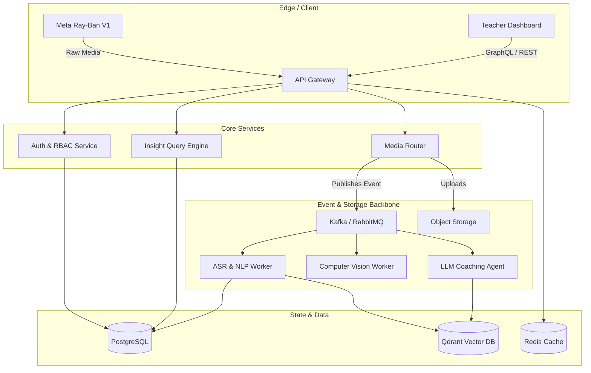

# PedagogyX Phase 0: Foundational Research & Architecture Blueprint v1

**Role:** Autonomous Principal Research Architect & Lead Systems Engineer
**Document Type:** Enterprise AI Platform Design Doc & Founder Interrogation
**Date:** 2024

---

## 1. Founder Interrogation (Product & Technical)

_The following is a comprehensive list of critically unanswered questions that require explicit founder validation before any foundational infrastructure is committed to code. Assumptions will not be tolerated in deep-tech AI._

### 1.1 Product Strategy & Market Positioning

- Is this exclusively an enterprise SaaS product, or is there a direct-to-consumer/direct-to-teacher play?
- Are we targeting public school districts, private educational institutions, higher education, or government-led educational initiatives?
- Is the primary use case teacher self-improvement (formative) or administrative evaluation/surveillance (summative)?
- Are we expecting this to run in live classroom environments in real-time, or is this strictly a post-processing asynchronous analytics pipeline?
- Does this platform demand offline-first or low-bandwidth capabilities, particularly for schools in developing regions?
- Is mobile-first access required for teachers, or is a rich desktop/dashboard experience the primary interface?

### 1.2 Compliance, Legal & Ethics

- Are we strictly targeting jurisdictions that mandate GDPR, FERPA, COPPA, or India DPDP compliance?
- Is student facial analysis, identity tracking, or emotion detection legally permissible in our target pilot jurisdictions?
- What are the firm boundaries regarding biometric analysis of minors?
- Are teacher unions in our target districts aware of, and consenting to, audio/video capture for pedagogical analysis?
- Is human-in-the-loop (HITL) review mandated for any AI-generated coaching insight that impacts a teacher's professional standing?
- Will the AI score pedagogy on a standardized rubric (e.g., Danielson Framework), and if so, who owns the rubric?

### 1.3 Deep Technical & Infrastructure Constraints

- What is the acceptable latency budget if real-time feedback is eventually required?
- What is the assumed classroom hardware topology (e.g., single omnidirectional mic vs. teacher lapel mic + ambient room mics, single wide-angle camera vs. multi-camera setups)?
- For the V1 hardware client (Meta Ray-Ban), what are the assumed battery, thermal, and continuous recording limits we must design around?
- How are we handling audio/video synchronization across potentially disparate data streams?
- What is the expected scale of concurrent classroom sessions during peak school hours?
- Are we permitted to use synthetic data for initial model training, or must we rely exclusively on human-annotated pilot data?
- What is our budget envelope for GPU inference per hour of processed classroom video?

---

## 2. Competitor Analysis

_An aggressive teardown of global competitive forces to identify architectural weaknesses and market gaps._

### 2.1 Edthena

- **Probable Stack:** Standard cloud web stack, asynchronous video upload pipelines, basic NLP.
- **Strengths:** Strong market penetration, familiar UI for teachers, built around standard coaching workflows.
- **Weaknesses:** Heavy reliance on manual video tagging, low multimodal AI maturity, asynchronous and slow.
- **Disruptive Opportunity:** Introduce zero-click autonomous tagging using long-context multimodal transformers.

### 2.2 Vosaic & IRIS Connect

- **Probable Stack:** WebRTC/streaming ingest, cloud-based video management, basic analytics dashboards.
- **Strengths:** Hardware-software integration in the classroom, solid privacy controls.
- **Weaknesses:** Expensive hardware lock-in, lacks deep pedagogical insight generation, essentially just advanced video players.
- **Disruptive Opportunity:** Agnostic hardware ingestion (e.g., Meta Ray-Ban integration) combined with deep semantic analysis of the lesson content itself.

### 2.3 AI Sokrates & Emerging Chinese Smart Classrooms

- **Probable Stack:** Heavy edge-compute (NVIDIA Jetson/DeepStream), multi-camera CV pipelines, real-time emotion/gaze tracking.
- **Strengths:** Unparalleled data capture density, real-time alerting, massive scale.
- **Weaknesses:** Highly invasive, culturally incompatible with Western privacy norms, prioritizes surveillance over coaching.
- **Disruptive Opportunity:** Replicate the intelligence density but re-architect for privacy-preserving, teacher-first, explainable AI architectures.

---

## 3. Scientific Literature Review

_A continuous evaluation of state-of-the-art research papers defining the pedagogical AI frontier._

- **Multimodal Learning Analytics (MMLA):** Recent papers highlight the necessity of fusing audio (prosody, speech-to-text) with visual (kinesics, proxemics) data. _Constraint:_ Synchronization architectures must handle sub-100ms drift to maintain affective computing accuracy.
- **Speech Emotion Recognition (SER) in Classrooms:** Literature indicates high degradation of SER models in noisy, multi-speaker environments. _Architecture Mandate:_ Implement robust blind source separation and noise-canceling pipelines prior to model inference.
- **Teacher Discourse Analysis:** Advances in LLMs allow for automated mapping of teacher questions (e.g., open vs. closed, wait time). _Feature:_ We can build custom embedding spaces mapping teacher dialogue to established pedagogical frameworks.
- **Affective Computing & Engagement:** While student emotion detection is highly researched, its ethical validity is heavily debated. _Decision:_ Prioritize teacher-centric metrics (pacing, clarity, tone) over invasive student tracking in Phase 1.

---

## 4. Tech Stack Evaluation

_A brutal assessment of potential infrastructure to ensure long-term scalability and operational excellence._

### 4.1 Backend Services

- **Go vs. Python vs. Node.js:**
  - _Python_ (FastAPI) is mandatory for tight coupling with ML pipelines and ONNX inference.
  - _Node.js_ (TypeScript) is ideal for frontend-facing GraphQL/REST aggregation.
  - _Decision:_ Microservices architecture using Python for worker nodes (ASR, CV) and Node.js/Python for API gateways.

### 4.2 ML & AI Frameworks

- **PyTorch vs. ONNX/TensorRT:**
  - PyTorch is for training/research.
  - _Decision:_ Production inference must be quantized and exported to ONNX or TensorRT to minimize GPU instance costs on AWS/GCP.

### 4.3 Databases & Storage

- **Relational:** PostgreSQL (citus/partitioned) for highly structured relational metadata (users, sessions, RBAC).
- **Vector:** Qdrant or Milvus for storing pedagogical embeddings, lesson semantic search, and RAG architectures.
- **Caching/State:** Redis for distributed locking, rate limiting, and pub/sub signaling across worker queues.
- **Blob:** AWS S3 or MinIO for immutable classroom media storage (strict lifecycle policies required for privacy).

### 4.4 Cloud Infrastructure

- **Kubernetes (EKS/GKE):** Mandatory for orchestrating heterogeneous workloads (CPU-bound API servers vs. GPU-bound inference workers).
- **Event Bus:** Kafka or RabbitMQ to decouple video ingestion from heavy ML processing tasks.

---

## 5. AI Feature Research

_Exploration of advanced capabilities required to dominate the educational AI market._

- **Teacher Speech Clarity & Pacing:** Utilizing Whisper/Wav2Vec2 for high-fidelity ASR, followed by temporal analysis to measure words-per-minute, wait time after questions, and teacher-talk vs. student-talk ratios.
- **Semantic Slide & Whiteboard Analysis:** Running OCR and multimodal LLMs (e.g., GPT-4V or open-source equivalents) on slide content to correlate what the teacher says with what is visually presented, detecting cognitive overload.
- **Pedagogical Pattern Detection:** Creating a Knowledge Graph of the lesson plan to detect if the teacher followed a direct instruction, constructivist, or inquiry-based pedagogical pattern.
- **Hallucination-Resistant Coaching:** Implementing a strict RAG-based coaching agent that roots every piece of feedback in a specific timestamped video event (e.g., "At 14:32, you asked an open-ended question but only waited 1.5 seconds for a response. Literature suggests a 3-second wait time increases student participation.").

---

## 6. Agile Scrum Planning

_Initial mapping of epics and sprints to transition from research to production._

### Epic 1: Platform Foundations & Auth

- Data modeling, RBAC, PostgreSQL schemas, compliance frameworks.
- API gateway routing, environment configurations.

### Epic 2: Media Ingestion & Storage Pipeline

- Secure S3 upload pipelines, FFmpeg transcode workers, raw media metadata extraction.
- Meta Ray-Ban V1 hardware integration protocols.

### Epic 3: ASR & Text Analytics Worker

- Whisper/Wav2Vec2 deployment, speaker diarization, basic NLP feature extraction (word counts, pacing).

### Epic 4: Multimodal & Vector Systems

- Qdrant integration, embedding pipelines for transcripts, semantic search API.

### Epic 5: Coaching Intelligence

- LLM agent orchestration, RAG prompt engineering, insights generation logic.

---

## 7. Architecture Design

_High-level system topology for PedagogyX._

```mermaid
graph TD
    subgraph Edge / Client
        RB[Meta Ray-Ban V1] --> |Raw Media| API[API Gateway]
        Web[Teacher Dashboard] --> |GraphQL / REST| API
    end

    subgraph Core Services
        API --> Auth[Auth & RBAC Service]
        API --> MediaRouter[Media Router]
        API --> QueryEngine[Insight Query Engine]
    end

    subgraph Event & Storage Backbone
        MediaRouter --> |Publishes Event| Kafka[Kafka / RabbitMQ]
        MediaRouter --> |Uploads| S3[Object Storage]
        Kafka --> ASRWorker[ASR & NLP Worker]
        Kafka --> CVWorker[Computer Vision Worker]
        Kafka --> AgentWorker[LLM Coaching Agent]
    end

    subgraph State & Data
        Auth --> PG[(PostgreSQL)]
        QueryEngine --> PG
        ASRWorker --> PG
        ASRWorker --> Qdrant[(Qdrant Vector DB)]
        AgentWorker --> Qdrant
        API --> Redis[(Redis Cache)]
    end
```

### Architectural Principles Applied

- **Event-Driven:** Ingestion is fully decoupled from heavy AI processing.
- **Scalable:** Workers can scale horizontally based on queue depth (GPU vs. CPU auto-scaling).
- **Secure:** Distinct boundaries between raw media storage, relational metadata, and anonymized vector embeddings.
- **Observable:** Tracing will be injected at the API Gateway and propagated through Kafka to all workers.
