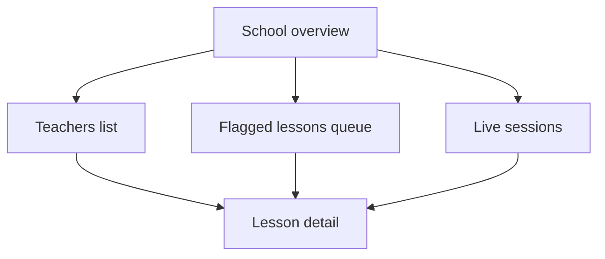

# Admin Live Dashboard — Wireframes (S01-05)

**Status:** Draft v0.1  
**Owner:** Product  
**Date:** 2026-05-19  
**Audience:** School principal, university department head, assigned coaches  
**Product focus:** **Teacher pedagogy** monitoring (D-PEDAGOGY) — not per-student league tables

**Success metrics surfaced:** **M-A** coverage · **M-B** time-to-insight · **M-C** admin action on flags

---

## Information architecture



---

## Screen 1 — School overview (home)

**Purpose:** M-A — “Are we covering all classrooms?”

```text
+------------------------------------------------------------------+
| PedagogyX Admin          [School: ABC Public]    [Principal ▼]   |
+------------------------------------------------------------------+
| OBSERVATION COVERAGE (M-A)          TIME-TO-INSIGHT (M-B)        |
| 17 / 20 rooms this week  85%        Median: 12 min  (target <30)  |
| [=========>    ]                     [Preview vs Final legend]     |
+------------------------------------------------------------------+
| LIVE NOW (3)                    | FLAGGED — NEED REVIEW (M-C)    |
| Room 4 · Ms. Sharma · LIVE      | 5 open · 2 overdue >48h        |
| Room 7 · Mr. Patel · UPLOADING  | [Review queue →]               |
| Room 12 · Dr. Rao · PROCESSING  |                                |
+------------------------------------------------------------------+
| TEACHERS — PEDAGOGY INDEX (7-day rolling, preview)               |
| Name          | Sessions | Avg index | Talk ratio | Trend       |
| Ms. Sharma    | 5        | 72        | 68/32 T/S  | ↑           |
| Mr. Patel     | 4        | 61        | 81/19 T/S  | ↓ flagged   |
| ...           |          |           |            |             |
+------------------------------------------------------------------+
```

**Key elements:**

- Coverage bar = primary M-A widget
- Median minutes class-end → dashboard-ready = M-B
- Flagged queue with 48h SLA = M-C entry point
- Teacher table sorted by pedagogy index — **no student ranking column**

---

## Screen 2 — Live session monitor

**Purpose:** Supervision during class; hot-path preview only.

```text
+------------------------------------------------------------------+
| ← Back    LIVE · Room 4 · Ms. Sharma · Started 10:02 AM          |
+------------------------------------------------------------------+
| [ Video preview / placeholder ]  | PREVIEW METRICS (hot path)    |
|  (policy: admin view logged)     | Teacher talk: 71%             |
|                                  | Activity proxy: moderate       |
|                                  | Status: PRELIMINARY              |
+------------------------------------------------------------------+
| Upload: ████████░░ 82%   | Edge: Connected | Cloud: Processing   |
+------------------------------------------------------------------+
| [ End monitoring ]  [ Open full lesson when ready ]               |
+------------------------------------------------------------------+
```

**Labels:** All live scores marked **PRELIMINARY** until cold path completes (SYSTEM_ARCHITECTURE).

---

## Screen 3 — Lesson detail (teacher pedagogy)

**Purpose:** Authoritative review after cold path; evidence for coach conversation.

```text
+------------------------------------------------------------------+
| ← Teachers    LESSON · Ms. Sharma · 19 May · 45 min              |
+------------------------------------------------------------------+
| PEDAGOGY INDEX (authoritative)     74 / 100                      |
| Components: Talk balance · Engagement · Pacing · Questioning*    |
| *questioning = Phase 2 if ASR rubric ready                       |
+------------------------------------------------------------------+
| TIMELINE                                                          |
| [====|====|====|====|====|====|====|====|====|====]              |
|  ^ low engagement segment (click → clip)                          |
+------------------------------------------------------------------+
| EVIDENCE CLIPS                                                    |
| [Thumb] 12:04–12:18 · High teacher talk · [Play] [Add note]      |
| [Thumb] 28:00–28:45 · Student discussion · [Play] [Add note]       |
+------------------------------------------------------------------+
| COACHING NARRATIVE (LLM, OSS)                                     |
| Summary paragraph...  [Regenerate disabled in v1 pilot]           |
+------------------------------------------------------------------+
| ADMIN ACTIONS (M-C)                                               |
| [ Mark reviewed ]  [ Assign coach ]  [ Export PDF — audit log ]  |
+------------------------------------------------------------------+
```

---

## Screen 4 — Flagged lessons queue (M-C)

```text
+------------------------------------------------------------------+
| FLAGGED LESSONS                    Filter: [All] [Overdue 48h]     |
+------------------------------------------------------------------+
| □ Mr. Patel · 18 May · Index 48 · Low student talk · 26h ago     |
| □ Ms. K · 17 May · Index 52 · Anomaly · OVERDUE 52h  ← red      |
| □ ...                                                             |
+------------------------------------------------------------------+
| Bulk: [ Mark reviewed ]  [ Assign to coach ]                      |
+------------------------------------------------------------------+
```

**M-C metric:** % rows with `reviewed_at` within 48h of `flagged_at`.

---

## Mobile / smartboard constraint

Admin dashboard is **web-only** (Next.js); usable on principal laptop/tablet. **Not** required to render on classroom smartboard (teacher sees minimal capture status UI only).

---

## Accessibility & compliance

- Hindi + English UI labels (Phase 1 English OK; i18n hooks)
- Audit log on every video/score view (RBAC in SYSTEM_ARCHITECTURE)
- Consent banner reference on capture agent — not repeated here

---

## Open design questions

1. Show **department** roll-up for universities on same home screen?
2. Export format for government reporting (deferred)?

---

## References

- [PRD-v0.1-draft.md](PRD-v0.1-draft.md)
- [SUCCESS_METRIC_OPTIONS.md](../01-phase0-founder-interrogation/SUCCESS_METRIC_OPTIONS.md)
- [SYSTEM_ARCHITECTURE.md](../05-architecture/SYSTEM_ARCHITECTURE.md)
