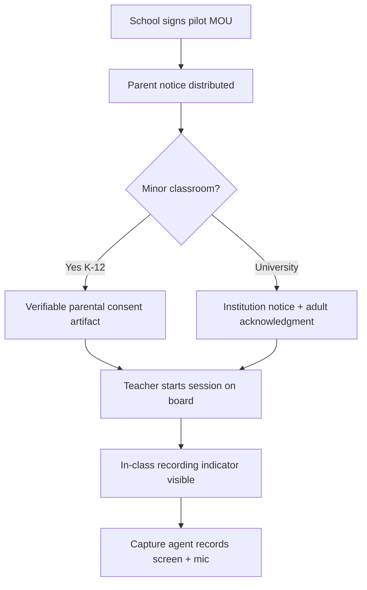

# Privacy Notice & Consent Flow — Wireframes (S02-05)

**Status:** Draft v0.1 — **pre-counsel placeholders** (replace text after G2 memo)  
**Owner:** Product + Compliance  
**Depends on:** [INDIA_DPDP_COUNSEL_ENGAGEMENT_BRIEF.md](../07-compliance-ethics/INDIA_DPDP_COUNSEL_ENGAGEMENT_BRIEF.md)  
**Not legal advice** — counsel must approve EN + HI copy before pilot.

---

## Flow overview



---

## Screen A — School admin: enable pilot site

**When:** Before first lesson capture at a site.

```text
+------------------------------------------------------------------+
| PedagogyX — Pilot site setup                                       |
+------------------------------------------------------------------+
| School: [________________________]  State: [________]            |
| DPIA status: [ Not started | Draft | Signed ]                    |
|                                                                    |
| [ ] Privacy notice EN uploaded (counsel-approved)                  |
| [ ] Privacy notice HI uploaded (counsel-approved)                |
| [ ] Recording policy acknowledged by principal                     |
|                                                                    |
| Consent mode:  ( ) K-12 minors — parental   ( ) University adults  |
|                                                                    |
| [ Save site ]   [ Cancel ]                                         |
+------------------------------------------------------------------+
```

**Data captured:** `school_id`, `dpia_version`, `notice_version_en`, `notice_version_hi`, `consent_mode`.

---

## Screen B — Parent / guardian notice (K-12)

**Channel:** SMS link, printed QR, or school portal — **counsel picks channel**.

```text
+------------------------------------------------------------------+
| [School logo]  ABC Public School — Classroom observation pilot      |
+------------------------------------------------------------------+
| WHAT WE RECORD                                                    |
| • Teacher screen and microphone during lessons                      |
| • Purpose: improve teaching practice (not student grades)         |
|                                                                    |
| WHO CAN SEE IT                                                    |
| • School coaches and administrators you already trust             |
|                                                                    |
| YOUR CHOICES                                                      |
| [ Read full notice EN ]  [ पूरी सूचना HI ]                         |
|                                                                    |
| [ I consent for my child’s classroom ]   [ I do not consent ]     |
|                                                                    |
| Child: [dropdown class/section]   Parent name: [______________]    |
| OTP / signature: [ counsel-defined field ]                        |
+------------------------------------------------------------------+
```

**Placeholder IDs stored:** `consent_artifact_id`, `parent_phone_hash`, `timestamp`, `notice_version`.

---

## Screen C — Teacher: start lesson (smartboard)

**When:** Teacher taps **Start lesson** on Windows/Android client.

```text
+------------------------------------------------------------------+
|  ● REC  PedagogyX — Lesson capture                                 |
+------------------------------------------------------------------+
| This session may be recorded for professional development.         |
| A visible indicator must stay on screen during capture.            |
|                                                                    |
| Room: [ 4 ]   Subject: [ Math ]   Duration est: [ 45 min ]       |
|                                                                    |
| [ Start recording ]              [ Cancel ]                        |
+------------------------------------------------------------------+
|  ████  Recording indicator (always on top, min 48×48 dp)         |
+------------------------------------------------------------------+
```

**Rules (engineering):**

- Block **Start** if site `dpia_status != signed` or consent mode incomplete (configurable post-counsel).
- Show **bilingual** one-line notice on indicator strip (EN + HI snippets from counsel).

---

## Screen D — In-class recording indicator (persistent)

```text
┌─────────────────────────────┐
│ ● Recording · PedagogyX      │
│ Professional development only │
└─────────────────────────────┘
```

Position: top-right overlay; cannot be dismissed while session active.

---

## Screen E — Opt-out / pause (teacher)

```text
+------------------------------------------------------------------+
| Pause capture?                                                    |
| Upload will stop; partial lesson may still process if already sent.|
| [ Pause 5 min ]  [ End lesson ]  [ Report problem ]                |
+------------------------------------------------------------------+
```

---

## Counsel deliverables mapping

| Wireframe | Counsel question (brief §)               |
| --------- | ---------------------------------------- |
| B         | §1 verifiable parental consent           |
| C–D       | §14 notice + in-class indicator language |
| A         | §6 school-as-fiduciary vs vendor roles   |

After G2: replace bracketed placeholders with approved `PRIVACY_NOTICE_EN.md` / `PRIVACY_NOTICE_HI.md` (off-repo or `docs/07-compliance-ethics/` if counsel permits).

---

## References

- [INDIA_DPDP_ARCHITECTURE.md](../07-compliance-ethics/INDIA_DPDP_ARCHITECTURE.md)
- [ADMIN_LIVE_DASHBOARD_WIREFRAMES.md](ADMIN_LIVE_DASHBOARD_WIREFRAMES.md)
- [SPRINT_02_PLAN.md](../09-agile/SPRINT_02_PLAN.md) — S02-05
