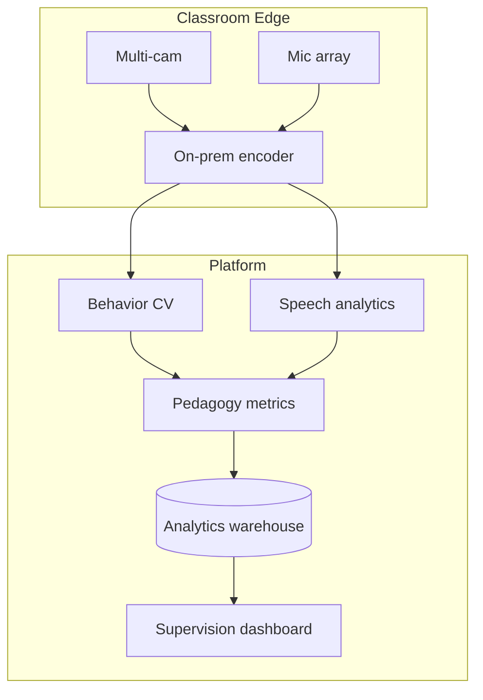

# Competitor Analysis: China Smart Classroom / AI Supervision Systems

**Status:** Draft | **Sensitivity:** High — ethics divergence from PedagogyX default posture

## Executive Summary

Chinese **智慧课堂** and **AI巡课督导** systems deliver **full-stack multimodal analytics**—teacher/student behavior CV, speech emotion, Flanders/S-T charts, real-time dashboards—often framed as **quality supervision** rather than teacher-owned coaching.

---

## Representative Capabilities **[FACT / vendor claims]**

| Capability         | Examples                                                                                                   |
| ------------------ | ---------------------------------------------------------------------------------------------------------- |
| Teacher behavior   | Teaching, board writing, questioning, movement                                                             |
| Student behavior   | Hand raise, head-up rate, attention, on/off-task                                                           |
| Speech analytics   | Speed, word frequency, emotion, sensitive phrases                                                          |
| Pedagogical models | Flanders interaction, S-T mapping                                                                          |
| CV stack           | YOLO variants, LSTM temporal modeling (Tencent article cites YOLOv12, 96.8% lab accuracy)                  |
| Scale              | Reports of 320 classrooms / 12 schools (Shenzhen pilot, Tencent); 50 schools / 9 districts (益课 platform) |

---

## Vendors / References (non-exhaustive)

- 中视天威 — AI巡课督导, AI智学分析
- 讯维 — 课堂教学分析
- 腾讯云 — 课堂教学智慧评价
- 华中师大国家数字化学习中心 — 益课智能教学分析平台

---

## Inferred Architecture

**Characteristics:** Real-time or near-real-time, **government-visible** dashboards, integrated recording systems.

---

## Strengths

- **Deepest multimodal feature breadth** commercially
- **District/national rollup** analytics
- Hardware + software **turnkey** deployments
- Strong CV research integration

## Weaknesses (Western market)

- **GDPR/FERPA/union** incompatibility for student biometrics
- **Teacher trust** deficit if used for performance management
- **Export restrictions** and data sovereignty
- Overclaim risk on **lab accuracy → real classroom**

---

## PedagogyX Strategic Choice

**[ASSUMPTION]** PedagogyX **learns technical patterns** (multi-modal fusion, temporal behavior models) but **rejects supervision-default UX** and student biometric scoring unless explicit opt-in jurisdictions.

---

## Sources

- https://cloud.tencent.com/developer/article/2615341
- https://www.bjzstw.com/system/product.html?id=492
- https://nercel.ccnu.edu.cn/info/1331/7181.htm
