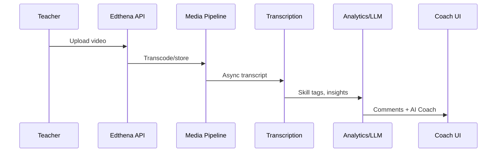

# Competitor Analysis: Edthena

**Status:** Draft | **Category:** US K-12 video coaching + AI coach

## Executive Summary

Edthena is a mature **video-based professional learning** vendor. Recent evolution (**VC3**, **AI Coach**) moves from pure collaboration toward **on-demand AI-guided reflection**, while preserving district-scale dashboards.

---

## Product Surface **[FACT]**

- **VC3:** Record (any device, no app required per marketing), upload, share, timestamped comments, skill-tagged feedback, transcripts, auto-insights from transcript, proficiency tracking, org dashboards.
- **AI Coach (2025):** Self-paced modules (practices, Science of Reading, math), action planning, impact assessment, unlimited on-demand coaching; admin dashboards with privacy framing.
- Awards: TIME Best Inventions 2025, SmartBrief Innovation Awards (vendor-reported).

---

## Inferred Architecture

| Layer | Inference | Confidence |
|-------|-----------|------------|
| Client | Web-first upload; mobile browser capture | High |
| Media | Cloud transcode + CDN playback | High |
| ASR | Transcript-driven insights | High |
| Analytics | NLP on transcript > classroom CV | Medium |
| AI Coach | LLM orchestration + structured PD modules | Medium |
| Multi-tenancy | District/school hierarchy | High |

**Pipeline hypothesis:**

---

## Strengths

- **Workflow maturity** — coaching loops, not just AI gimmicks
- **Low friction capture** — no app requirement reduces IT friction
- **Privacy-aware admin story** for AI Coach
- **Standards-aligned skill tagging**

## Weaknesses / Gaps

- Limited public evidence of **deep multimodal CV** (engagement heatmaps, board OCR)
- **Real-time coaching** not core (vs IRIS Go Live)
- **International / multilingual** depth unclear
- AI Coach risks **generic LLM feedback** without clip-level grounding

---

## Business Model **[FACT]**

B2B SaaS to schools/districts; professional development budget line.

---

## PedagogyX Differentiation Opportunities

1. **Multimodal evidence bundles** (slide + speech alignment) with citations
2. **Configurable privacy tiers** stronger than transcript-only competitors
3. **Open benchmarks** on instructional constructs (talk ratio, dialogic moves)
4. **Coach-in-the-loop** agent editing (not fully autonomous PD)

---

## Sources

- https://www.edthena.com/new-vc3-video-coaching-for-teachers/
- https://www.edthena.com/ai-coach-for-teachers
