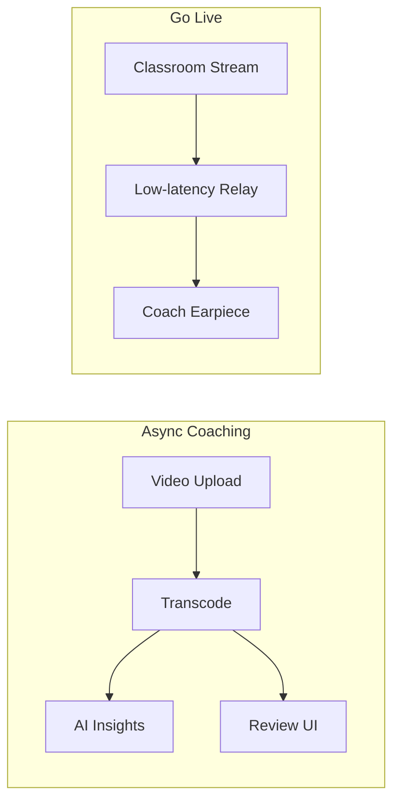

# Competitor Analysis: IRIS Connect

**Status:** Draft | **Category:** Global classroom video PD + live coaching

## Executive Summary

IRIS Connect combines **secure video capture**, **structured pathways**, and **live remote coaching**—a differentiated **synchronous** capability rare among US competitors.

---

## Product Surface **[FACT]**

- Record app + optional **recording kits**
- Encrypted cloud accounts, selective sharing, time-linked comments
- **Go Live:** remote observation + in-ear coaching
- **Adaptive pathways** — expert frameworks, progress tracking
- **AI insights** on teaching practice (details proprietary)
- 100,000+ educators, 50+ countries (vendor claim)
- GDPR compliance emphasized (UK origin)

---

## Inferred Architecture

| Subsystem      | Notes                                                    |
| -------------- | -------------------------------------------------------- |
| Edge capture   | App + hardware kits sync to cloud                        |
| Real-time path | WebRTC or similar for Go Live — **low latency critical** |
| Async path     | Standard upload → transcode → review                     |
| PD platform    | LMS-like pathways, not just media                        |

---

## Strengths

- **Live coaching** moat
- **Hardware + software** bundle for consistent capture
- **International footprint**
- Strong **privacy** marketing for EU

## Weaknesses

- Hardware dependency increases **deployment friction**
- AI transparency limited publicly
- May be **coaching-first**, weaker on quantitative district analytics vs China platforms

---

## PedagogyX Implications

- Treat **Go Live** as Phase 3+ unless founder mandates real-time in v1
- Partner or integrate with hardware vendors vs building kits early
- Match **pathway-based PD** with richer multimodal evidence

---

## Sources

- https://www.irisconnect.com/us/video-technology/
- https://www.irisconnect.com/us/lesson-observation/
