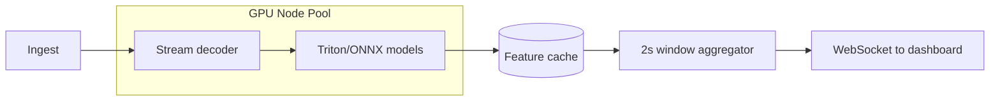

# AI / ML Architecture v0.2 (India Supervision)

**Status:** Draft — multi-cam + real-time + identifiable students

---

## v1 Model Stack (Founder-Aligned)

| Stream | Models / techniques | Hot | Cold |
|--------|---------------------|-----|------|
| `audio_mic` | ASR (Whisper-class), diarization, talk ratio | Yes | Yes |
| `screen` | Slide OCR, UI change detection, app classification | Partial | Yes |
| `cam_*` | Person detect, pose, hand-raise, head-up proxy | Yes | Yes |
| Fusion | Temporal transformer / rules (Flanders/S-T proxies) | Heuristic | Full |
| LLM | Rubric narrative, lesson summary | Optional live | Yes |

**Languages:** English + Hindi ASR **[ASSUMPTION]** until D-11 confirmed.

---

## Pedagogy Index (Admin Score) — Draft Components

**[HYPOTHESIS]** Composite index for dashboards:

| Component | Weight (TBD) | Source |
|-----------|----------------|--------|
| Teacher talk ratio | 15% | Audio |
| Student talk ratio | 15% | Audio |
| Interaction density | 15% | CV + audio |
| Pacing / silence gaps | 10% | Audio |
| Board/slide utilization | 15% | Screen |
| Student attention proxy | 20% | Multi-cam CV |
| Question rate (instructional) | 10% | NLP |

**Risk:** Publishing single score without validity study — document as **indicative** until efficacy RCT.

---

## Real-Time Inference Architecture

**SLO draft (hot path):**

- Preview talk ratio: p95 < **8s** delay
- Activity labels: p95 < **5s**
- GPU autoscale on concurrent classrooms per school

---

## Identifiable Student Processing

**[FOUNDER DECISION]** Face/body tracks may persist per session for analytics.

Mitigations:

- Session-scoped pseudonymous track IDs (not national ID)
- No cross-lesson student identity **unless** school enables SIS linkage **[ASSUMPTION: default OFF]**
- Retention TTL on face embeddings

---

## LLM Policy (D-12 unresolved)

| Option | India fit |
|--------|-------------|
| Self-hosted Llama/Mistral on GPU | Best if D-12 forbids cloud |
| Azure OpenAI India region | If counsel approves DPA |
| No LLM on raw video frames | Redact to text + slide text only |

**Default implementation:** LLM inputs = **transcript + structured metrics JSON** only (no raw child images in prompt).

---

## Eval Priorities (Revised)

1. Multi-stream sync accuracy (ms drift)
2. Hot vs cold score divergence (must be < ε or UI warns)
3. Hindi/English code-switch WER
4. Indian classroom layout CV (bench rows, fan noise)
5. Admin score stability week-over-week
