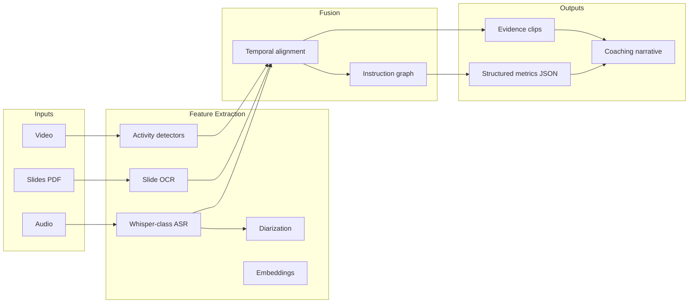
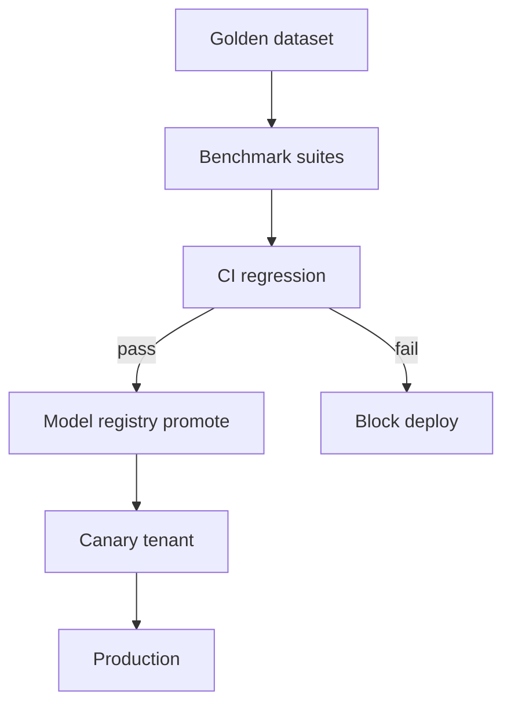

# AI / ML Architecture v0.1

**Status:** Draft

---

## Model Layers (Tiered Product)

| Tier | Modality | Models (indicative) | Cost |
|------|----------|---------------------|------|
| **T0** | Audio | ASR + diarization + talk metrics | $ |
| **T1** | Audio + slides | + slide OCR/embedding alignment | $$ |
| **T2** | Single-camera video | + activity detection, teacher pose | $$$ |
| **T3** | Multi-cam + board | + fusion, engagement proxies | $$$$ |

**[ASSUMPTION]** Ship **T0→T1** before T3.

---

## ML Pipeline

---

## Temporal Alignment Strategy

**[HYPOTHESIS]** Master timeline = **audio waveform clock** (sample-accurate), with video frame timestamps and slide change events snapped via cross-correlation on speech ↔ slide titles.

| Signal | Timestamp source |
|--------|------------------|
| Utterances | ASR word timestamps |
| Slide change | PDF metadata / vision diff |
| Board writing | OCR change detection |
| CV events | Frame index → audio clock |

---

## Coaching Agent (LLM) Guardrails

1. **Retrieve** only from lesson artifacts + district rubric docs (RAG)
2. **Require citations** — `[mm:ss]` links to clip URLs
3. **Schema-constrained JSON** intermediate (metrics → narrative)
4. **Secondary critic model** or rule checks for unsupported claims
5. **Human approval** before admin-visible release

**[FACT]** Hallucination in education feedback is high-liability.

---

## Eval Pipeline (MLOps)

**Benchmark suites (build):**

| Suite | Metrics |
|-------|---------|
| ASR | WER, diarization DER |
| Talk ratio | MAE vs human coders |
| Questions | F1 (Donnelly baseline ~0.59 utterance) |
| Coaching | Human rubric: groundedness, actionability |
| CV | mAP per behavior (if enabled) |

---

## Model Sourcing Strategy

| Component | Build | Buy | Open weights |
|-----------|-------|-----|--------------|
| ASR | Fine-tune | Deepgram/AWS | Whisper |
| Diarization | Fine-tune | — | pyannote |
| NLP discourse | Train | — | DeBERTa-class |
| CV | Train | — | YOLO/DETR |
| Coaching LLM | Prompt+RAG | API (restricted) | Llama on GPU |

**[ASSUMPTION]** No training on identifiable student data without contract + IRB.

---

## Long-Context Video **[HYPOTHESIS]**

For 45–90 min lessons:

- **Hierarchical:** segment → clip embeddings → lesson summary transformer
- **Do not** naive full-attention on 1080p所有 frames
- Explore Video-LLM for **coach Q&A** only, not autonomous scoring

---

## Knowledge Graph (Phase 2+)

Nodes: `Lesson`, `Activity`, `Utterance`, `RubricSkill`, `Standard`, `EvidenceClip`  
Edges: `demonstrates`, `violates`, `precedes`, `correlates`

Store: Postgres JSONB first; Neo4j if query complexity demands.
