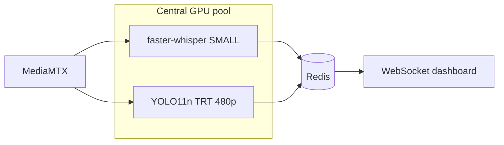

# AI / ML Architecture v0.4 (Central OSS Inference)

**Status:** Draft — ML on **central servers**; RTX 5070 **dev/benchmark only**; clients do not run models  
**Refs:** [OSS_STACK_REFERENCE.md](../06-stack-evaluation/OSS_STACK_REFERENCE.md), [GPU_BUDGET_RTX5070.md](GPU_BUDGET_RTX5070.md)

## Deployment split

| Where                            | What runs                                     |
| -------------------------------- | --------------------------------------------- |
| **Android / Windows smartboard** | Capture, encode, upload (optional Silero VAD) |
| **Central OSS backend**          | faster-whisper, YOLO, fusion, Ollama          |
| **Developer RTX 5070**           | Benchmark + export engines for backend        |

## v1 Model Stack (Founder-Aligned)

| Stream      | OSS model                                  | Hot (central GPU) | Cold (central GPU)    |
| ----------- | ------------------------------------------ | ----------------- | --------------------- |
| `audio_mic` | **faster-whisper** small→medium INT8       | Yes (small)       | Yes (medium/large-v3) |
| `screen`    | Frame diff + **PaddleOCR**/Tesseract (CPU) | CPU only          | Yes                   |
| `cam_1`     | **YOLO11n** TensorRT 480p                  | Yes (5 fps max)   | 720p batch            |
| `cam_2+`    | YOLO11n sequential                         | **No**            | Yes (queued)          |
| Fusion      | Python rules / sklearn                     | Heuristic         | Full                  |
| LLM         | **Ollama** Qwen2.5-7B-Q4                   | **No**            | Yes (exclusive VRAM)  |

**Languages:** English + Hindi ASR **[ASSUMPTION]** until D-11 confirmed.

---

## Pedagogy Index (Admin Score) — Draft Components

**[HYPOTHESIS]** Composite index for dashboards:

| Component                     | Weight (TBD) | Source       |
| ----------------------------- | ------------ | ------------ |
| Teacher talk ratio            | 15%          | Audio        |
| Student talk ratio            | 15%          | Audio        |
| Interaction density           | 15%          | CV + audio   |
| Pacing / silence gaps         | 10%          | Audio        |
| Board/slide utilization       | 15%          | Screen       |
| Student attention proxy       | 20%          | Multi-cam CV |
| Question rate (instructional) | 10%          | NLP          |

**Risk:** Publishing single score without validity study — document as **indicative** until efficacy RCT.

---

## Real-Time Inference (Central Server)

**SLO (hot path):** talk ratio p95 < 10s; cam1 5 fps max; drop cam if GPU saturated.

**Cold path:** final pedagogy index after overnight queue on same GPU.

## Identifiable Student Processing

**[FOUNDER DECISION]** Face/body tracks may persist per session for analytics.

Mitigations:

- Session-scoped pseudonymous track IDs (not national ID)
- No cross-lesson student identity **unless** school enables SIS linkage **[ASSUMPTION: default OFF]**
- Retention TTL on face embeddings

---

## LLM Policy (OSS + RTX 5070)

| Option                        | Status               |
| ----------------------------- | -------------------- |
| **Ollama / vLLM** on edge box | **Default**          |
| Cloud OpenAI / Azure          | **Out of core path** |
| Vision LLM                    | **Deferred** (VRAM)  |

**Default:** Qwen2.5-7B-Instruct Q4 via Ollama; inputs = transcript + metrics JSON only.

---

## Eval Priorities (Revised)

1. Multi-stream sync accuracy (ms drift)
2. Hot vs cold score divergence (must be < ε or UI warns)
3. Hindi/English code-switch WER
4. Indian classroom layout CV (bench rows, fan noise)
5. Admin score stability week-over-week
