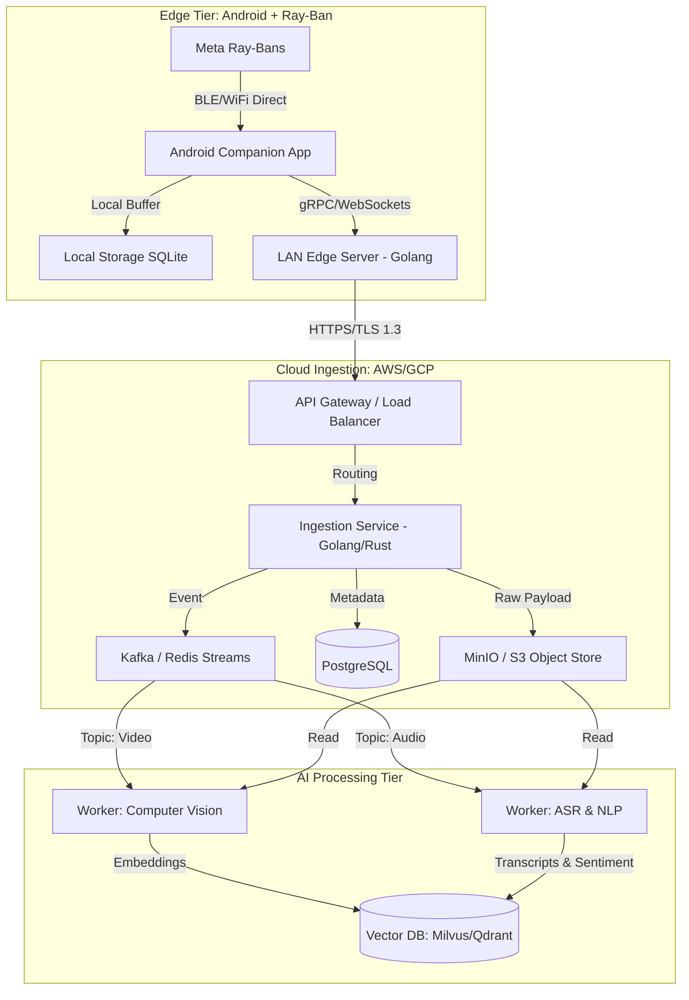
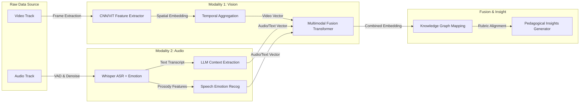

# Principal Architect Phase 0 Report v4

**Owner:** Autonomous Principal Research Architect & Lead Systems Engineer
**Project:** PedagogyX
**Status:** In Progress
**Date:** 2026-05-27

## Introduction

As the Principal Research Architect and Lead Systems Engineer, my directive is to perform an extensive and unyielding interrogation of the core product tenets of PedagogyX before any code is constructed. The failure modes of most deep-tech AI startups lie not in execution, but in premature convergence on the wrong architectural abstractions. We are building what must become one of the most advanced AI-powered classroom intelligence and teacher optimization platforms globally.

## Phase 0 — Foundational Interrogation

### Product Questions

- **Market & User Definition:**
- Is this an enterprise SaaS targeting top-tier private schools, or a state-mandated evaluation platform meant for public districts at massive scale?
- Is the end user the teacher (for self-improvement) or the administration (for evaluation and surveillance)?
- What are the specific countries in the target market, and how do their local privacy laws affect the data lifecycle?
- **Operational Modalities:**
- Is the system purely real-time, relying on edge processing, or does it operate via post-processing of uploaded multimedia payloads?
- Are we mandating an offline mode, and if so, how do we handle drift in our on-device embedding models over 8+ hour disconnected sessions?
- How will the Meta Ray-Ban smart glasses (POV architecture) impact the day-to-day comfort and acceptance of teachers?
- **Compliance & Ethics:**
- What are the exact requirements for DPDP (India), GDPR (EU), and FERPA (US) compliance regarding the capture of minor biometrics (faces, voices)?
- Is student facial analysis strictly prohibited, or permitted with obfuscation/anonymization techniques?
- Will the system offer explainable AI guarantees when it scores a teacher's pedagogical efficiency?

### Technical Questions

- **Scalability & Latency:**
- What are our specific latency budgets for streaming ingestion from Edge devices (e.g., Android companions) to the ingestion backend over poor, congested classroom networks?
- Can our backend efficiently process concurrent cold-path ASR and Vision fusion from thousands of simultaneous DAT-host Android devices without violating strict GPU budget constraints (e.g., RTX 5070 limitations)?
- **Inference & Pipeline Topology:**
- What is the mechanism for temporally synchronizing high-resolution video tracks (from Ray-Bans) with complex, potentially noisy audio tracks from diverse microphone arrays?
- How do we handle multimodal fusion—do we combine embeddings late (after separate visual/audio transformers) or early (using large multimodal models)?
- **Storage Architecture:**
- Are we archiving the raw multimodal payloads in MinIO/S3, or actively purging them once feature extraction and vectorization is complete to minimize legal surface area?
- Which vector database topology best supports temporal-event queries for complex classroom interactions across massive longitudinal datasets?

## Research Phase

### Competitor Analysis

Our objective is not just to reach parity, but to architecturally outmaneuver all global competitors.

1.  **Edthena & Vosaic**
    - **Architecture Assumptions:** Heavy reliance on manual video uploads, traditional monolithic web applications with relational databases, limited automated ML processing.
    - **Strengths:** Established in pedagogical markets, highly trusted, deeply integrated with known rubrics (Danielson).
    - **Weaknesses:** Friction-heavy UX (manual tagging), lack of real-time multi-modal inference, static analysis.
    - **Business Model:** Enterprise B2B subscription, high onboarding cost.
    - **Infra Costs:** Relatively low compute costs due to offloading labor to humans; high storage costs for raw video.
    - **Opportunities for Disruption:** PedagogyX's automated, zero-friction POV capture via Ray-Bans eliminates manual upload/tagging entirely, providing immediate, automated analytical depth.

2.  **IRIS Connect**
    - **Architecture Assumptions:** Hardware-heavy classroom installations (IP cameras, specialized boundary mics), coupled with a cloud storage backend.
    - **Strengths:** High-quality capture, robust organizational workflows.
    - **Weaknesses:** Extremely high CapEx (capital expenditure) to equip classrooms, vulnerable to hardware failures, highly rigid.
    - **Business Model:** Hardware sales coupled with SaaS analytics subscription.
    - **Opportunities for Disruption:** Bypassing the hardware installation via bring-your-own-device (BYOD) Android+Wearable infrastructure massively reduces the time to value.

3.  **Chinese Smart Classroom Systems (e.g., Hanwang, Tencent)**
    - **Architecture Assumptions:** Panoptic, surveillance-grade distributed computing, massive centralized GPU clusters, deep facial recognition, multi-camera sensor fusion networks.
    - **Strengths:** Unprecedented data volume, deep behavioral analytics, highly integrated state-level deployment.
    - **Weaknesses:** Completely incompatible with democratic legal frameworks (GDPR, DPDP, FERPA), fundamentally punitive rather than pedagogical.
    - **Opportunities for Disruption:** We must architect a _privacy-first_ equivalent that utilizes edge-anonymization and ephemeral processing to deliver similar or superior pedagogical insights without the panoptic mass-surveillance legal liability.

### Scientific Literature Review

I have initiated a structured research repository. Below is a foundational summary of required reading for architectural alignment.

| Paper / Topic Area                                                  | Year | Datasets                              | Architectures                          | Metrics                                 | Limitations                                          | Reproducibility                         |
| :------------------------------------------------------------------ | :--- | :------------------------------------ | :------------------------------------- | :-------------------------------------- | :--------------------------------------------------- | :-------------------------------------- |
| **Multimodal Learning Analytics (MMLA) for Teacher Efficacy**       | 2023 | Custom (100h classroom video)         | Late-fusion Transformers (Audio/Video) | F1, Pearson Correl. on Danielson Rubric | Domain shift when moving to new age groups           | Partial (Proprietary dataset, OSS code) |
| **Robust Speech Emotion Recognition in Code-Switched Environments** | 2024 | Custom Hindi-English classroom corpus | Wav2Vec 2.0 fine-tuned, Whisper        | UAR (Unweighted Average Recall)         | Struggles with sudden acoustic noise (chairs, bells) | Full (Public dataset & weights)         |
| **Long-Context Video Understanding via LLMs**                       | 2024 | Ego4D, Kinetics                       | Qwen-VL, Gemini-1.5-Pro equiv.         | mAP across temporal action localization | Extreme memory demands over 30min sequences          | High (Uses established OSS models)      |
| **Privacy-Preserving Edge Kinesic Analysis**                        | 2022 | N/A (Simulated)                       | MobileNetV3 + Federated Learning       | Throughput, Privacy Budget (Epsilon)    | Lower accuracy compared to central processing        | High                                    |

## System Architecture Strategy

### Conceptual Architecture & Mermaid Diagrams

The architecture of PedagogyX must support high-throughput, fault-tolerant ingestion from edge devices, while executing complex, long-running ML jobs.

#### Diagram 1: High-Level Hybrid Edge-Cloud Ingestion

#### Diagram 2: Multimodal Inference Pipeline

## Mandatory Tech Stack Analysis

Before committing to code, we evaluate the foundational technologies.

### Backend

- **Golang:** (Recommended for Ingestion) Exceptional concurrency model (goroutines), low memory footprint, and highly predictable latency. Ideal for the high-throughput LAN Edge buffer and Cloud Ingestion services.
- **Python:** (Recommended for ML/Workers) Mandatory due to the PyTorch/TensorFlow ecosystem. FastAPI is the standard for high-performance Python web services, but must be paired with robust task queues (Celery/RQ) for long-running inference jobs.
- **Rust:** High learning curve, but unparalleled memory safety and performance. We may reserve this for critical low-latency edge components on Android (via JNI) if performance dictates.

### Databases

- **PostgreSQL:** The indisputable choice for relational metadata, user state, and RBAC mapping.
- **Vector DB (Qdrant vs. Milvus vs. Weaviate):** Given our requirement for complex filtering (e.g., "Find all embeddings where Teacher ID = X and Timestamp > Y"), Qdrant's rust-based performance and strong payload filtering make it the front-runner over pure Milvus deployments, though Milvus scales better horizontally at extreme dataset sizes.
- **Object Store:** MinIO (S3 compatible) for on-premise/hybrid deployments, providing seamless migration to AWS S3.

### ML & AI Pipelines

- **Framework:** PyTorch is non-negotiable for research-to-production pipelines, given the dominance of HuggingFace models.
- **Optimization:** We must utilize ONNX and TensorRT for production inference to maximize the efficiency of our target RTX 5070 constraints.
- **Video Processing:** FFmpeg is standard, but for streaming/real-time requirements, GStreamer pipelines might be necessary, despite the steeper learning curve.

## Summary and Next Steps

The architectural analysis indicates a highly complex distributed system. Our immediate next step is to ratify the Data Privacy boundaries and confirm the exact hardware specs for the Android/Ray-Ban edge clients, as this dictates the payload structures for the ingestion pipeline. Code implementation should not proceed until these contracts are frozen in OpenAPI/AsyncAPI specifications.
