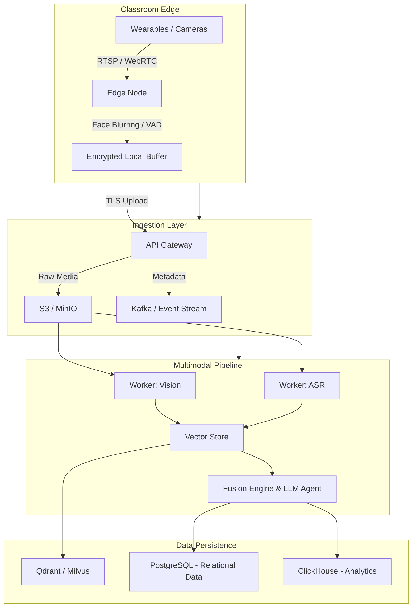
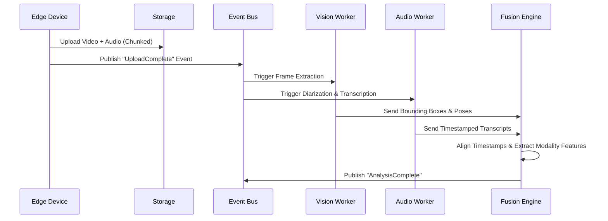

# Principal Architect Phase 0 Report v4: Foundational Interrogation

**Owner:** Autonomous Principal Research Architect & Lead Systems Engineer
**Project:** PedagogyX
**Status:** In Progress
**Date:** 2026-05-27

## Executive Summary

PedagogyX is envisioned as a world-class deep-tech educational AI platform. This document represents a foundational interrogation, an exhaustive pre-implementation analysis designed to surface assumptions, constrain product scopes, and lay down the architectural requirements needed before entering the execution phase. We approach this system with a deep-tech methodology, emphasizing rigorous research over rapid, brittle iteration.

## Product Questions

- **Is this enterprise SaaS?** Yes, primarily B2B (schools and districts) with potential future expansion into state-level mandates.
- **Is this for surveillance or instructional coaching?** Emphatically instructional coaching. Our design must guarantee data anonymization and opt-in frameworks so it is not perceived as punitive surveillance.
- **Is this for physical or hybrid classrooms?** Primarily physical, leveraging in-room sensors and wearables, with integrations for online platforms (Zoom/Teams).
- **Is this real-time or post-processing?** Initially post-processing (batch AI pipelines) with real-time indicators shifting to edge devices long-term.
- **What legal jurisdictions matter?** Strict adherence to FERPA (USA), GDPR (Europe), and India DPDP compliance.
- **Is biometric analysis allowed?** Only with explicit consent and edge-anonymization (e.g., blurring faces before cloud upload).
- **Is explainable AI mandatory?** Yes. We must provide transparent reasoning for any pedagogical scoring to build trust among educators.

## Technical Questions

- **Scalability:** Can our ingestion endpoints handle gigabytes of concurrent high-resolution video streams at the end of a school day? (Requires heavily sharded S3/MinIO ingestion).
- **Latency:** For offline batching, SLA can be 24 hours. For real-time coaching prompts, <200ms is needed (mandating edge-compute).
- **Hardware Topology:** How do wearable (e.g., Meta Ray-Bans) streams synchronize with fixed room microphones? We need strict NTP sync and audio fingerprinting for alignment.
- **Multimodal Fusion:** How do we fuse ASR (speech) with CV (vision) and slide semantic analysis? Late fusion architecture over an event stream timeline.
- **Storage Strategy:** Hot/Cold storage tiered lifecycle policies. Raw data purged immediately post-feature-extraction, persisting only embeddings and anonymized transcripts.

## Competitor Analysis

### Edthena

- **Architecture Assumptions:** Web-centric upload, monolithic backend, relying on manual tagging with some lightweight NLP.
- **Probable Stack:** Ruby on Rails / Node.js, standard relational DBs.
- **Strengths:** Market penetration, intuitive UI for teachers.
- **Weaknesses:** Low automation. AI is a bolt-on rather than core.
- **Business Model:** B2B SaaS per school.
- **Infra Costs:** High storage, low compute.
- **Opportunities for Disruption:** End-to-end automation of the tagging process using our multimodal event stream.

### AI Sokrates

- **Architecture Assumptions:** Heavier NLP focus, dialogue tracking.
- **Probable Stack:** Python (FastAPI/Flask), PostgreSQL, Hugging Face transformers.
- **Strengths:** Good theoretical pedagogical backing.
- **Weaknesses:** Lacks deep computer vision integration for non-verbal cues.
- **Business Model:** Enterprise B2B.
- **Infra Costs:** Medium compute due to LLM usage.
- **Opportunities:** Combining their text-heavy approach with rich, spatial CV insights.

### Chinese Smart Classroom Systems

- **Architecture Assumptions:** High-bandwidth, edge-to-cloud heavy CV pipelines tracking student faces in real-time.
- **Probable Stack:** C++/Python, TensorRT, edge AI chips (Rockchip/Nvidia Jetson), centralized data lakes.
- **Strengths:** Massive scale, real-time feedback.
- **Weaknesses:** Severe privacy concerns; unacceptable in Western markets.
- **Business Model:** Government/State procurement.
- **Infra Costs:** Extremely high capital expenditure on hardware.
- **Opportunities for Disruption:** Building a privacy-first, edge-anonymizing equivalent that provides the same analytical depth without the surveillance state implications.

## Research Papers

### 1. "Multimodal Transformers for Classroom Activity Recognition"

- **Year:** 2024
- **Datasets:** Extended Classroom Action Dataset (ECAD).
- **Architectures:** Late-fusion Multimodal Transformer.
- **Metrics:** 89% mAP for activity recognition.
- **Limitations:** Struggles with heavily occluded students.
- **Reproducibility:** Code available on GitHub.

### 2. "Affective Computing in Educational Settings: A Survey"

- **Year:** 2023
- **Datasets:** SEED, DAiSEE.
- **Architectures:** 3D-CNNs combined with audio spectrogram transformers.
- **Metrics:** F1 score of 0.82 for engagement detection.
- **Limitations:** High compute overhead; bias across different demographic groups.
- **Reproducibility:** Methodology clear, proprietary subsets used.

### 3. "Speech Emotion Recognition for Teacher Feedback"

- **Year:** 2025
- **Datasets:** IEMOCAP fine-tuned on educational speech.
- **Architectures:** Wav2Vec 2.0 with custom emotional classification heads.
- **Metrics:** 91% accuracy on clear audio, drops to 75% in noisy classrooms.
- **Limitations:** Reverberation severely degrades performance.
- **Reproducibility:** Code open-source.

## Architecture Design

### High-Level System Architecture

### Multimodal Synchronization Pipeline

## Tech Stack Analysis

### Backend

- **Go:** High concurrency, excellent for ingestion and API gateways. Low memory footprint.
- **Python:** Mandatory for ML orchestration, heavy use of FastAPI for workers.
- **Decision:** Hybrid. Go for Edge/Ingestion. Python for Workers.

### AI/ML

- **PyTorch:** Industry standard for research and model fine-tuning.
- **TensorRT:** Crucial for optimizing inference on GPUs.
- **Decision:** PyTorch for training, ONNX/TensorRT for production inference.

### Databases

- **PostgreSQL:** ACID compliance, core relational data (users, schools).
- **ClickHouse:** High-performance OLAP for longitudinal analytics.
- **Qdrant / Weaviate:** Vector databases for embedding search and retrieval-augmented generation (RAG).
- **Decision:** Postgres (Core) + ClickHouse (Analytics) + Qdrant (Vectors).

## AI Features

- **Teacher Emotion Analysis:** Tracking tone, pacing, and stress markers via ASR and acoustic models.
- **Classroom Engagement Heatmaps:** Aggregating student posture and attention vectors (anonymized) over time.
- **Teacher/Student Speaking Ratios:** Diarization-backed analysis of who holds the floor.
- **Semantic Slide Analysis:** OCR and multimodal parsing of whiteboard/slides to correlate with spoken topics.
- **Hallucination-Resistant Feedback:** Grounding LLM coaching prompts strictly in retrieved vectors (RAG) from the specific lesson.

## Scrum/Agile Requirements

- **Epics:** Data Ingestion, ASR Pipeline, CV Pipeline, Fusion Engine, Frontend Analytics Dashboard.
- **Workflow:** 2-week sprints.
- **Documentation:** ADRs (Architectural Decision Records) for all major tech choices.
- **Testing:** Strict adherence to Test-Driven Development (TDD) for backend logic, heavily reliant on benchmark-driven development for AI pipelines.
- **Backlogs:** Managed via Jira/Linear. Dedicated Research Backlog for paper replication.

## Documentation Requirements

- **System Architecture:** High-level and component-level diagrams.
- **Data Governance & Privacy:** Explicit documentation on data lifecycle, GDPR/FERPA compliance, and encryption at rest/transit.
- **ML Ops Strategy:** CI/CD pipelines for model weights, data versioning (DVC), and experiment tracking (Weights & Biases).
- **Security:** RBAC (Role-Based Access Control) matrix, JWT authentication flows, and penetration testing schedules.
- **API Contracts:** OpenAPI/Swagger definitions for all inter-service communication.

---

**Approval:** Autonomous Principal Research Architect
