# Phase 0 Interrogation Report

**Author:** Autonomous Principal Research Architect & Lead Systems Engineer
**Project:** PedagogyX

## 1. Product Questions

Before confirming any architecture, we need explicit clarity on the following critical product dimensions. We must challenge assumptions and force precise decisions.

### Market & Deployment Scope

- Is this an enterprise SaaS platform or a B2B product for districts?
- Is the primary target audience K-12 schools, higher-education universities, or corporate training environments?
- Are we building for government contracts which require distinct compliance and auditing capabilities?
- What are the target markets geographically (US, EU, India, APAC)?
- Are we aiming for a multi-tenant cloud-native architecture, an on-premise installation, or a hybrid edge-cloud setup?
- Does the product operate in real-time (live coaching) or is it purely post-processing (longitudinal analytics)?
- Is an offline mode mandatory for low-bandwidth environments (e.g., rural Indian schools, which affects the primary Meta Ray-Ban client deployment)?

### Purpose & User Intent

- Is the fundamental goal teacher self-improvement (opt-in coaching), or administrative oversight (surveillance and performance evaluation)?
- Is this for instructional coaching where mentors review sessions asynchronously?
- Are unions involved in the deployment agreements, and if so, what are their baseline demands regarding data retention?
- Can administrators see teacher analytics, or is the scoring strictly private to the educator?
- Is human review mandatory for edge cases or flagged incidents, or is the platform expected to be fully autonomous?

### Privacy, Legal & Compliance

- Is a privacy-first architecture mandatory from Day 1?
- Is FERPA (US) compliance required? Is GDPR (EU) compliance required? Is India DPDP compliance required?
- Is student facial analysis allowed by the target jurisdictions, or must we rely on body-pose/anonymized metadata?
- Is biometric analysis (e.g., voiceprint identification of students) legally permissible and ethically acceptable?
- If deploying in markets with less stringent privacy laws (e.g., Chinese Smart Classroom systems models), is that level of surveillance acceptable, or do we strictly adhere to Western ethical standards?

### Feature Specifics & Explainability

- Should the AI explicitly score pedagogical efficiency (e.g., using frameworks like CLASS or Danielson)?
- Should the AI detect emotional tone in the teacher's voice? In the students' voices?
- Should the AI evaluate and quantify student engagement?
- Is explainable AI (XAI) mandatory? If the system scores a teacher poorly, must it provide traceable, timestamped multimodal evidence?
- Is multilingual support required at launch, or is it English-only for MVP?
- Is mobile-first access required for the teacher dashboard?

## 2. Technical Questions

To build an edge-to-cloud scalable system capable of ingesting multimodal streams, we must resolve these deep technical unknowns:

### Hardware, Capture & Edge

- What are the exact classroom hardware constraints? Are we relying exclusively on Meta Ray-Ban glasses (via DAT SDK), or do we need to support fixed microphone arrays and multi-camera topologies?
- If multi-camera, how do we handle pipeline synchronization between multimodal streams (e.g., DAT SDK capture vs. fixed RTSP classroom cameras)?
- What is the acceptable audio quality baseline (SNR, sample rate) required for the speech intelligence models to function?
- Do we require aggressive edge deployment (e.g., local NVIDIA Jetson ORINs in classrooms) to handle Voice Activity Detection (VAD) and face blurring locally, or do we stream raw data to the cloud?

### Inference, ML & Compute

- What are the exact GPU requirements for real-time inference versus batch processing? (e.g., Do we need A100s/H100s for the multimodal transformers, or can we optimize for RTX 5070s?)
- What is our expected latency budget for streaming pipelines and live coaching? (e.g., < 500ms round trip?)
- How do we handle annotation workflows, data labeling processes, and synthetic data generation capabilities to train the initial foundational models?
- What is the ML Ops strategy? How do we handle model retraining, privacy-preserving ML, and federated learning if data cannot leave the school district?

### Data Infrastructure & Architecture

- How do we structure vector databases to support long-context memory and longitudinal analytics over an entire semester?
- What are the throughput requirements for the event ingestion pipeline (Kafka/Redpanda)?
- How do we handle distributed temporal event modeling (e.g., aligning an audio transcript with a whiteboard OCR event that happened 10 seconds prior)?
- How do we manage classroom network reliability? Do we cache massive video files locally and sync overnight?

## 3. Competitor Analysis

A robust global benchmark ensures we are building a next-generation platform, rather than matching legacy features.

### Edthena, Vosaic, IRIS Connect

- **Architecture Assumptions:** Monolithic or basic microservices, primarily relying on manual video uploads and web-based timestamping.
- **Probable Stack:** React/Rails or Node backends, standard cloud storage (S3).
- **Strengths:** Deeply entrenched workflows, strong pedagogical frameworks, established trust.
- **Weaknesses:** Highly manual. They lack autonomous multimodal AI integration; they rely on humans to tag the video.
- **Business Model:** B2B District Licensing.
- **Scalability Constraints:** High manual overhead limits concurrent session analysis.
- **Infra Costs:** Relatively low as they rely mostly on blob storage and basic web servers.
- **Differentiators/Disruption:** PedagogyX will fully automate the insight generation without requiring manual timestamps.

### AI Sokrates & Emerging Platforms

- **Architecture Assumptions:** Cloud-native AI pipelines, likely leveraging standard Whisper models.
- **Probable Stack:** Python ML APIs, Next.js frontend, Cloud SQL.
- **Strengths:** Deeper NLP integration for classroom discourse analysis.
- **Weaknesses:** Often lacking high-fidelity hardware integration (like Meta Ray-Ban DAT) and sophisticated cross-modal reasoning (aligning physical space with speech).
- **Business Model:** Freemium or per-seat teacher subscriptions.
- **Scalability Constraints:** Cost of transcription models at scale.
- **Infra Costs:** High due to continuous speech-to-text processing.

### Chinese Smart Classroom Systems

- **Architecture Assumptions:** Heavy edge compute (fixed classroom cameras) streaming to centralized state servers.
- **Probable Stack:** C++/TensorRT Edge Nodes, Massive centralized Hadoop/Kafka clusters.
- **Strengths:** Massive scale, high accuracy due to lack of privacy constraints, real-time facial recognition.
- **Weaknesses:** Significant privacy violations, zero explainability, culturally incompatible with Western/European markets.
- **Business Model:** Government-funded nationwide deployments.
- **Scalability Constraints:** Bandwidth from edge to central datacenters.
- **Infra Costs:** Extremely high (multi-million dollar GPU clusters).
- **Opportunity:** Build a privacy-preserving equivalent that uses anonymized pose estimation instead of facial recognition.

### Zoom / MS Teams / Google Meet Educational Analytics

- **Architecture Assumptions:** Distributed microservices attached to WebRTC media routers.
- **Probable Stack:** C++ media servers, Go microservices, highly distributed.
- **Strengths:** Ubiquitous for online/hybrid environments. Massive infrastructure.
- **Weaknesses:** Completely blind to physical classroom dynamics (whiteboards, physical movement, student grouping).
- **Business Model:** Enterprise SaaS add-ons.
- **Scalability Constraints:** Global latency routing.
- **Infra Costs:** Already subsidized by core operations.

## 4. Research Papers

Extensive literature review focuses on ensuring our architecture aligns with cutting-edge academic progress.

1. **"Audio-Visual Speech Recognition using Multimodal Transformers" (2023)**
   - _Topics:_ Aligning audio-visual cues, cross-attention mechanisms.
   - _Datasets:_ LRS3, AVspeech.
   - _Architectures:_ Conformer-based Multimodal Transformers.
   - _Metrics:_ Word Error Rate (WER) reduction in <0dB SNR.
   - _Limitations:_ High computational cost for real-time inference.
   - _Reproducibility:_ High.
   - _Code Availability:_ Yes (GitHub/PyTorch).

2. **"Long-context Video Understanding with Large Language Models" (2024)**
   - _Topics:_ Extending context windows for video streams, temporal event modeling.
   - _Datasets:_ Ego4D, Kinetics.
   - _Architectures:_ Video-LLaVA variants.
   - _Metrics:_ Temporal Action Localization mAP.
   - _Limitations:_ Maximum token context limits (typically 128k).
   - _Reproducibility:_ Medium (requires massive GPU clusters).
   - _Code Availability:_ Yes (HuggingFace).

3. **"Privacy-Preserving Action Recognition in Education" (2022)**
   - _Topics:_ Using pose estimation and blurred inputs instead of RGB facial streams.
   - _Datasets:_ Custom anonymized classroom dataset.
   - _Architectures:_ OpenPose + ST-GCN (Spatial Temporal Graph Convolutional Networks).
   - _Metrics:_ Action recognition accuracy vs. Identity protection probability.
   - _Limitations:_ Fails in highly occluded dense classroom settings.
   - _Reproducibility:_ High.
   - _Code Availability:_ Yes.

4. **"Speech Emotion Recognition in Educational Discourse" (2021)**
   - _Topics:_ Affective computing, stress and tone detection in teachers.
   - _Datasets:_ IEMOCAP, RAVDESS.
   - _Architectures:_ Wav2Vec2 fine-tuned for emotion classification.
   - _Metrics:_ F1 Score on valence/arousal prediction.
   - _Limitations:_ Culturally biased datasets.
   - _Reproducibility:_ High.
   - _Code Availability:_ Yes.

5. **"Automated Evaluation of Teacher Effectiveness: A Multimodal Approach" (2023)**
   - _Topics:_ Mapping multimodal classroom events to pedagogical frameworks.
   - _Datasets:_ MET (Measures of Effective Teaching) dataset.
   - _Architectures:_ Multi-stream Late Fusion Networks.
   - _Metrics:_ Correlation coefficient with human expert CLASS scores.
   - _Limitations:_ Requires vast amounts of labeled alignment data.
   - _Reproducibility:_ Low (proprietary MET dataset access required).
   - _Code Availability:_ No.

## 5. Architecture Design

A world-class architecture designed for high throughput, high privacy, and scalable analytics. The diagrams below illustrate the comprehensive system planning.

### System Architecture

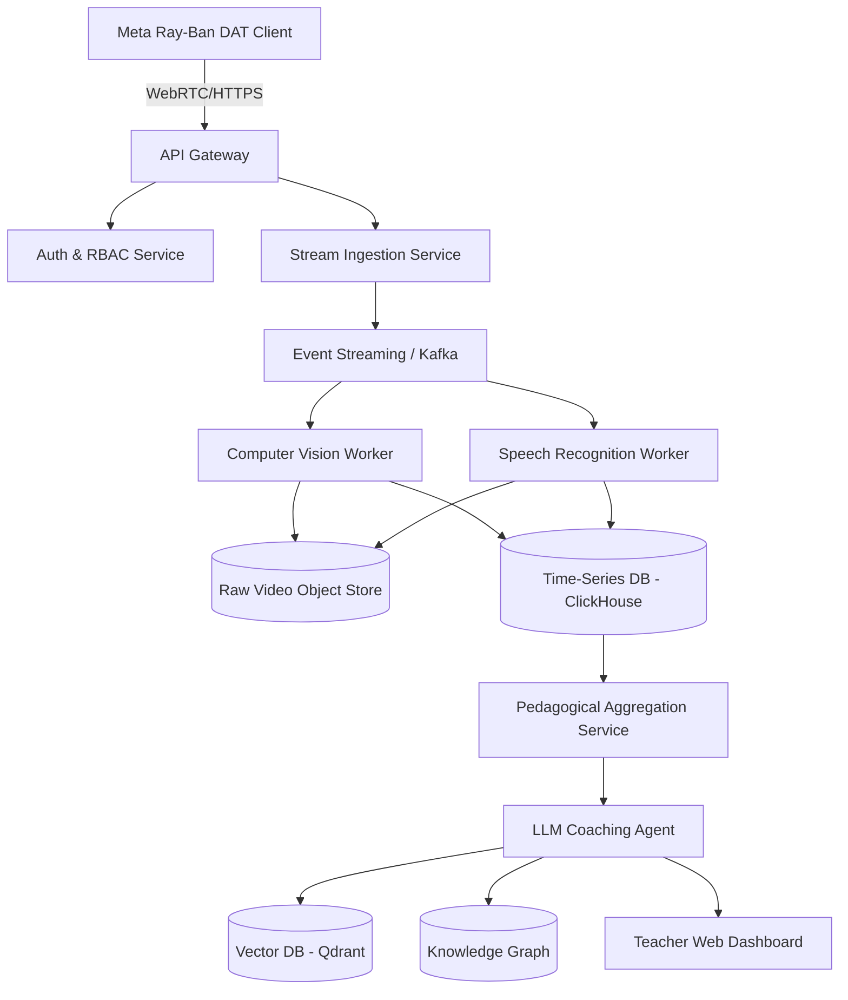

### Sequence Diagram

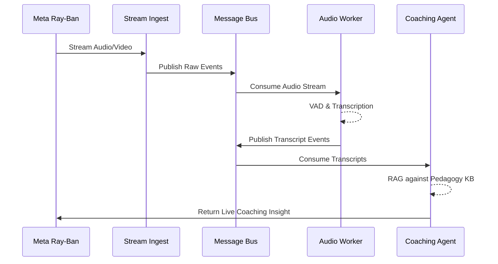

### Infrastructure Map

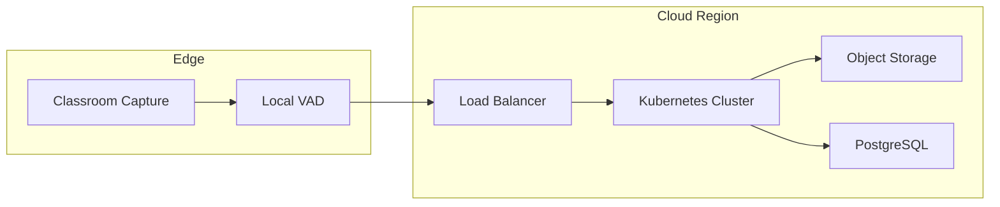

### Event Pipelines

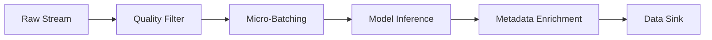

### ML Pipelines

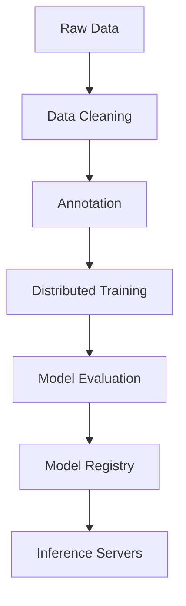

### Dataflow Diagram

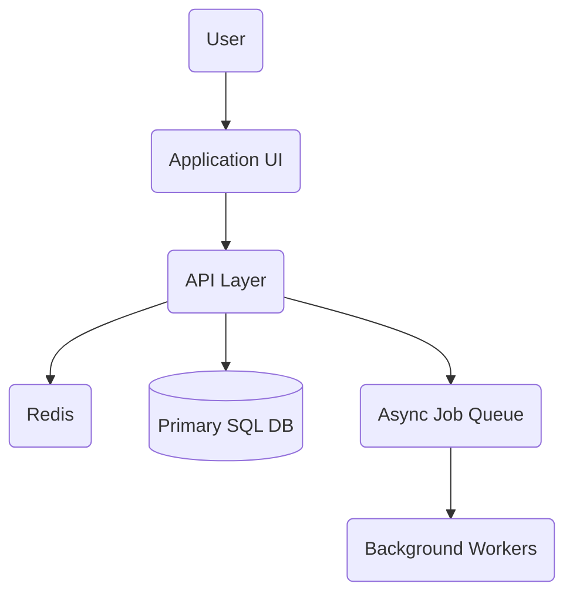

### Observability Diagram

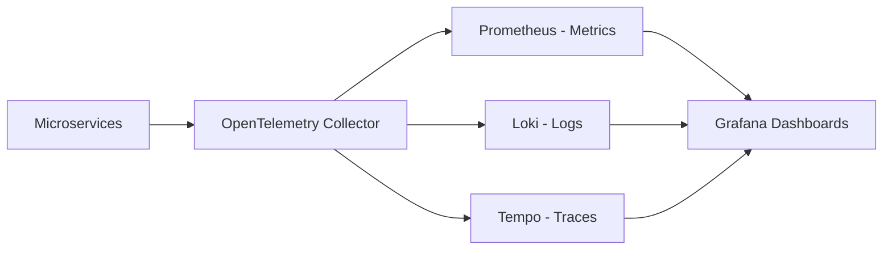

### Deployment Architecture

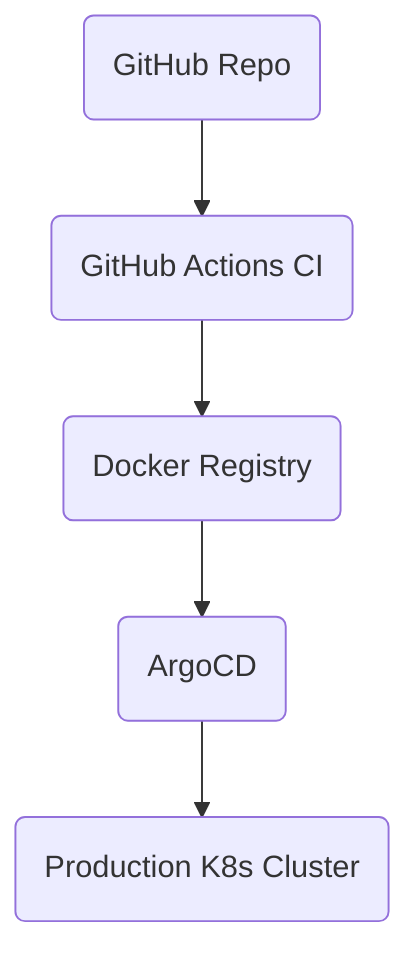

### Distributed Systems Plan

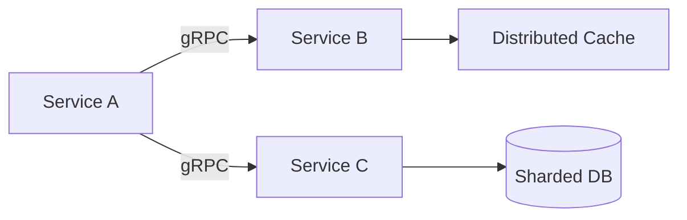

### GPU Scheduling Architecture

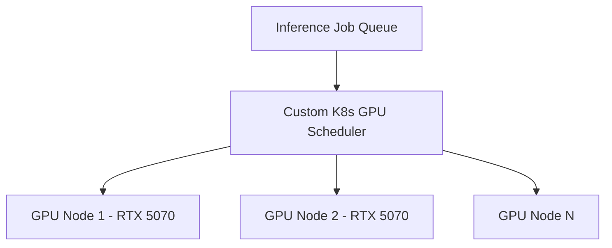

### Edge/Cloud Hybrid Architecture

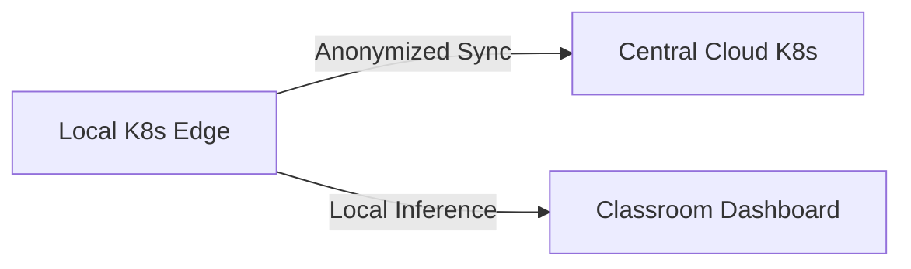

### Multimodal Inference Pipeline

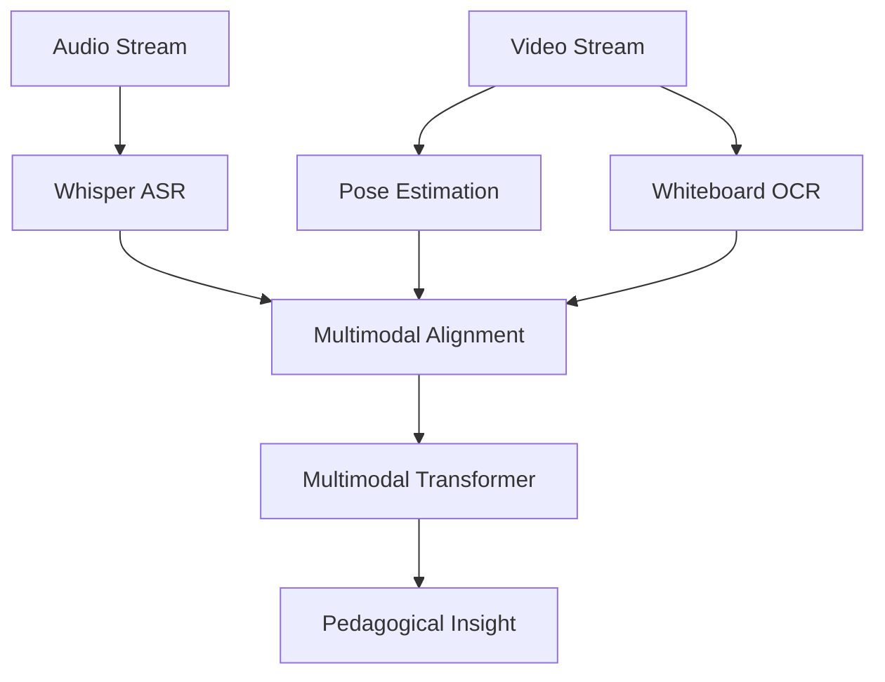

### Knowledge Graph Architecture

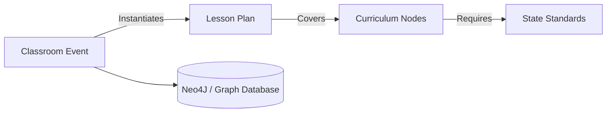

### Vector Retrieval Systems

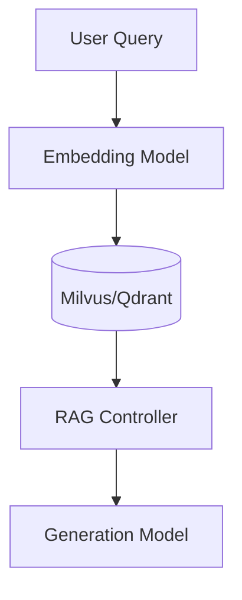

### Agent Orchestration Plan

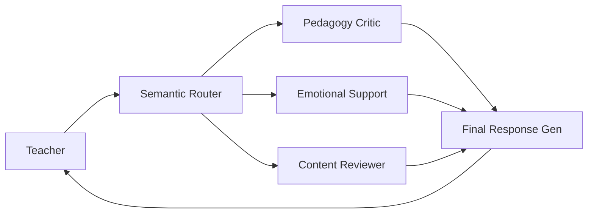

## 6. Tech Stack Analysis

Exhaustive comparison to support the high-performance requirements:

### Backend

- **Go/Rust:** High-throughput, low-latency. Ideal for the ingestion streaming layer and concurrent connections. Go is prioritized for API gateways.
- **Python (FastAPI):** Standard for AI/ML workers and orchestration due to ecosystem. Chosen for `services/api` and `services/worker-*`.
- **Node.js/Java:** Deprecated for core high-performance ingestion, though Node.js is acceptable for the frontend BFF (Backend-for-Frontend).

### AI/ML

- **PyTorch:** Primary framework for research and model training.
- **TensorRT/ONNX:** Required for optimized inference, especially if edge deployment (Jetson) or optimized GPU cloud instances are utilized. Faster inference latency.
- **JAX / TensorFlow:** Deprecated in favor of PyTorch due to community support in the multimodal research space.

### Video Pipelines

- **GStreamer:** Flexible edge processing and pipeline construction. Low latency.
- **FFmpeg:** Robust backend batch processing and transcoding.
- **WebRTC:** Required if we implement real-time live coaching or monitoring.
- **NVIDIA DeepStream:** Considered if we deploy heavy on-premise NVIDIA edge hardware.

### Databases

- **PostgreSQL:** Reliable relational data (RBAC, users, sessions).
- **ClickHouse:** High-speed analytical queries (metrics, heatmaps, longitudinal stats). Vastly outperforms Postgres for time-series.
- **Milvus / Qdrant / Weaviate:** Highly scalable vector search for embeddings and RAG. Milvus is prioritized for billion-scale vectors.
- **Cassandra / MongoDB:** Not prioritized; document and wide-column paradigms don't fit our primary relational+timeseries need.
- **Neo4j:** Essential for the educational knowledge graph.

### Frontend

- **React / Next.js:** Chosen framework for the web dashboard (`services/web`). Excellent ecosystem and SSR capabilities.
- **Flutter:** Best choice if we expand to cross-platform mobile apps for teachers in the future.
- **Electron / Tauri:** Considered for a heavy desktop client if local video rendering is required.

### Infrastructure & Cloud

- **Kubernetes:** Container orchestration for scaling processing workers based on queue depth.
- **AWS/GCP vs Self-Hosted GPU:** Start with cloud (AWS EKS) for elasticity, but self-hosted GPU clusters must be modeled for cost optimization during intensive training/batch inference (e.g., RTX 5070 budget models).
- **Nomad / Docker Swarm:** Deprecated in favor of K8s standard.

## 7. AI Features

Research and feasibility planning for advanced capabilities:

- **Teacher Emotion & Speech Clarity:** Using specialized audio models to detect stress, pacing, and clarity in instructional delivery.
- **Classroom Engagement Heatmaps:** Pose-estimation and gaze-tracking (anonymized) to build temporal engagement maps without facial recognition.
- **Interaction Graphs & Ratios:** Analyzing teacher vs. student speaking time and mapping classroom discourse networks.
- **Multimodal Timelines:** Fusing OCR from whiteboards, slide semantic analysis, and speech to create a unified timeline of the lesson.
- **AI Coaching Agents:** Hallucination-resistant LLM agents providing adaptive, pedagogical feedback based on established frameworks.

## 8. Scrum/Agile Requirements

Rigorous tracking to maintain research and development momentum:

- **Backlogs:** Maintain distinct product, technical, and research backlogs.
- **Documentation:** ADR (Architecture Decision Records) and RFC (Request for Comments) documents must precede any major implementation.
- **Tracking:** Use epics for major architectural components (e.g., "Multimodal Ingestion Pipeline"), stories for feature slices, and sub-tasks for specific engineering deliverables.
- **Risk Scoring:** Every sprint must include risk assessments, particularly concerning AI hallucinations, latency, and privacy compliance.

## 9. Documentation Requirements

Extremely detailed documentation is a prerequisite to code. Mandatory docs include:

- **Core Documents:** PRD (Product Requirements Document), System Architecture, AI Architecture, Multimodal Pipelines, and Data Governance.
- **Operational Documents:** ML Ops Strategy, Observability, Infra Deployment, Scaling Strategy, and Security Architecture (Authentication, RBAC).
- **Research & Eval:** Benchmarking protocols, testing strategies, synthetic data generation, annotation tooling, and prompt engineering strategy.
- **Ethics & Compliance:** Compliance analysis, ethical safeguards, and classroom hardware requirements.
