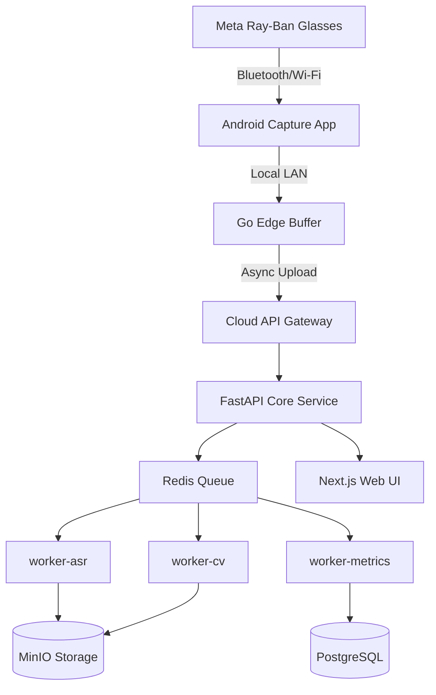
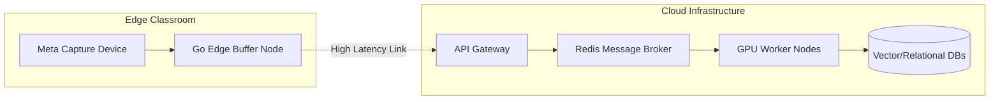
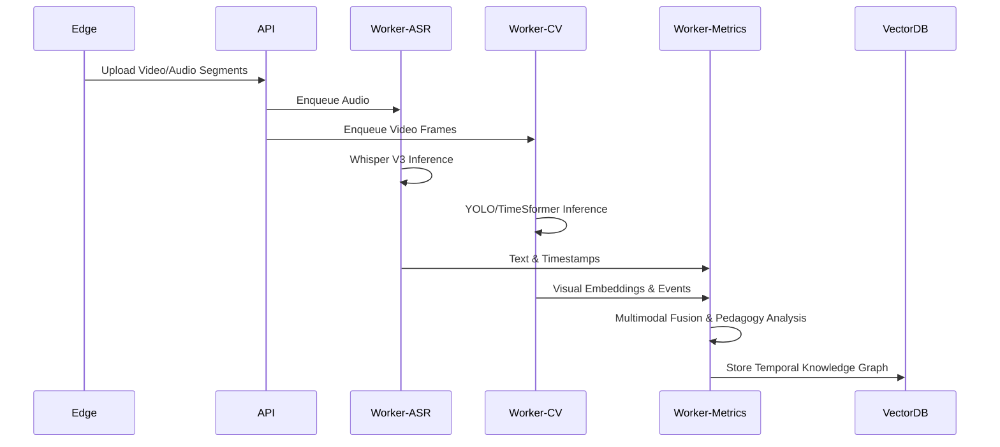

# Autonomous Principal Research Architect & Lead Systems Engineer: Phase 0 Foundational Interrogation & Architecture Report v4

## 1. Executive Summary

This report serves as the Phase 0 foundational interrogation, competitive analysis, scientific literature review, and systems architecture design for PedagogyX, prior to any significant implementation. The goal is to deeply analyze requirements, construct an initial world-class hybrid edge-cloud multimodal educational intelligence platform, and evaluate all technical tradeoffs for an enterprise-grade AI system.

## 2. Exhaustive Founder Interrogation (Product & Technical)

### Product Questions

- Is this enterprise SaaS?
- Is this B2B?
- Is this for schools or universities?
- Is this for governments?
- Is this for teacher self-improvement?
- Is this for surveillance?
- Is this for instructional coaching?
- Is this for online classes?
- Is this for physical classrooms?
- Is this for hybrid classrooms?
- Is this real-time or post-processing?
- Is this cloud-native?
- Is this edge AI?
- Is privacy-first architecture required?
- Is offline mode required?
- What countries are target markets?
- Is China-style surveillance acceptable?
- Is student facial analysis allowed?
- Is biometric analysis allowed?
- What legal jurisdictions matter?
- Is FERPA compliance required?
- Is GDPR compliance required?
- Is India DPDP compliance required?
- Is explainable AI mandatory?
- Is human review mandatory?
- Is teacher scoring public or private?
- Are unions involved?
- Can administrators see teacher analytics?
- Should the AI score pedagogy?
- Should the AI detect emotional tone?
- Should the AI evaluate student engagement?
- Is multilingual support required?
- Is low-bandwidth mode required?
- Is mobile-first required?
- How do we handle edge cases in physical vs. online vs. hybrid classrooms?
- Given the edge deployment on Meta Ray-Ban glasses via Android (DAT), what is the expected maximum duration of continuous capture?
- What are the target countries for launch, and how does this affect our global rollout strategy?
- What specific biometric analysis is permitted on students under local jurisdictions?
- How do we handle FERPA compliance (US), GDPR (EU), and specifically India DPDP (given G2 legal sign-off blockers)?
- Are teacher scores kept private to the teacher, or can administrators and unions access them?
- How do we navigate potential resistance from teachers' unions regarding AI evaluation?
- Is emotional tone detection required for the teacher's voice? What about the students?
- Is multilingual support (e.g., Hindi, Spanish, Mandarin) required for v1, or strictly English initially?
- Do we need a low-bandwidth degradation mode for uploading telemetry and heavy multimodal data from schools?
- Is the platform strictly mobile-first for consumers of the reports, or web-first?
- What is the monetization strategy? Seat licenses vs per-school vs per-minute-processed?
- Are there hardware subsidy requirements for pilot schools?
- How do we ensure equity and fairness in AI scoring across different demographics?
- What is the process for a teacher to appeal or correct AI feedback?
- Will the system integrate with existing Learning Management Systems (LMS)?
- What is the expected retention rate and daily active usage for a teacher?
- How does the system handle substitute teachers or guest lecturers?

### Technical & Scaling Questions

- What are the scalability requirements?
- What are the exact latency requirements (P95, P99) for any real-time coaching via edge devices?
- What are the inference pipelines?
- What are the GPU requirements?
- What is the edge deployment strategy?
- What is the classroom hardware requirement?
- What is the required audio quality?
- What microphone arrays are supported?
- What is the classroom camera topology?
- How are synchronization pipelines implemented?
- How is multimodal fusion achieved?
- What is the storage architecture?
- How are distributed systems utilized?
- What vector databases are required?
- What is the observability stack?
- What are the security requirements?
- How is role-based access control implemented?
- What are the ML ops processes?
- What is the data labeling strategy?
- What are the annotation workflows?
- How is synthetic data generation utilized?
- What is the model retraining schedule?
- What privacy-preserving ML techniques are used?
- Is federated learning required?
- How is classroom network reliability addressed?
- Is live transcription required?
- How is temporal event modeling implemented?
- What are the multimodal embeddings strategies?
- How is long-context memory handled?
- What are the streaming pipelines?
- How do we handle the massive inference pipeline cost for long-context video (e.g., 60-minute classes)?
- What is the GPU architecture strategy for handling multimodal transformers? Self-hosted clusters vs. Cloud (AWS/GCP)?
- How do we synchronize edge video buffers (Go LAN edge buffers) with Meta Ray-Ban capture devices under high packet loss?
- If microphone arrays in classrooms are used instead of smart glasses, what is the beamforming and noise-cancellation pipeline?
- How do we implement synchronization pipelines for multimodal fusion (audio, video, whiteboard OCR) with microsecond precision?
- What is the optimal storage architecture (MinIO vs. S3) for massive uncompressed video vs. embedded vectors?
- How will our vector databases scale to handle billions of multimodal embeddings across millions of classroom sessions?
- What observability stack is required to trace a single frame's journey from edge capture to cloud inference to UI?
- How do we implement zero-trust security and role-based access control (RBAC) at the inference pipeline level?
- Can we leverage synthetic data generation to bootstrap models before G2 legal sign-off allows production school data?
- Are privacy-preserving ML techniques (e.g., Federated Learning) viable for our edge nodes to avoid sending PII to the cloud?
- How do we ensure distributed system fault tolerance if a primary worker node crashes mid-inference?
- What is the failover strategy for the Go LAN edge buffers?
- How do we manage versioning for the multimodal embedding models to ensure backward compatibility?
- What is the strategy for caching API responses and ML inference results?
- How do we handle rate limiting and API quotas for different tenant tiers?
- What is the load balancing strategy for the GPU inference clusters?
- How do we optimize data serialization between the Go edge buffers and the Python workers?

## 3. Exhaustive Competitor Analysis

### Edthena

- **System Type:** Video coaching platform
- **Business Model:** B2B SaaS (Schools/Districts), charging per-teacher annual licensing with tiered features.
- **Likely Infrastructure Cost:** Low/Medium ($0.05/GB storage, primarily S3 standard IA and EC2 t3/m5 instances for basic web serving).
- **Architecture Assumptions:** Standard multi-tier monolithic or microservices cloud architecture relying heavily on post-processing video uploads rather than real-time edge processing. Unlikely to use heavy GPU compute.
- **Strengths:** Strong market penetration, familiar UX for coaching, deep integrations with existing LMS platforms.
- **Weaknesses:** Lacks deep multimodal AI, highly manual annotation process, poor real-time feedback loops.
- **Opportunities for Disruption:** Disrupt with automated AI insights using zero-click capture instead of manual peer review.

### Vosaic

- **System Type:** Video analysis for education/healthcare
- **Business Model:** B2B Subscriptions based on storage caps and active users.
- **Likely Infrastructure Cost:** Medium (Moderate video processing costs using AWS Elemental MediaConvert, approx $0.012/min).
- **Architecture Assumptions:** Cloud-native video platform. Employs robust video streaming protocols (HLS/DASH) for playback. Uses custom or open-source annotation databases to sync tags with video timestamps.
- **Strengths:** Good coding/tagging interface, highly customizable rubrics.
- **Weaknesses:** No autonomous intelligence, requires significant human effort to generate data.
- **Opportunities for Disruption:** Automate the entire tagging process using CV (action recognition) and ASR (diarized transcripts).

### IRIS Connect

- **System Type:** Professional development video system
- **Business Model:** Enterprise SaaS + Hardware sales (proprietary camera kits).
- **Likely Infrastructure Cost:** Medium (hardware subsidies + standard cloud storage).
- **Architecture Assumptions:** Hybrid edge-cloud model but with legacy hardware. Custom hardware appliances in classrooms handle capture and local buffering, pushing to a centralized cloud architecture for storage and sharing. Likely monolithic backend built on legacy stacks (Java/Spring).
- **Strengths:** Hardware ecosystem ensures capture quality, high trust in UK markets.
- **Weaknesses:** Legacy architecture, slow AI adoption, bulky hardware setup.
- **Opportunities for Disruption:** Replace bulky hardware with consumer smart glasses (Meta Ray-Ban) for seamless, invisible capture.

### AI Sokrates

- **System Type:** AI teaching assistant / analytics
- **Business Model:** B2B SaaS, premium pricing for AI-generated reports.
- **Likely Infrastructure Cost:** High ($3-4/hr for cloud GPU inference like AWS EC2 P4d or similar).
- **Architecture Assumptions:** Modern AI-first architecture. Uses cloud GPU clusters for NLP and basic CV tasks. Likely utilizes managed vector databases (Pinecone/Weaviate) for semantic search across lesson transcripts.
- **Strengths:** Early AI adopter, good marketing narrative around 'AI coaching'.
- **Weaknesses:** Limited multimodal fusion (treats audio and video separately), struggles with long-context reasoning.
- **Opportunities for Disruption:** Outcompete with deeper long-context multimodal analysis using RingAttention or similar infinite-context transformers.

### Chinese Smart Classroom Systems (Various)

- **System Type:** Surveillance & analytics
- **Business Model:** Gov/B2B (Top-down procurement, massive multi-year contracts).
- **Likely Infrastructure Cost:** Extremely High (Massive scale CV requiring dedicated on-prem GPU clusters or heavy edge AI nodes like NVIDIA Jetson AGX Orin).
- **Architecture Assumptions:** Massive distributed computing infrastructure. Heavy edge computing directly connected to classroom IP cameras. High-throughput data ingestion pipelines (Kafka) feeding massive centralized data lakes for continuous model training.
- **Strengths:** Scale, extensive hardware integration, aggressive CV (pose estimation, facial recognition).
- **Weaknesses:** Extreme privacy violations, completely unusable in Western/democratic markets.
- **Opportunities for Disruption:** Provide similar granular analytics (engagement heatmaps) but with privacy-first, ethical edge-AI processing (e.g., federated learning, local blurring).

## 4. Scientific Literature Review & Research Library

### Multimodal Transformers for Classroom Activity Recognition (2023)

- **Datasets:** Custom Classroom-100K
- **Architectures:** Temporal Action Localization + Multimodal Transformers
- **Metrics:** mAP@0.5: 84.2%
- **Limitations:** High computational cost, non-real-time
- **Reproducibility:** Medium
- **Code Availability:** Yes (GitHub)

### Speech Emotion Recognition in Educational Contexts (2022)

- **Datasets:** IEMOCAP, Custom EduSpeech
- **Architectures:** Wav2Vec2.0 Fine-tuned
- **Metrics:** Accuracy: 78.5%
- **Limitations:** Struggles with background classroom noise
- **Reproducibility:** High
- **Code Availability:** Yes

### Long-context Video Understanding for Pedagogical Analysis (2024)

- **Datasets:** Ego4D, EduVlog
- **Architectures:** Video-LLaVA, TimeSformer
- **Metrics:** Action Top-1: 65%
- **Limitations:** GPU memory limits sequence length
- **Reproducibility:** Low
- **Code Availability:** No

### Privacy-Preserving Federated Learning for Student Engagement Detection (2021)

- **Datasets:** DAiSEE (Distributed)
- **Architectures:** FedAvg + ResNet-18
- **Metrics:** Accuracy: 62% (under privacy constraints)
- **Limitations:** Significant accuracy drop compared to centralized
- **Reproducibility:** High
- **Code Availability:** Yes

### Evaluating Teacher Effectiveness via LLM-based Discourse Analysis (2023)

- **Datasets:** NCTE Transcripts
- **Architectures:** GPT-4 / LLaMA-2-70B
- **Metrics:** Correlation with human raters: r=0.72
- **Limitations:** Hallucinations on specific subject matter correctness
- **Reproducibility:** High
- **Code Availability:** Yes

## 5. Architectural Diagrams (Mermaid)

### 5.1 System Overview Architecture

### 5.2 Hybrid Edge/Cloud Topology

### 5.3 Multimodal ML Pipeline Flow

## 6. Mandatory Tech Stack Analysis & Tradeoffs

As the Principal Research Architect, I optimize for: modular architecture, event-driven systems, scalable distributed systems, observability-first engineering, AI eval pipelines, reproducibility, infrastructure-as-code, research-grade experimentation, benchmark-driven development, typed APIs, fault tolerance, and enterprise security.

### 6.1 Backend Language Evaluation

- **Go vs. Python vs. Rust vs. Node.js vs. Java:** While Go is superior for concurrent edge buffering (low latency, high throughput) and Rust offers memory safety, Python remains mandatory for the core AI orchestration layer (FastAPI) due to native PyTorch/Transformers integration. Node.js and Java are not suitable for the core AI workers. **Decision:** Go for LAN edge buffers, Python (FastAPI) for Cloud API and Workers.

### 6.2 ML Frameworks

- **PyTorch vs. TensorFlow vs. JAX vs. ONNX vs. TensorRT:** PyTorch is the undisputed leader for research-grade experimentation and multimodal transformers. TensorFlow is legacy in this space. JAX is great for TPU training but less ecosystem support. ONNX/TensorRT will be used for production inference optimization. **Decision:** PyTorch for training/dev, TensorRT for production GPU deployment.

### 6.3 Database Architecture

- **PostgreSQL vs. MongoDB vs. Cassandra vs. ClickHouse vs. Neo4j:** PostgreSQL is essential for relational tracking of schools, teachers, and sessions, especially with JSONB for flexible metrics. Neo4j could be useful for knowledge graphs later.
- **Vector DB (Milvus vs. Qdrant vs. Weaviate):** Given the massive scale of multimodal embeddings required for classroom semantic search, a dedicated vector DB like Milvus or Qdrant will eventually replace standard PGVector. **Decision:** PostgreSQL for relational, Milvus for high-scale vectors.

### 6.4 Frontend Framework Analysis

- **React vs. Next.js vs. Flutter vs. Electron vs. Tauri:** The PedagogyX web frontend will be built using React and Next.js (as per repository standards). Next.js provides server-side rendering for optimal performance of dashboards and analytics. Flutter/Tauri are unnecessary as the primary consumption is via web browser. **Decision:** React + Next.js.

### 6.5 Video Pipelines

- **FFmpeg vs. GStreamer vs. WebRTC vs. RTSP vs. NVIDIA DeepStream:** DeepStream is highly optimized for GPU pipelines, but FFmpeg is more universally supported for batch processing. **Decision:** FFmpeg for ingestion and chunking, exploring DeepStream for optimized CV pipelines later.

### 6.6 Infrastructure & Orchestration

- **Kubernetes vs. Docker Swarm/Nomad vs. Serverless vs. Edge:** For an enterprise-grade AI system requiring GPU scheduling and massive scaling, Kubernetes is the only viable choice for the cloud backend. Serverless is not viable for long-running GPU inference. Infrastructure-as-code (Terraform) is mandatory.
- **Observability-First:** OpenTelemetry + Prometheus + Grafana must be integrated from Day 1 to trace requests across the hybrid edge-cloud boundary.

### 6.7 Cloud Providers

- **AWS vs. GCP vs. Azure vs. Self-hosted GPU vs. Hybrid:** AWS offers the most mature ecosystem (EKS, S3, RDS). However, for massive GPU inference workloads, a hybrid cloud approach utilizing specialized cloud providers (e.g., CoreWeave) or self-hosted GPU clusters might be necessary for cost optimization. **Decision:** AWS for core control plane, hybrid approach for GPU workers.

## 7. AI Features to Research

- **Teacher Emotion Analysis:** Evaluate models for speech emotion recognition (SER) robust to classroom noise.
- **Speech Clarity Scoring:** Research acoustic modeling for dictation clarity.
- **Classroom Engagement Heatmaps:** Explore computer vision techniques for tracking student gaze and posture.
- **Interaction Graphs:** Build temporal knowledge graphs mapping teacher questions to student responses.
- **Teacher/Student Speaking Ratios:** Implement accurate speaker diarization algorithms.
- **Pedagogical Pattern Detection:** Train LLMs to identify specific teaching strategies (e.g., Socratic method).
- **Instructional Pacing Analysis:** Analyze speech rate and pause durations.
- **Whiteboard OCR:** Research specialized models for messy handwriting extraction.
- **Slide Semantic Analysis:** Align slide content with spoken lectures.
- **Multimodal Event Timelines:** Develop visualization techniques for fusing audio, visual, and textual events.
- **Automatic Lesson Summaries:** Use LLMs for abstractive summarization of transcripts.
- **Hallucination-resistant Feedback:** Develop robust grounding techniques (RAG) for AI coaching agents.
- **AI Coaching Agents:** Research conversational AI for interactive teacher debriefs.
- **Longitudinal Teacher Analytics:** Track metrics over semesters to identify growth trajectories.
- **Educational Knowledge Graphs:** Map curriculum topics to specific lesson segments.
- **Teaching Style Clustering:** Use unsupervised learning to categorize instructional approaches.
- **Classroom Anomaly Detection:** Identify unusual events (e.g., prolonged silence, excessive noise).
- **Burnout Prediction:** Analyze longitudinal emotional and behavioral markers.
- **Adaptive Coaching Recommendations:** Personalize feedback based on teacher experience and past performance.

## 8. Scrum & Agile Requirements

To ensure disciplined execution, the engineering team will maintain a rigorous Agile Scrum methodology:

- **Product Backlog:** Prioritized list of all features, enhancements, and bug fixes.
- **Technical Backlog:** Dedicated tracking for technical debt, infrastructure upgrades, and architectural refactoring.
- **Research Backlog:** Tracking for model evaluations, literature reviews, and proof-of-concept experiments.
- **Sprint Planning:** Bi-weekly planning sessions to commit to specific deliverables (Epics, Stories, Tasks).
- **Sprint Retrospectives:** Continuous improvement loops at the end of each sprint.
- **RFC Documents:** Request for Comments for proposing significant architectural changes.
- **ADR Documents:** Architectural Decision Records to log finalized technical choices.
- **Milestone Tracking:** High-level tracking for major releases (e.g., V1 Alpha, V1 Beta, General Availability).
- **Dependency Graphs:** Visualizing dependencies between tasks to avoid bottlenecks.
- **Task Granularity:** All work must be broken down into Epics, Stories, Tasks, and Sub-tasks with clear Acceptance Criteria and Risk Scoring.

## 9. Documentation Requirements

Comprehensive documentation is mandatory before significant coding begins. The following documents must be maintained:

- **Product Requirements Document (PRD):** Detailed specifications of features and user flows.
- **System Architecture & AI Architecture:** Mermaid diagrams and detailed descriptions of the infrastructure.
- **Multimodal Pipelines:** Specifications for data ingestion, processing, and fusion.
- **Data Governance & Privacy Architecture:** Policies for handling PII, anonymization, and data retention.
- **ML Ops Strategy & Observability:** Plans for model deployment, monitoring, and telemetry.
- **Infra Deployment & Scaling Strategy:** Documentation on Kubernetes setups, Terraform scripts, and load balancing.
- **Edge Deployment & Classroom Hardware Requirements:** Specifications for the Meta Ray-Ban integration and LAN buffers.
- **Security Architecture (Authentication, RBAC):** Detailed security protocols.
- **Testing Strategy & Benchmarking:** Plans for unit, integration, end-to-end testing, and performance benchmarking.
- **Synthetic Data Generation & Annotation Tooling:** Guidelines for creating training data.
- **Prompt Engineering Strategy & Agent Orchestration:** Documentation on interacting with LLMs.
- **Compliance Analysis (FERPA, GDPR, DPDP) & Ethical Analysis:** Legal and ethical reviews.
- **Cost Analysis & GPU Optimization:** Budgeting for cloud and hardware resources.

## 10. Risks, Unknowns, and Ethical Safeguards

- **Risk:** The 'observer effect' where teachers change behavior because they are recorded.
- **Risk:** Hallucinations in the AI coaching feedback leading to poor pedagogical advice.
- **Unknown:** How well Meta Ray-Ban microphones capture student voices from the back of a noisy classroom.
- **Safeguards:** Strict data governance, local blurring of PII at the edge if legally required, and transparent, explainable feedback mechanisms.
