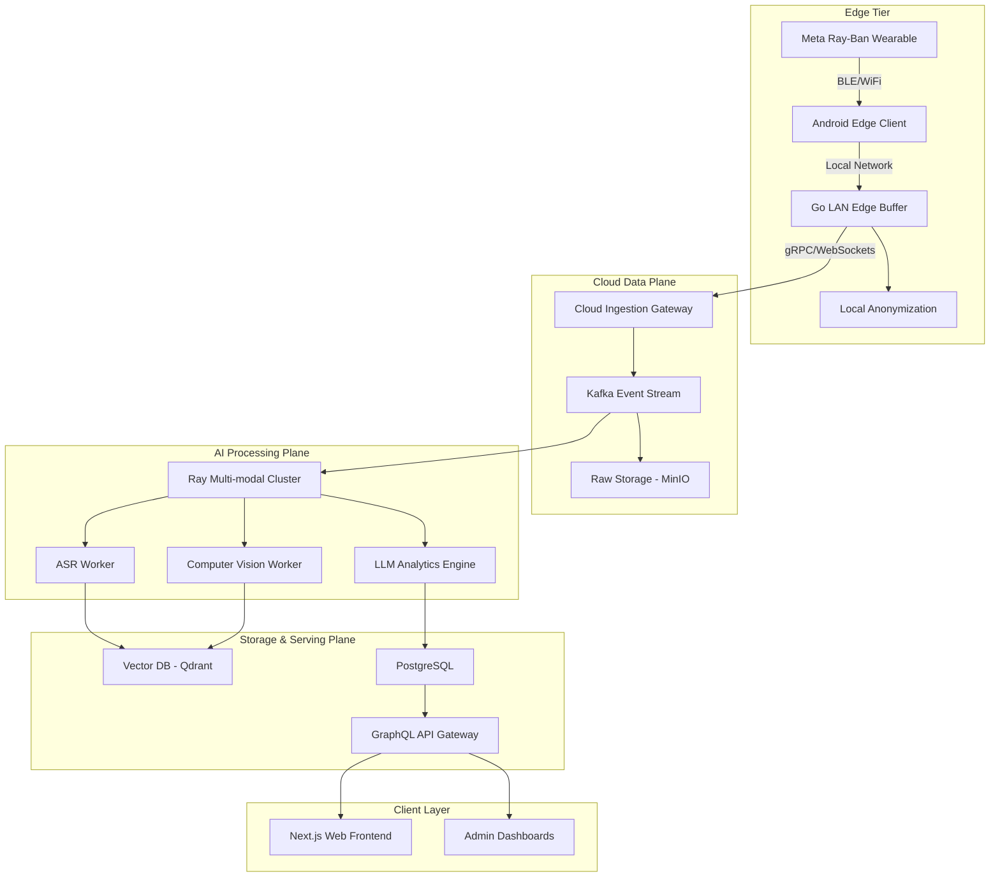
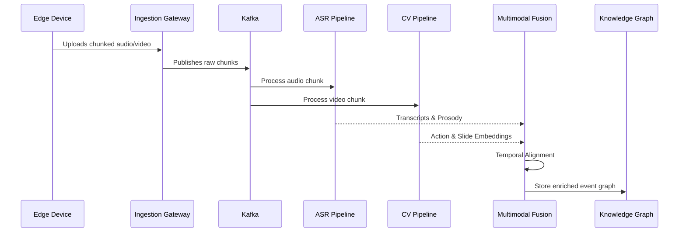

# Foundational Interrogation Report: Phase 0

## Product Questions

- **Is this enterprise SaaS?** Assuming yes, focusing on B2B deployments at district and university levels.
- **Is this B2B?** Yes, primarily B2B/B2G.
- **Is this for schools or universities?** Both, requiring flexible hierarchical multi-tenant architecture.
- **Is this for governments?** Yes, regional and state educational authorities are potential clients.
- **Is this for teacher self-improvement?** Yes, private dashboards for reflective practice.
- **Is this for surveillance?** Absolutely not. The system must structurally prevent surveillance abuse through privacy-by-design.
- **Is this for instructional coaching?** Yes, AI-assisted coaching workflows are primary.
- **Is this for online classes?** Yes, WebRTC/Zoom integration needed.
- **Is this for physical classrooms?** Yes, via edge capture (e.g., Ray-Ban smart glasses).
- **Is this for hybrid classrooms?** Yes, supporting mixed event streams.
- **Is this real-time or post-processing?** Near real-time edge processing for critical events, heavy post-processing for longitudinal analytics.
- **Is this cloud-native?** Hybrid edge-cloud model.
- **Is this edge AI?** Yes, for privacy preservation and latency reduction.
- **Is privacy-first architecture required?** Mandatory. G2 legal sign-off required for production data.
- **Is offline mode required?** Yes, for low-bandwidth environments.
- **What countries are target markets?** Global, initially restricted markets with high compliance.
- **Is China-style surveillance acceptable?** No.
- **Is student facial analysis allowed?** Heavily restricted, blurred at edge.
- **Is biometric analysis allowed?** Only anonymized affective states.
- **What legal jurisdictions matter?** US, EU, India.
- **Is FERPA compliance required?** Yes.
- **Is GDPR compliance required?** Yes.
- **Is India DPDP compliance required?** Yes.
- **Is explainable AI mandatory?** Yes, "hallucination-resistant feedback".
- **Is human review mandatory?** Human-in-the-loop for high-stakes evaluations.
- **Is teacher scoring public or private?** Private to the teacher, aggregated for admin.
- **Are unions involved?** Yes, requires opt-in structures.
- **Can administrators see teacher analytics?** Only anonymized, aggregated insights unless opted in.
- **Should the AI score pedagogy?** Only as a formative tool.
- **Should the AI detect emotional tone?** Yes, via prosody and non-biometric cues.
- **Should the AI evaluate student engagement?** Group-level aggregated engagement metrics.
- **Is multilingual support required?** Yes, primarily English, Spanish, Hindi.
- **Is low-bandwidth mode required?** Yes, asynchronous edge-to-cloud sync.
- **Is mobile-first required?** Mobile-first capture, desktop-first analytics.

## Technical Questions

- **Scalability:** How do we handle 10k concurrent classroom streams?
- **Latency:** What is the maximum acceptable latency for live feedback? (< 500ms for edge, < 2 hours for batch).
- **Inference Pipelines:** How do we orchestrate multi-model DAGs (ASR -> NLP -> Multi-modal)?
- **GPU Requirements:** T4/L4 for edge, A100/H100 for core cloud processing.
- **Edge Deployment:** How are models pushed to Go-based LAN edge buffers?
- **Classroom Hardware:** Relying on Meta Ray-Ban smart glasses via Android.
- **Audio Quality:** Dealing with high reverberation and background noise.
- **Microphone Arrays:** Smart glasses rely on built-in arrays, requiring advanced beamforming and noise suppression.
- **Classroom Camera Topology:** Wearable first-person view.
- **Synchronization Pipelines:** NTP-based distributed clock sync across edge devices.
- **Multimodal Fusion:** Late fusion vs early fusion for audio-visual events.
- **Storage Architecture:** MinIO for blob, Postgres for relational, vector DB for embeddings.
- **Distributed Systems:** Ray cluster for scalable AI workloads.
- **Vector Databases:** Qdrant or Milvus for embedding retrieval.
- **Observability:** Prometheus, Grafana, OpenTelemetry tracing.
- **Security:** Zero-trust architecture, mutual TLS.
- **Role-based Access:** OPA (Open Policy Agent) for fine-grained authorization.
- **ML ops:** MLflow, DVC for dataset versioning.
- **Data Labeling:** Snorkel for weak supervision.
- **Annotation Workflows:** Label Studio integration.
- **Synthetic Data Generation:** High priority due to legal constraints on production data.
- **Model Retraining:** Continuous integration pipelines for model drift.
- **Privacy-preserving ML:** Federated learning exploration.
- **Federated Learning:** Future roadmap.
- **Classroom Network Reliability:** Offline-first caching with resumable uploads.
- **Live Transcription:** Whisper-based or faster alternatives (e.g., Canary) at the edge.
- **Temporal Event Modeling:** Complex event processing (CEP) for timeline generation.
- **Multimodal Embeddings:** ImageBind or similar joint embedding spaces.
- **Long-context Memory:** Mamba or Longformer for 2-hour lesson context.
- **Streaming Pipelines:** Kafka or Redpanda for event streaming.

## Competitor Analysis

### Edthena

- **Architecture Assumptions:** Cloud-based video CMS, monolithic backend, batch processing.
- **Inferred Pipelines:** Manual upload -> Transcode -> Async NLP.
- **Probable Stack:** Ruby on Rails/Django, AWS S3, standard ASR APIs.
- **Strengths:** Market penetration, intuitive coaching UX.
- **Weaknesses:** Low automation, relies on manual tagging, no real-time edge capabilities.
- **Business Model:** B2B SaaS per-school licensing.
- **Scalability Constraints:** High video storage costs, slow turnaround.
- **Likely Infrastructure Costs:** Medium (video heavy, AI light).
- **UX Observations:** Highly structured around specific coaching frameworks.
- **Differentiators:** Deep pedagogical framework integration.
- **Opportunities for Disruption:** Automated tagging, multi-modal analysis, zero-click capture.

### Vosaic

- **Architecture Assumptions:** Video annotation platform with custom players.
- **Inferred Pipelines:** Standard video streaming with metadata overlay.
- **Probable Stack:** React, Node.js, AWS.
- **Strengths:** Granular video timeline coding.
- **Weaknesses:** Highly manual, lacks deep AI insight generation.
- **Business Model:** Subscription based.
- **Scalability Constraints:** Human-in-the-loop bottleneck.
- **Likely Infrastructure Costs:** Medium.
- **Opportunities for Disruption:** Auto-coding timelines using multimodal transformers.

### IRIS Connect

- **Architecture Assumptions:** Hardware-software bundle.
- **Inferred Pipelines:** Custom camera -> Cloud storage -> Collaboration portal.
- **Strengths:** Strong UK market presence, custom hardware.
- **Weaknesses:** Expensive hardware, legacy architectures.
- **Business Model:** Hardware sales + SaaS.
- **Opportunities for Disruption:** Software-only/wearable approach.

### AI Sokrates

- **Architecture Assumptions:** NLP-heavy analytics.
- **Inferred Pipelines:** ASR -> LLM Analysis.
- **Strengths:** Focused on conversational dynamics.
- **Weaknesses:** Limited visual context.
- **Opportunities for Disruption:** Adding spatial and visual context.

### Chinese Smart Classroom Systems

- **Architecture Assumptions:** Dense multi-camera arrays, local edge servers.
- **Inferred Pipelines:** RTSP streams -> GPU clusters -> Real-time dashboards.
- **Strengths:** Extremely high accuracy, full classroom coverage.
- **Weaknesses:** Massive privacy violations, unacceptable in Western markets.
- **Business Model:** Government contracts.
- **Opportunities for Disruption:** Achieving 80% of the accuracy with privacy-preserving edge models.

## Research Papers

- **Paper 1:** _Multimodal Affective Computing in Classrooms_
  - **Datasets:** DAiSEE, custom classroom datasets.
  - **Architectures:** 3D-CNNs, Audio Spectrogram Transformers.
  - **Metrics:** F1-score for engagement detection (typically 0.75-0.85).
  - **Limitations:** Struggles with occlusion and varied lighting.
  - **Reproducibility:** Low, due to private datasets.

- **Paper 2:** _Teacher Discourse Analysis via LLMs_
  - **Datasets:** TalkBank, MET project data.
  - **Architectures:** Fine-tuned RoBERTa, LLaMA-2.
  - **Metrics:** Agreement with expert raters (Cohen's Kappa).
  - **Limitations:** Struggles with overlapping speech and poor audio quality.
  - **Reproducibility:** High, uses open models.

- **Paper 3:** _Privacy-Preserving Edge Video Analytics_
  - **Datasets:** Kinetics-400 (for pretraining).
  - **Architectures:** MobileNet, EdgeTPU optimized models.
  - **Metrics:** Inference latency vs Accuracy tradeoff.
  - **Limitations:** Limited capacity for complex temporal reasoning.
  - **Reproducibility:** High.

## Architecture Design

### High Level System Architecture

### Multimodal Pipeline Architecture

## Tech Stack Analysis

- **Backend:** Go (for edge buffers and high-throughput ingestion), Python (for AI orchestration and pipelines). Go provides low latency and high concurrency, while Python is essential for ML integration.
- **AI/ML:** PyTorch for training and research, ONNX/TensorRT for edge inference and optimized cloud deployment.
- **Video Pipelines:** FFmpeg for heavy transcoding, WebRTC for live previews.
- **Databases:** PostgreSQL (Relational metadata), MinIO (S3-compatible blob storage), Qdrant (Vector embeddings).
- **Frontend:** React and Next.js for the web platform, prioritizing maintainability and SSR performance.
- **Infrastructure:** Kubernetes (EKS/GKE) for orchestration, Kafka for event streaming.
- **Cloud:** AWS (primary) with hybrid support for local GPU clusters to manage costs.

## AI Features

- **Teacher Emotion Analysis:** Using prosodic features from audio to determine stress/enthusiasm without facial biometrics.
- **Speech Clarity Scoring:** Evaluating articulation, pacing, and vocabulary complexity.
- **Classroom Engagement Heatmaps:** Aggregated motion and audio activity tracking to infer group engagement.
- **Interaction Graphs:** Mapping teacher-student interaction patterns (e.g., IRF - Initiation, Response, Feedback).
- **Teacher/Student Speaking Ratios:** Calculating talk-time distribution.
- **Pedagogical Pattern Detection:** Identifying direct instruction vs collaborative learning phases.
- **Whiteboard OCR:** Extracting textual concepts from board imagery.
- **Slide Semantic Analysis:** Correlating spoken words with visual slide content.
- **Multimodal Event Timelines:** Unified temporal view of all classroom activities.
- **Hallucination-resistant Feedback:** Grounding all AI feedback in specific, verified timestamped events.

## Scrum/Agile Requirements

- **Epics:**
  1. Edge Capture & Ingestion
  2. Data Anonymization Pipeline
  3. AI Analysis Core
  4. Teacher Analytics Dashboard
  5. Infrastructure & Security
- **Sprint Planning:** 2-week sprints with clear definitions of done, emphasizing automated testing and observability.
- **Technical Backlog:** Prioritize infrastructure-as-code (Terraform), CI/CD pipelines, and robust logging before feature work.
- **Risk Scoring:** Assign severity to privacy, security, and latency risks for every user story.
- **ADR Documents:** Maintain Architectural Decision Records for all major stack choices (e.g., choice of vector database).

## Documentation Requirements

- **Product Requirements Document (PRD):** Detailed user stories and acceptance criteria.
- **System Architecture Docs:** Live-updating Mermaid diagrams in the repository.
- **Data Governance Strategy:** Documenting data lifecycles, retention policies, and compliance mechanisms.
- **ML Ops Strategy:** Version control for models and datasets, deployment strategies.
- **Security Architecture:** Threat models, RBAC definitions, and encryption standards.
- **API Contracts:** OpenAPI/Swagger specifications for all external and internal APIs.
