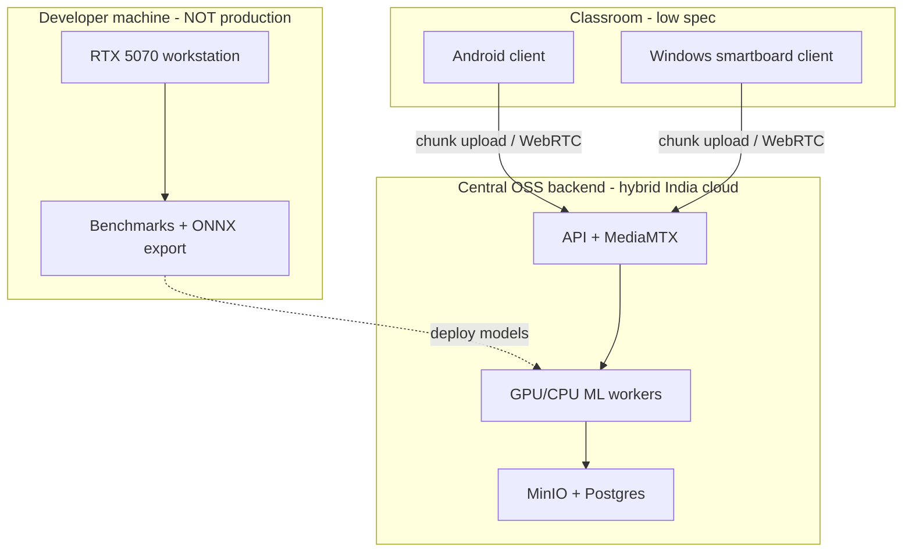

# Production Client Specification — Android & Windows Smartboards

**Status:** Draft v0.2  
**ADR:** [ADR-0007](../08-rfc-adr/ADR-0007-production-clients-low-end.md)

---

## Compatibility mandate (founder 2026-05-19)

| Principle        | Detail                                                                                                                                        |
| ---------------- | --------------------------------------------------------------------------------------------------------------------------------------------- |
| **Platforms**    | **All low-end Android boards** + **all low-end Windows smartboards** that meet profile budgets below                                          |
| **Not required** | Specific OEM or model — certification is **profile-based** (RAM, encode, CPU %)                                                               |
| **Product goal** | Capture lessons for **teacher pedagogy monitoring and assessment** (admin sees **per-teacher** lesson quality, not per-student league tables) |
| **Client role**  | Thin capture + upload only; pedagogy scoring on **central** GPU path                                                                          |

Pilot sites log make/model for the compatibility matrix; see [INDIA_PILOT_DEVICE_REFERENCE.md](../01-phase0-founder-interrogation/INDIA_PILOT_DEVICE_REFERENCE.md) for **example** brands only.

---

## Deployment model

---

## Reference low-end profiles (certify any hardware)

Any Android panel or Windows smartboard **in scope** if it passes the profile tier (automated soak test + pilot checklist).

| Profile            | Minimum class                 | Encode goal                          | If fails                       |
| ------------------ | ----------------------------- | ------------------------------------ | ------------------------------ |
| **Android A**      | 4 GB RAM, SoC with HW H.264   | Screen + mic + optional 480p cam     | Downgrade to B                 |
| **Android B**      | 2–3 GB RAM, older SoC         | Screen + mic only                    | Document as cam-unsupported    |
| **Windows SB**     | Celeron N5105-class, 4 GB RAM | 720p screen + mic; optional 480p cam | Downgrade to SB-min            |
| **Windows SB min** | 4 GB RAM, slow disk           | Screen + mic only                    | Minimum supported Windows tier |

**[ACTION]** At pilot: log make/model/Android/Windows version; map to profile A/B/SB/SB-min.

---

## Per-platform capture

### Android (OSS components)

| Component | API / library                                    |
| --------- | ------------------------------------------------ |
| Screen    | `MediaProjection` + `MediaCodec` H.264           |
| Audio     | `AudioRecord` → AAC in MP4                       |
| Camera    | Camera2, max **720p @ 15 fps** on weak devices   |
| Upload    | OkHttp resumable; Foreground Service             |
| Local DB  | SQLite                                           |
| UI        | Kotlin Compose WebView shell for admin dashboard |

### Windows smartboard (OSS)

| Component | Option                                        |
| --------- | --------------------------------------------- |
| Screen    | DXGI Desktop Duplication or GDI fallback      |
| Audio     | WASAPI capture                                |
| Camera    | DirectShow / MF                               |
| Encode    | FFmpeg libav (LGPL build) or Media Foundation |
| Installer | MSI via Tauri or WiX (.NET)                   |

---

## CPU / memory budget (client)

| Resource      | Budget                                              |
| ------------- | --------------------------------------------------- |
| CPU sustained | ≤ **40%** of weak Celeron during capture            |
| RAM           | ≤ **512 MB** client process (excluding OS)          |
| Disk buffer   | ≤ **2 GB** rolling (then drop oldest or stop)       |
| GPU on client | Not required; use hardware media encoder if present |

---

## Network

| Mode      | Behavior                                                         |
| --------- | ---------------------------------------------------------------- |
| WiFi good | Stream chunks every **15s** + live server metrics                |
| WiFi poor | Buffer to disk; batch upload after class                         |
| Offline   | Record locally; sync when online (**mandatory** for rural India) |

**Min uplink target:** **2 Mbps** sustained for screen+mic **[HYPOTHESIS]** — measure in pilot.

---

## Multi-cam on low-end hardware

| Stream    | Client encodes?             | Notes                            |
| --------- | --------------------------- | -------------------------------- |
| Screen    | **Yes**                     | Primary instructional signal     |
| Mic       | **Yes**                     |                                  |
| USB cam 1 | **If** CPU &lt; 40% at 480p | Auto-disable if thermal/CPU high |
| Cam 2+    | **No** on client            | RTSP → central MediaMTX          |

---

## What runs on RTX 5070 (development only)

- Export TensorRT engines for **server** GPUs (same architecture family if possible)
- Measure RTF for whisper / YOLO / Ollama → size **central** worker fleet
- E2E tests against **local docker compose** mimicking production API

---

## Minimum viable client v1

1. Start / stop lesson
2. Screen + mic capture
3. Optional single cam
4. Resumable upload
5. Recording indicator + consent ack
6. Show session status (upload % / server processing state)

**Defer:** on-device analytics UI beyond status; native coach UI can be web on same board browser.

---

## D-PROC (closed 2026-05-19)

**Founder choice: C — Hybrid.**

- **LAN edge** (district/school node): ingest, offline buffer, resumable forward to cloud — no full GPU ML on edge in v1.
- **India cloud**: PedagogyX-managed OSS GPU workers (ASR, CV, LLM, authoritative scores).

See [ADR-0008](../08-rfc-adr/ADR-0008-d-proc-hybrid-central-ml.md). **D-10 = ₹0 customer budget** — size **founder-funded** pilot infra per [GPU_PILOT_COST_MODEL.md](GPU_PILOT_COST_MODEL.md).
