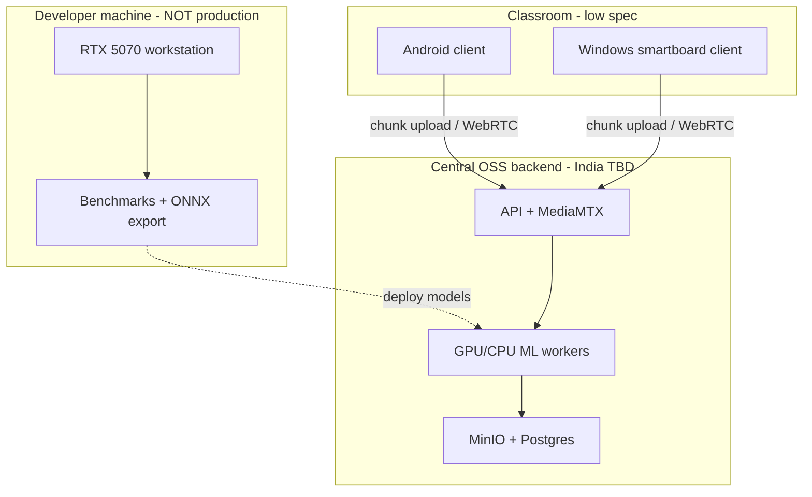

# Production Client Specification — Android & Windows Smartboards

**Status:** Draft v0.1  
**ADR:** [ADR-0007](../08-rfc-adr/ADR-0007-production-clients-low-end.md)

---

## Deployment model

---

## Reference low-end targets (benchmark before v1)

| Profile | Example specs | Goal |
|---------|---------------|------|
| **Android A** | 4 GB RAM, Snapdragon 6xx / MediaTek G85 | 480p cam + screen + mic encode |
| **Android B** | 2–3 GB RAM, older panel | Screen + mic only; defer cam |
| **Windows SB** | Celeron N5105, 4 GB RAM, 64 GB eMMC | 720p screen + mic; one 480p cam |
| **Windows SB min** | 4 GB RAM, HDD | Screen + mic only |

**[ACTION]** Founder to confirm actual OEM models used in India pilots.

---

## Per-platform capture

### Android (OSS components)

| Component | API / library |
|-----------|---------------|
| Screen | `MediaProjection` + `MediaCodec` H.264 |
| Audio | `AudioRecord` → AAC in MP4 |
| Camera | Camera2, max **720p @ 15 fps** on weak devices |
| Upload | OkHttp resumable; Foreground Service |
| Local DB | SQLite |
| UI | Kotlin Compose WebView shell for admin dashboard |

### Windows smartboard (OSS)

| Component | Option |
|-----------|--------|
| Screen | DXGI Desktop Duplication or GDI fallback |
| Audio | WASAPI capture |
| Camera | DirectShow / MF |
| Encode | FFmpeg libav (LGPL build) or Media Foundation |
| Installer | MSI via Tauri or WiX (.NET) |

---

## CPU / memory budget (client)

| Resource | Budget |
|----------|--------|
| CPU sustained | ≤ **40%** of weak Celeron during capture |
| RAM | ≤ **512 MB** client process (excluding OS) |
| Disk buffer | ≤ **2 GB** rolling (then drop oldest or stop) |
| GPU on client | Not required; use hardware media encoder if present |

---

## Network

| Mode | Behavior |
|------|----------|
| WiFi good | Stream chunks every **15s** + live server metrics |
| WiFi poor | Buffer to disk; batch upload after class |
| Offline | Record locally; sync when online (**mandatory** for rural India) |

**Min uplink target:** **2 Mbps** sustained for screen+mic **[HYPOTHESIS]** — measure in pilot.

---

## Multi-cam on low-end hardware

| Stream | Client encodes? | Notes |
|--------|-----------------|-------|
| Screen | **Yes** | Primary instructional signal |
| Mic | **Yes** | |
| USB cam 1 | **If** CPU &lt; 40% at 480p | Auto-disable if thermal/CPU high |
| Cam 2+ | **No** on client | RTSP → central MediaMTX |

---

## What runs on RTX 5070 (development only)

- Export TensorRT engines for **server** GPUs (same architecture family if possible)
- Measure RTF for whisper / YOLO / Ollama → size **central** worker fleet
- E2E tests against **local docker compose** mimicking production API

---

## Minimum viable client v1

1. Start / stop lesson
2. Screen + mic capture
3. Optional single cam
4. Resumable upload
5. Recording indicator + consent ack
6. Show session status (upload % / server processing state)

**Defer:** on-device analytics UI beyond status; native coach UI can be web on same board browser.

---

## Open: D-PROC

Where central ML runs (managed cloud vs district server) — blocks production infra sizing.
