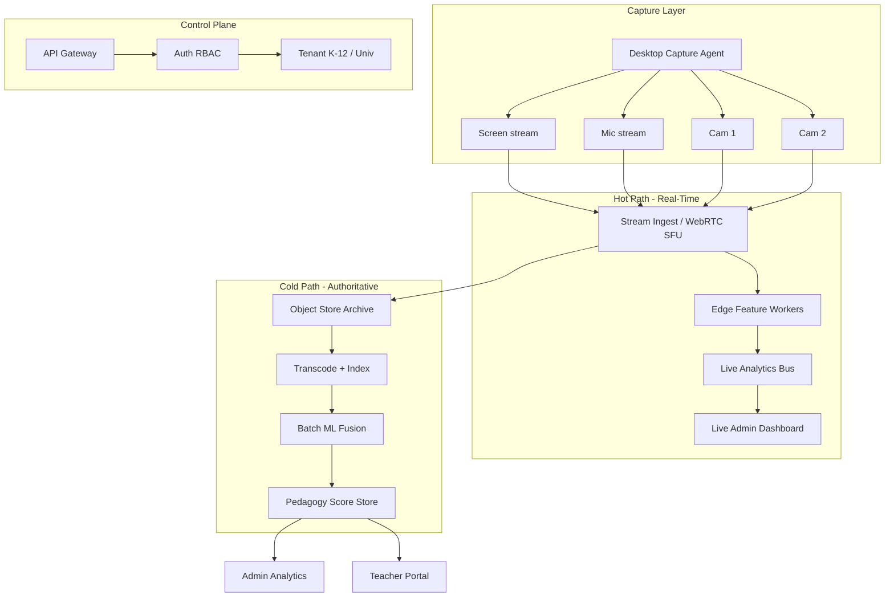
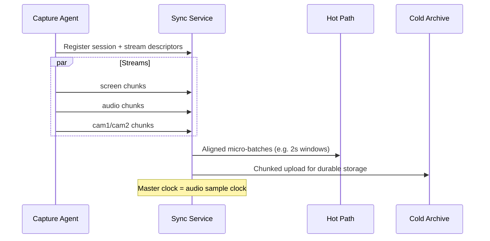
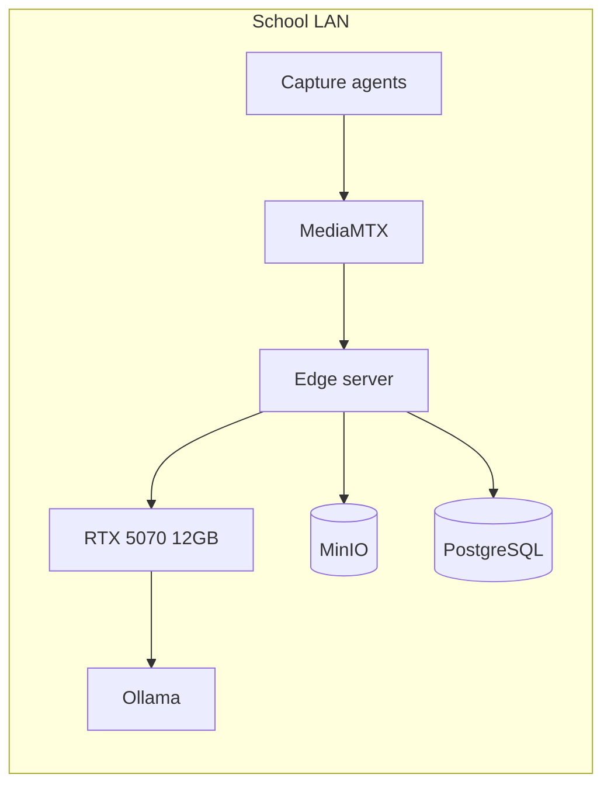

# System Architecture v0.3 (India Supervision, OSS Edge)

**Status:** Draft — aligned to [FOUNDER_ANSWERS.md](../01-phase0-founder-interrogation/FOUNDER_ANSWERS.md)  
**Supersedes:** v0.1 assumptions (US coaching-only)  
**ADRs:** [ADR-0003](../08-rfc-adr/ADR-0003-india-supervision-v1-scope.md), [ADR-0004](../08-rfc-adr/ADR-0004-capture-screen-multicam.md), [ADR-0005](../08-rfc-adr/ADR-0005-foss-first-stack.md), [ADR-0006](../08-rfc-adr/ADR-0006-rtx5070-compute-budget.md)  
**OSS stack:** [OSS_STACK_REFERENCE.md](../06-stack-evaluation/OSS_STACK_REFERENCE.md) | **GPU:** [GPU_BUDGET_RTX5070.md](GPU_BUDGET_RTX5070.md)

---

## Architectural Principles (Revised)

1. **OSS-first** — self-hosted; no proprietary ASR/LLM APIs ([ADR-0005](../08-rfc-adr/ADR-0005-foss-first-stack.md))
2. **Edge compute** — **RTX 5070 12 GB** max per node; GPU job scheduler ([ADR-0006](../08-rfc-adr/ADR-0006-rtx5070-compute-budget.md))
3. **India data residency** — school LAN / on-prem MinIO + Postgres
4. **Dual path:** **audio + 1 cam live** (hot) + **full multi-cam + screen** batch (cold, authoritative)
5. **Multi-stream sync** — screen + mic + multi-cam
6. **Supervision mode** — admin dashboards; **final** scores after cold queue
7. **Segment templates** — K-12 vs university

---

## Logical Architecture

---

## Stream Synchronization

| Challenge | Mitigation |
|-----------|------------|
| A/V drift | Cross-correlate screen OCR events with speech |
| Multi-cam alignment | Hardware genlock or software timestamp + calibration |
| Packet loss | Local ring buffer on agent; resumable upload |

---

## Real-Time vs Batch Responsibilities

| Capability | Hot path (latency) | Cold path (quality) |
|------------|-------------------|---------------------|
| Talk ratio estimate | ~5s rolling | Final diarization |
| Activity detection | Lightweight YOLO | Full transformer fusion |
| Engagement proxy | Heuristic | Calibrated model |
| Pedagogy index | Preview score | **Authoritative** admin score |
| Coaching tips | Live nudges (optional) | Full LLM report |

**[ASSUMPTION]** Admin contractual SLAs reference **cold path** scores; hot path labeled "preliminary."

---

## Deployment (OSS Edge — India Pilot)

| Component | OSS |
|-----------|-----|
| Ingest | MediaMTX |
| Queue | NATS JetStream |
| Storage | MinIO |
| DB | PostgreSQL |
| GPU jobs | faster-whisper, TensorRT YOLO, Ollama |

**Pilot capacity (one RTX 5070):** ~1–2 live audio/1-cam previews + overnight batch for 8–16 lessons/day.

See [GPU_BUDGET_RTX5070.md](GPU_BUDGET_RTX5070.md).

## RBAC (Supervision Mode)

| Role | Live view | Individual scores | Raw student video |
|------|-----------|-------------------|-------------------|
| Teacher | Own class | Own (preview) | Own sessions |
| Coach | Assigned | Assigned | If permitted |
| School admin | School | **Yes** | **Yes** |
| District admin | District aggregate + drill-down | **Yes** | Policy-dependent |
| University dean | Department | **Yes** | Policy-dependent |

Audit: immutable log of every stream view and score export.

---

## Capture Agent (v1)

See ADR-0004. Minimum platforms:

- Windows 10+ (primary lab / smart classroom PC)
- **[HYPOTHESIS]** Android companion for USB camera relay

Not in v1: iOS screen capture (policy restrictions).

---

## Open Blockers

- D-10 budget → GPU sizing
- D-12 LLM → coaching narrative architecture
- Legal G2 → consent flows in agent installer
