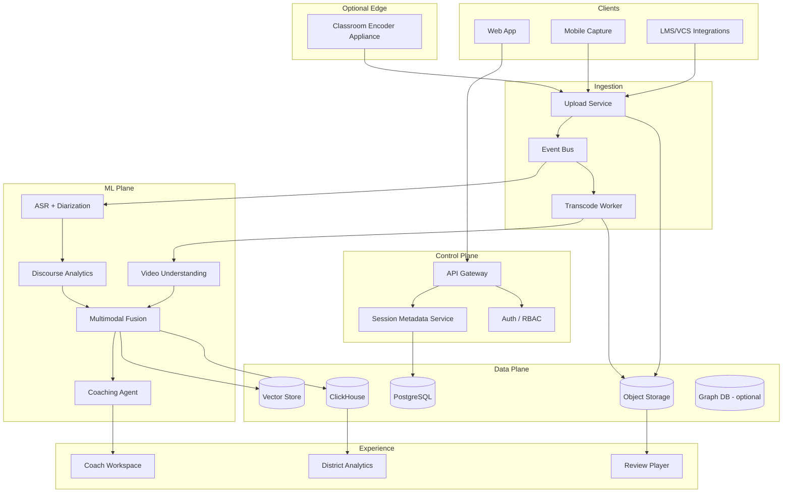
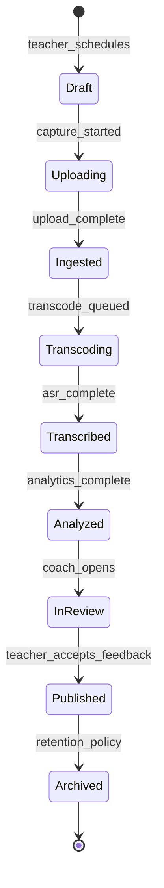
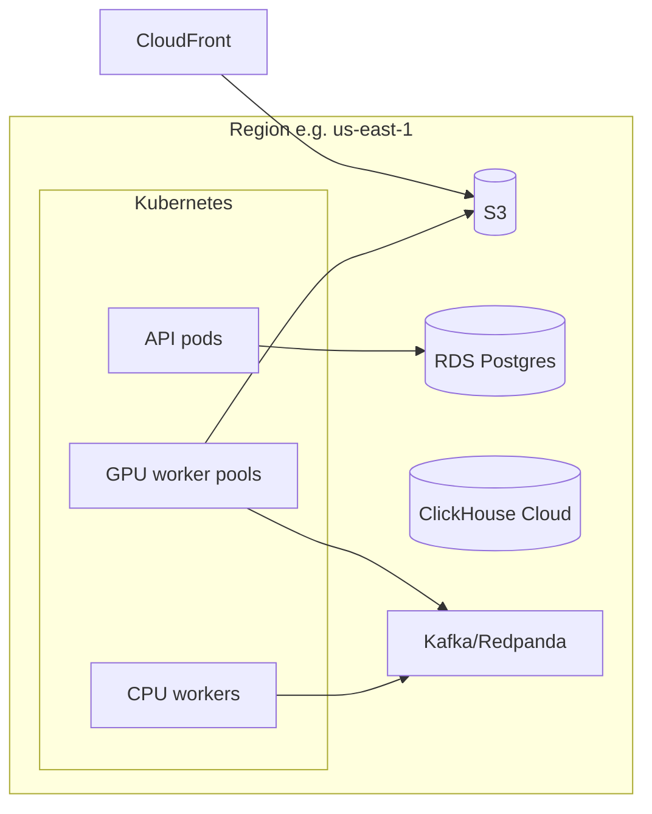
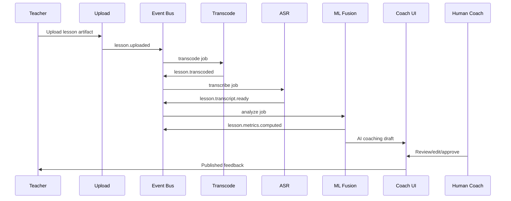

# System Architecture v0.1 (Reference)

**Status:** Draft — **blocked on G0/G1 founder decisions**  
**RFC:** [RFC-0001](../08-rfc-adr/RFC-0001-platform-vision-and-scope.md)

---

## Architectural Principles

1. **Privacy tiers by configuration** — same codebase, different feature flags per tenant
2. **Immutable ingest** — raw media append-only; analytics recomputable
3. **Event-driven** — lesson lifecycle as event stream
4. **Human-in-the-loop** for externally visible AI coaching
5. **Eval-first ML** — no model promotion without benchmark regression pass

---

## Logical Architecture

---

## Lesson Lifecycle (Event Model)

**Core events (Avro/Protobuf TBD):** `lesson.uploaded`, `lesson.transcoded`, `lesson.transcript.ready`, `lesson.metrics.computed`, `lesson.coaching.draft`, `lesson.coaching.approved`

---

## Deployment Architecture (Cloud Reference)

**[ASSUMPTION]** Single-region MVP; multi-region for EU data residency in Phase 2.

---

## Subsystem Boundaries

| Service | Responsibility | SLO draft |
|---------|----------------|-----------|
| Upload | Resumable multipart, virus scan, checksum | 99.9% |
| Transcode | H.264/H.265 normalization, thumbnails | p95 < 2× realtime |
| ASR | Transcript + diarization + confidence | p95 < 15 min / 50 min lesson |
| Discourse | Talk ratio, questions, dialogic proxies | batch |
| CV | Optional detectors | GPU quota |
| Coaching Agent | RAG + rubric-grounded narrative | human approval |
| Analytics API | Aggregates only for district roles | k-anonymity ≥ 5 |

---

## Sequence: Post-Lesson Analysis (Default Path)

---

## Security Zones

| Zone | Data | Exposure |
|------|------|----------|
| Public | Marketing | Internet |
| App | De-identified analytics | Authenticated users |
| Sensitive | Raw video, transcripts with student voice | RBAC + audit |
| ML | Training exports | Isolated account, no prod keys |

---

## Open Architecture Questions

See [CRITICAL_DECISIONS_BLOCKERS.md](../01-phase0-founder-interrogation/CRITICAL_DECISIONS_BLOCKERS.md) and ADRs.
