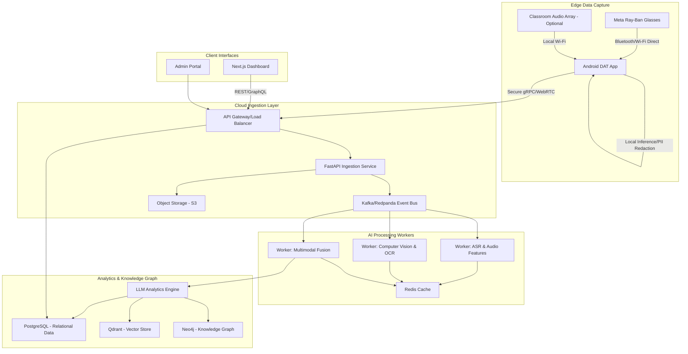

# System Architecture Report v1

## Introduction

This document outlines the v1 system architecture for PedagogyX, an autonomous multimodal AI classroom intelligence platform. The architecture is designed to handle high-throughput, low-latency ingestion of multimodal data (video, audio, telemetry) from Meta Ray-Ban smart glasses via an Android companion app (DAT), process it through sophisticated AI pipelines, and deliver actionable pedagogical insights.

## Core Principles

1.  **Hybrid Edge/Cloud Topology (ADR-0008)**: Heavy, latency-sensitive inference (e.g., wake-word detection, real-time feedback) and PII redaction occur at the edge (Android DAT or local school server). Heavy batch processing (long-context LLM analysis, knowledge graph updates) occurs in the cloud.
2.  **Multimodal Fusion**: The system must seamlessly align disparate data streams (first-person video, high-fidelity audio, presentation OCR) chronologically.
3.  **Privacy by Design**: All ingestion pipelines must be designed with DPDP compliance in mind, assuming the need for data residency in `ap-south-1`.
4.  **Event-Driven Asynchronous Processing**: To handle bursty workloads (e.g., thousands of classes ending simultaneously), the core processing pipeline uses an event-driven architecture backed by distributed queues.

## High-Level System Architecture

## Data Ingestion & Storage

- **Capture Surface**: Meta Ray-Ban glasses acting as the primary capture device, streaming to the Android DAT app.
- **Edge Processing**: The Android app handles initial PII redaction (e.g., face blurring, voice anonymization if required) and basic local inference before uploading to the cloud to minimize bandwidth.
- **Cloud Ingestion**: A FastAPI-based ingestion service receives chunks of video/audio. Raw media is stored in Object Storage (S3-compatible, located in `ap-south-1`).
- **Event Bus**: Metadata and processing tasks are published to a high-throughput event bus (e.g., Kafka, Redpanda) to decouple ingestion from processing.

## AI Processing Pipeline (Workers)

The system utilizes specialized worker nodes for different modalities:

1.  **ASR (Automatic Speech Recognition)**: Uses specialized models (e.g., Whisper fine-tuned for Indian English/Hindi code-mixing and classroom noise) to generate transcripts. Also extracts acoustic features (pitch, energy) for Speech Emotion Recognition (SER).
2.  **CV (Computer Vision)**: Processes video frames for teacher pose estimation, whiteboard OCR, and slide semantic analysis.
3.  **Multimodal Fusion**: A specialized worker that takes timestamped outputs from ASR and CV, aligning them into a unified, chronological "event timeline" of the classroom session.

## Data Storage Strategy

- **Relational (PostgreSQL)**: Stores user accounts, school metadata, RBAC policies, and structured metrics (e.g., teacher speaking ratio).
- **Vector (Qdrant)**: Stores embeddings of multimodal events, allowing for semantic search (e.g., "Find times when the teacher successfully explained a complex math concept").
- **Knowledge Graph (Neo4j)**: Maps relationships between teachers, pedagogical strategies, student outcomes, and curriculum topics, enabling deep longitudinal analytics.
- **Caching (Redis)**: Used for session management, rate limiting, and caching frequently accessed analytics.

## Observability & Security

- **Observability**: Comprehensive telemetry using OpenTelemetry. Traces span from the Android DAT app through the cloud microservices. Metrics and logs are aggregated (e.g., Prometheus/Grafana, ELK stack).
- **Security**: Zero-trust architecture. All data at rest and in transit is encrypted. Strict Role-Based Access Control (RBAC) ensures administrators cannot view raw teacher videos unless explicitly permitted.

## Scalability & Hardware Constraints

- **Cloud GPUs**: The worker nodes require GPU acceleration. Given cost and availability, the architecture targets optimization for L4/T4 GPUs rather than relying exclusively on high-end H100s.
- **Edge Constraints**: Edge processing algorithms must fit within the strict 12GB VRAM constraint specified in ADR-0008, requiring aggressive quantization (e.g., INT8) and optimization (ONNX/TensorRT).
