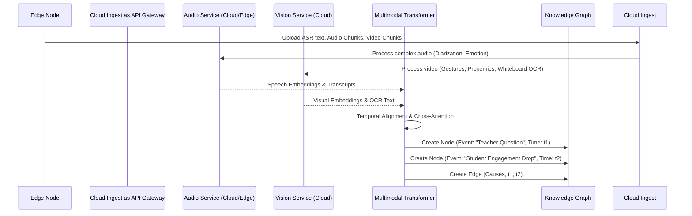

# SYSTEM ARCHITECTURE v1

**CONFIDENTIAL INTERNAL RESEARCH DOCUMENT**
**AUTHOR:** Autonomous Principal Research Architect
**PROJECT:** PedagogyX
**STATUS:** PRE-IMPLEMENTATION (Phase 0)

## 1. High-Level System Architecture (Hybrid Edge/Cloud)

PedagogyX employs a Hybrid Edge/Cloud topology to balance low latency, hardware constraints (12GB VRAM), and advanced multimodal analysis.

```mermaid
graph TD
    subgraph "Edge Environment (Classroom)"
        A[Meta Ray-Ban (DAT Client)] -->|Bluetooth/Wi-Fi| B(12GB VRAM Edge Node)
        C[Secondary IP Camera] -->|RTSP| B
        B -->|Local ASR (Quantized Whisper)| D[Local Text Cache]
        B -->|Local CV (Face Blur/Engagement)| E[Anonymized Visual Metadata]
    end

    subgraph "Cloud Infrastructure"
        F[API Gateway / Load Balancer]
        G[Multimodal Fusion Engine (PyTorch/Transformers)]
        H[Vector Database (Qdrant)]
        I[Knowledge Graph (Neo4j)]
        J[PostgreSQL (Relational Data)]
        K[LLM Orchestration (Agentic Coaching)]
    end

    B -->|Encrypted Chunk Upload| F
    D --> F
    E --> F

    F --> G
    G -->|Embeddings| H
    G -->|Entities/Relationships| I
    G -->|Metadata| J

    H --> K
    I --> K
    J --> K

    K -->|Coaching Insights| L[Teacher Dashboard (Next.js)]
```

## 2. Multimodal ML Pipeline

The ML pipeline fuses asynchronous audio, visual, and contextual streams to generate pedagogical metrics.



## 3. Deployment & Scalability Architecture

- **Edge Nodes:** Provisioned via Ansible, running a stripped-down Linux OS. Local inference handled by ONNX Runtime or TensorRT to maximize the 12GB VRAM limit.
- **Cloud Compute:** Kubernetes cluster (EKS/GKE) managing stateless API services (FastAPI/Node.js).
- **GPU Scheduling:** Ray cluster deployed on Kubernetes for distributing intensive, post-hoc batch processing of multimodal fusion tasks.
- **Storage:** S3-compatible object storage for raw (encrypted) and processed video chunks; PostgreSQL for tenant and RBAC management; Qdrant for multimodal embedding retrieval; Neo4j for semantic relationship mapping.

EOF
