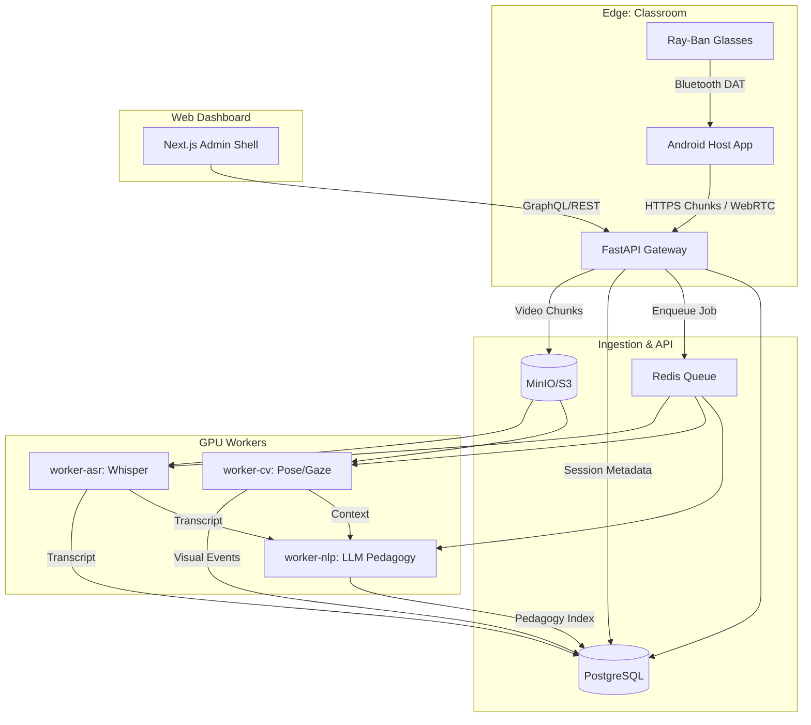
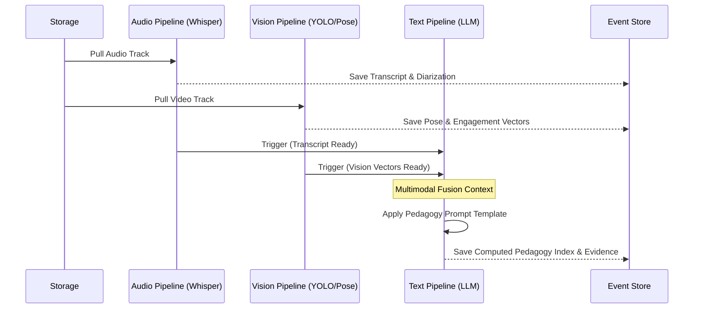

# World-Class Enterprise Architecture: PedagogyX

## Overview

This document defines the elite, scalable, and privacy-preserving architecture for PedagogyX. It is designed to support the Phase 1 deployment utilizing Meta Ray-Ban smart glasses (via Android DAT companion app) as the primary edge capture device, streaming to a hybrid cloud-edge ML pipeline.

---

## 1. High-Level System Topology

PedagogyX employs a **Hybrid Edge-Cloud Architecture (D-PROC=C)**.

1.  **Tier 1: Intelligent Edge (Capture)**
    - **Hardware:** Meta Ray-Ban Smart Glasses + Android Host Device.
    - **Responsibilities:** Media capture, Bluetooth (DAT) routing, chunking, local encryption, network resilience buffer.
2.  **Tier 2: Ingestion & Routing (Cloud API)**
    - **Hardware:** Kubernetes/Docker Swarm clusters (AWS `ap-south-1` or equivalent).
    - **Responsibilities:** Authentication (JWT/API Keys), WebRTC termination, payload ingestion, event streaming (Kafka/Redis).
3.  **Tier 3: Multimodal ML Inference (GPU Pool)**
    - **Hardware:** Distributed GPU cluster (e.g., RTX 5070 pool per ADR-0006).
    - **Responsibilities:** ASR, Computer Vision (pose, gaze), NLP/LLM pedagogical classification.
4.  **Tier 4: Persistence & Analytics (Data Layer)**
    - **Hardware:** Managed Postgres, Object Storage (MinIO/S3), Vector Database.
    - **Responsibilities:** Relational metadata, raw/processed video storage, embedding storage for longitudinal search.
5.  **Tier 5: Presentation (Admin/Teacher Web Shell)**
    - **Hardware:** Next.js Server-Side Rendered application.
    - **Responsibilities:** Real-time dashboards, historical analytics, video playback with synchronized transcripts.

---

## 2. System Diagrams

### 2.1 Core Dataflow & Event Pipeline

### 2.2 Multimodal Inference Pipeline

The ML pipeline uses a late-fusion architecture to generate the final Pedagogy Index.

---

## 3. Distributed Systems & Scalability Strategy

- **Stateless Ingestion:** The FastAPI edge nodes are entirely stateless. They receive chunks, write to object storage, and publish an event. They can scale horizontally infinitely based on CPU/Network IO.
- **Asynchronous ML Workers:** ML inference is decoupled from ingestion. If the GPU cluster is overwhelmed, jobs queue in Redis. The Android client is unaffected by backend processing delays.
- **Database Sharding:** PostgreSQL is designed for multi-tenant isolation. Initially, logical separation via `tenant_id` columns is used. Future scaling will employ physical sharding per school district.

## 4. Security & Privacy Architecture (India DPDP Compliant)

- **Zero-Trust Edge:** The Android host app requires short-lived JWTs. The API assumes the network is hostile.
- **Encryption at Rest & Transit:** TLS 1.3 for all transit. MinIO/S3 uses AES-256 server-side encryption. Database volumes are encrypted.
- **PII Segregation:** Audio transcripts and video files are treated as high-risk PII. Aggregate metrics (e.g., "30% teacher talk time") are treated as low-risk analytics.
- **Data Residency:** All infrastructure must be localized to the target region (e.g., `ap-south-1` for India) to comply with data sovereignty laws.

## 5. Deployment & Observability

- **Infrastructure as Code (IaC):** Terraform/Pulumi defines all cloud resources.
- **Containerization:** Docker for all services. Kubernetes/Nomad for orchestration.
- **Observability:**
  - **Metrics:** Prometheus scraping FastAPI and GPU workers.
  - **Logs:** Fluentd/Vector shipping to localized Elasticsearch/Loki.
  - **Tracing:** OpenTelemetry (OTel) spans across the Android client, API, and workers to identify latency bottlenecks in the ML pipeline.
