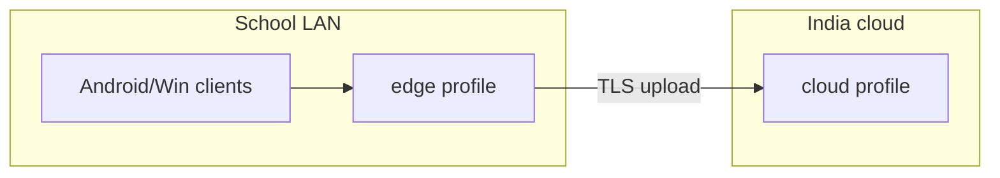

# Docker Compose OSS Pilot Stack (S01-10)

**Status:** Draft v0.1 — **reference architecture only** (implementation gated on G2)  
**Owner:** Platform  
**Date:** 2026-05-19  
**ADR:** [ADR-0008](../08-rfc-adr/ADR-0008-d-proc-hybrid-central-ml.md)

---

## Overview

Two Compose **profiles** for hybrid D-PROC:

| Profile     | Host                                | GPU               | Role                                        |
| ----------- | ----------------------------------- | ----------------- | ------------------------------------------- |
| **`edge`**  | School/district LAN (NUC / mini-PC) | No                | Buffer, ingest, forward to cloud            |
| **`cloud`** | India VPS (founder-managed)         | Yes (12 GB class) | ML workers, API, storage, admin UI          |
| **`dev`**   | Founder RTX 5070 workstation        | Yes               | Full stack for benchmarks (mirrors `cloud`) |

---

## Edge profile (`compose.edge.yaml`)

**Hardware:** 4 vCPU, 8 GB RAM, 256 GB SSD, Ubuntu 24.04 LTS.

```yaml
# Reference only — not deployed until G2
services:
  edge-gateway:
    image: pedagogyx/edge-gateway:latest
    ports:
      - "443:443"
      - "8554:8554" # RTSP fan-in optional
    volumes:
      - edge_buffer:/data/buffer
    environment:
      CLOUD_API_URL: https://api.pedagogyx.example.in
      SCHOOL_ID: ${SCHOOL_ID}
      EDGE_TOKEN: ${EDGE_TOKEN}

  mediamtx-edge:
    image: bluenviron/mediamtx:latest
    ports:
      - "1935:1935"
    volumes:
      - ./mediamtx.edge.yml:/mediamtx.yml:ro

  minio-edge:
    image: minio/minio:latest
    command: server /data --console-address ":9001"
    volumes:
      - minio_edge:/data
    # Encrypted buffer only; lifecycle sync to cloud

volumes:
  edge_buffer:
  minio_edge:
```

**Responsibilities:**

- Accept HTTPS chunk uploads from Android/Windows clients on LAN
- Persist encrypted buffer (≤ 2 GB rolling per client policy)
- Forward to cloud when WAN available (resumable)
- Optional RTSP from IP cameras → relay to cloud MediaMTX

---

## Cloud profile (`compose.cloud.yaml`)

**Hardware:** 8+ vCPU, 32 GB RAM, 1× NVIDIA GPU (12 GB VRAM), 500 GB NVMe.

```yaml
# Reference only — not deployed until G2
services:
  postgres:
    image: postgres:16
    environment:
      POSTGRES_DB: pedagogyx
      POSTGRES_USER: pedagogyx
    volumes:
      - pg_data:/var/lib/postgresql/data

  redis:
    image: redis:7-alpine

  nats:
    image: nats:2-alpine
    command: ["-js"]

  minio:
    image: minio/minio:latest
    command: server /data --console-address ":9001"
    volumes:
      - minio_data:/data

  mediamtx:
    image: bluenviron/mediamtx:latest
    ports:
      - "8554:8554"
      - "8889:8889" # WebRTC

  api:
    image: pedagogyx/api:latest
    depends_on: [postgres, redis, minio, nats]
    ports:
      - "8080:8080"
    environment:
      DATABASE_URL: postgres://pedagogyx@postgres:5432/pedagogyx
      MINIO_ENDPOINT: minio:9000
      NATS_URL: nats://nats:4222

  worker-asr:
    image: pedagogyx/worker-asr:latest
    deploy:
      resources:
        reservations:
          devices:
            - driver: nvidia
              count: 1
              capabilities: [gpu]
    depends_on: [nats, minio]

  worker-cv:
    image: pedagogyx/worker-cv:latest
    deploy:
      resources:
        reservations:
          devices:
            - driver: nvidia
              count: 1
              capabilities: [gpu]
    depends_on: [nats, minio]

  worker-llm:
    image: pedagogyx/worker-llm:latest
    # Ollama sidecar or embedded
    deploy:
      resources:
        reservations:
          devices:
            - driver: nvidia
              count: 1
              capabilities: [gpu]

  web:
    image: pedagogyx/web:latest
    ports:
      - "3000:3000"
    depends_on: [api]

  keycloak:
    image: quay.io/keycloak/keycloak:latest
    command: start-dev
    environment:
      KC_DB: postgres
      KC_DB_URL: jdbc:postgresql://postgres:5432/pedagogyx

volumes:
  pg_data:
  minio_data:
```

**GPU scheduling note:** In pilot, run **one GPU job at a time** via queue (ASR → CV → LLM) to stay within 12 GB — see [GPU_BUDGET_RTX5070.md](../05-architecture/GPU_BUDGET_RTX5070.md).

---

## Dev profile (`compose.dev.yaml`)

Same as `cloud` on founder machine with:

- Bind-mount `./models` for faster-whisper / TensorRT engines
- `NVIDIA_VISIBLE_DEVICES=0` (RTX 5070)
- Optional **mock edge** container simulating delayed WAN upload

---

## Network topology



---

## Deployment commands (future)

```bash
# Edge (school IT)
docker compose -f compose.edge.yaml up -d

# Cloud (founder VPS)
docker compose -f compose.cloud.yaml up -d

# Dev (5070 workstation)
docker compose -f compose.dev.yaml up -d
```

---

## Validation checklist (Sprint 04 target)

- [ ] Edge buffers 30 min lesson while cloud unreachable
- [ ] Cloud ingests edge-forwarded chunks; M-B preview &lt; 5 min
- [ ] Keycloak RBAC: school admin sees own teachers only
- [ ] All images built from OSS Dockerfiles in repo (post-G2)

---

## References

- [OSS_STACK_REFERENCE.md](OSS_STACK_REFERENCE.md)
- [CENTRAL_OSS_BACKEND_SPEC.md](../05-architecture/CENTRAL_OSS_BACKEND_SPEC.md)
- [RFC-0002 Capture Agent](../08-rfc-adr/RFC-0002-capture-agent-sync-protocol.md)
