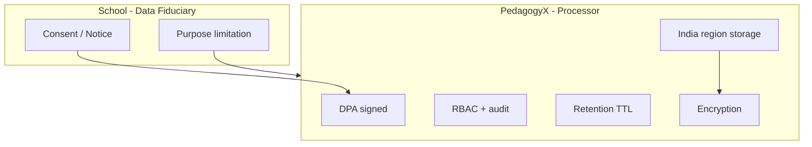

# India DPDP & Classroom Surveillance — Compliance Architecture

**Status:** Draft — **requires qualified Indian counsel**  
**Trigger:** Founder confirmed **India year-1**, **identifiable student video**, **admin scores**, **supervision mode**

**Not legal advice.**

---

## Applicable Framework (High Level)

| Law / guidance                                        | Relevance                                                              |
| ----------------------------------------------------- | ---------------------------------------------------------------------- |
| **Digital Personal Data Protection Act, 2023 (DPDP)** | Processing of digital personal data; children's data heightened duties |
| **IT Rules / sector guidance**                        | Schools as data fiduciaries; vendor as Data Processor                  |
| **NCERT / state education policies**                  | Varies by state — deployment contracts must cite purpose               |
| **RTE Act** (context)                                 | Child rights, dignity — marketing must not undermine                   |

**[FACT]** DPDP imposes obligations on Data Fiduciaries and Processors; children's consent rules are stricter (verifiable parental consent where applicable).

---

## Data Categories PedagogyX Will Process (v1)

| Category              | Examples                          | Sensitivity                                                      |
| --------------------- | --------------------------------- | ---------------------------------------------------------------- |
| Student personal data | Face, voice, name on screen       | High                                                             |
| Teacher personal data | Voice, video, performance scores  | High                                                             |
| Biometric-adjacent    | Face recognition for ID           | **Very high** — minimize to detection not storage where possible |
| Derived analytics     | Engagement scores, pedagogy index | Medium — may still be personal data if re-identifiable           |
| Screen content        | Slides, LMS, chat                 | May contain third-party PII                                      |

---

## Required Controls (Architecture)

| Control            | Implementation                                                                                     |
| ------------------ | -------------------------------------------------------------------------------------------------- |
| **Data residency** | Primary storage + inference in **AWS ap-south-1** (Mumbai) or Azure Central India **[ASSUMPTION]** |
| **DPA**            | Processor agreement with school/state; subprocessor list                                           |
| **Notice**         | English + Hindi notices; recording indicator in capture agent                                      |
| **Consent**        | School-obtained verifiable parental consent for minors; document artifact IDs in metadata          |
| **Purpose**        | Contract limits use to **educational quality / supervision** — no advertising                      |
| **Retention**      | Configurable TTL; default proposal **90 days raw**, **1 year aggregates** pending counsel          |
| **Access**         | Admin RBAC; every view logged                                                                      |
| **Rights**         | Deletion/export APIs for fiduciary requests                                                        |
| **Cross-border**   | No US replication without SCC + legal review **[ASSUMPTION]**                                      |

---

## Identifiable Student Video — DPIA Topics

Counsel must sign off on:

1. **Necessity** of identification vs de-identified analytics
2. **Automated decision-making** — admin scores affecting teachers (employment linkage?)
3. **Impact on children** — psychological harm, chilling effects on participation
4. **Alternative** less invasive means (audio-only tier for pilot schools)

---

## Real-Time Processing

- Live streams = **continuous processing** — update privacy notice accordingly
- **No secondary use** of streams for model training without explicit opt-in
- Edge buffering minimization (ring buffer only)

---

## LLM / Cloud AI (D-12 open)

**[ASSUMPTION until founder answers]** Student-adjacent transcripts and frames:

- **No** public API (OpenAI consumer) on identifiable child data
- Prefer **in-region** Azure OpenAI / self-hosted vLLM on private VPC
- Log redaction before prompt construction

---

## Open Items for Counsel

- [ ] State-by-state recording consent (two-party audio?)
- [ ] Government school vs private school procurement rules
- [ ] University segment under DPDP (adult students — different consent?)
- [ ] Grievance officer and India representative requirements for foreign entity

---

## Gate G2 Exit Criteria

- Signed legal memo
- DPIA template completed for pilot school archetype
- Privacy notice + consent flow wireframes approved
