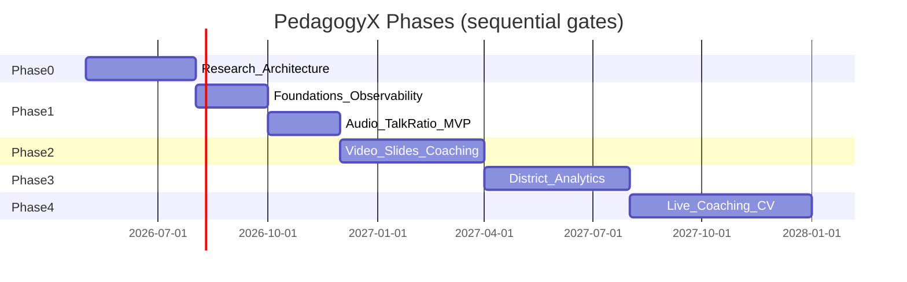

# Implementation Roadmap (High-Level)

**Status:** Draft — calendar dates require founder input

## Phase 0 — Research (current)

- Documentation corpus
- Founder interrogation
- Legal engagement
- Eval dataset strategy
- **Exit:** G0–G2 gates passed
- **Sprint 03 prep (doc only):** [SPRINT_03_MVP_PREP.md](SPRINT_03_MVP_PREP.md) · [RFC-0003](../08-rfc-adr/RFC-0003-monorepo-scaffold-post-g2.md)

## Phase 1 — Foundations + Audio MVP

**Build order (non-negotiable):**

1. Observability (OTel, structured logs, metrics)
2. IaC dev/staging
3. API contracts + event schemas
4. Upload + transcode + ASR pipeline
5. Talk ratio metrics + confidence
6. Coach review UI (minimal)
7. Eval CI for ASR/talk ratio

**No:** student CV, district heatmaps, gamification

## Phase 2 — Multimodal Coaching

- Slide ingestion + alignment
- Video with de-id tier
- Evidence clips + rubric RAG agent
- Human approval workflow

## Phase 3 — Enterprise & Integrations

- SSO/SCIM, district analytics (aggregated)
- Zoom/Teams import
- SOC 2 audit

## Phase 4 — Advanced (optional)

- Live WebRTC coaching
- Multi-cam CV
- Knowledge graph analytics

---

## Team Ramp (indicative)

| Phase | Team size                |
| ----- | ------------------------ |
| 0     | 1–2 architects + founder |
| 1     | 6–8 FTE                  |
| 2     | 10–14 FTE                |
| 3     | 15–20 FTE                |

**[ASSUMPTION]** Not calendar estimates — staffing model only.
