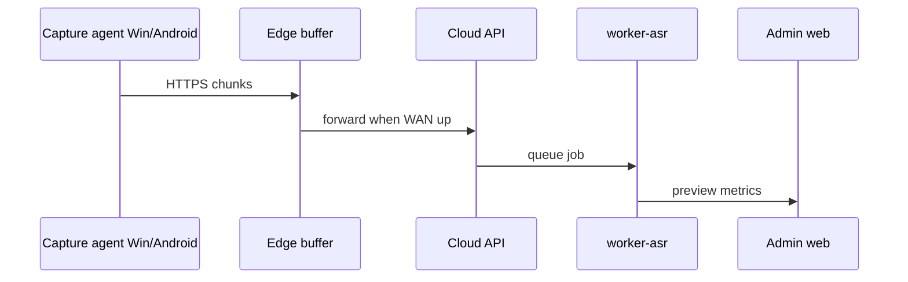

# Sprint 03 — MVP Prep (Post-G2 Code Authorization)

**Status:** Planned — **blocked until G2** (India legal memo)  
**Depends on:** Sprint 02 ✅ (docs + CPU dev path) · G2 🔴  
**Goal:** First **authorized** vertical slice — no feature creep beyond Phase 1 audio + upload path

---

## Preconditions (must be green before writing app code)

| Gate           | Requirement                                                    |
| -------------- | -------------------------------------------------------------- |
| **G2**         | Signed counsel memo on file (confidential PDF off-repo OK)     |
| **G3**         | Architecture v0.2 accepted (already draft complete)            |
| **Benchmarks** | `./bench_full_pipeline.sh gpu` on RTX 5070 — update cost model |
| **Pilot**      | Named school + D-DEV device checklist filled                   |

---

## Vertical slice v0 (Sprint 03–04 target)

**User story:** Teacher starts lesson on smartboard → screen+mic upload → admin sees **preliminary talk ratio** within M-B target.

### Build order (strict)

| #   | Component                   | Tech           | Done when                                |
| --- | --------------------------- | -------------- | ---------------------------------------- |
| 1   | `compose.dev.yaml` runnable | Docker         | `docker compose up` healthy              |
| 2   | API skeleton                | Go or FastAPI  | `/health`, auth stub                     |
| 3   | MinIO + Postgres migrations | SQL            | session row created                      |
| 4   | Upload ingest API           | resumable      | 50 MB test file lands                    |
| 5   | worker-asr                  | faster-whisper | RTF logged; transcript JSON              |
| 6   | Talk ratio job              | Python         | teacher % on preview API                 |
| 7   | Admin web shell             | Next.js        | wireframe screens 1–3 static → live data |

**Explicitly defer:** multi-cam CV, LLM coaching narrative, student ID, mobile iOS.

---

## Repo layout (proposed — create only after G2)

See [RFC-0003](../08-rfc-adr/RFC-0003-monorepo-scaffold-post-g2.md). **No `services/` commits until G2.**

---

## Sprint 03 backlog (draft)

| ID     | Deliverable                                  | Owner    | Status                      |
| ------ | -------------------------------------------- | -------- | --------------------------- |
| S03-01 | G2 memo filed; gate updated in docs/README   | Founder  | 🔴                          |
| S03-02 | GPU benchmark JSON merged                    | ML       | 🟡                          |
| S03-03 | Monorepo scaffold + CI (lint, test, compose) | Platform | 🟢 `infra/compose.dev.yaml` |
| S03-04 | API + Postgres + MinIO upload path           | Backend  | 🟢 chunk upload API         |
| S03-05 | worker-asr container (EN first)              | ML       | 🟢 stub + optional whisper  |
| S03-06 | Admin UI: school overview (M-A widget)       | Frontend | 🟢 live overview API        |
| S03-07 | Windows capture agent spike (RFC-0002)       | Client   | 🔴                          |

---

## Exit criteria (Sprint 03)

- One **end-to-end demo**: record → upload → ASR → talk ratio on admin UI (staging)
- M-B measured on staging &lt; 30 min for 45 min lesson (target)
- No production school data until DPIA signed for that site

---

## References

- [IMPLEMENTATION_ROADMAP.md](IMPLEMENTATION_ROADMAP.md)
- [RFC-0003](../08-rfc-adr/RFC-0003-monorepo-scaffold-post-g2.md)
- [DOCKER_COMPOSE_PILOT_STACK.md](../06-stack-evaluation/DOCKER_COMPOSE_PILOT_STACK.md)
- [RFC-0002](../08-rfc-adr/RFC-0002-capture-agent-sync-protocol.md)
- [MOCK_CAPTURE_AGENT_SPEC.md](../06-stack-evaluation/MOCK_CAPTURE_AGENT_SPEC.md)
- [PRIVACY_NOTICE_CONSENT_WIREFRAMES.md](../02-product/PRIVACY_NOTICE_CONSENT_WIREFRAMES.md)
- [ADMIN_LIVE_DASHBOARD_WIREFRAMES.md](../02-product/ADMIN_LIVE_DASHBOARD_WIREFRAMES.md)
