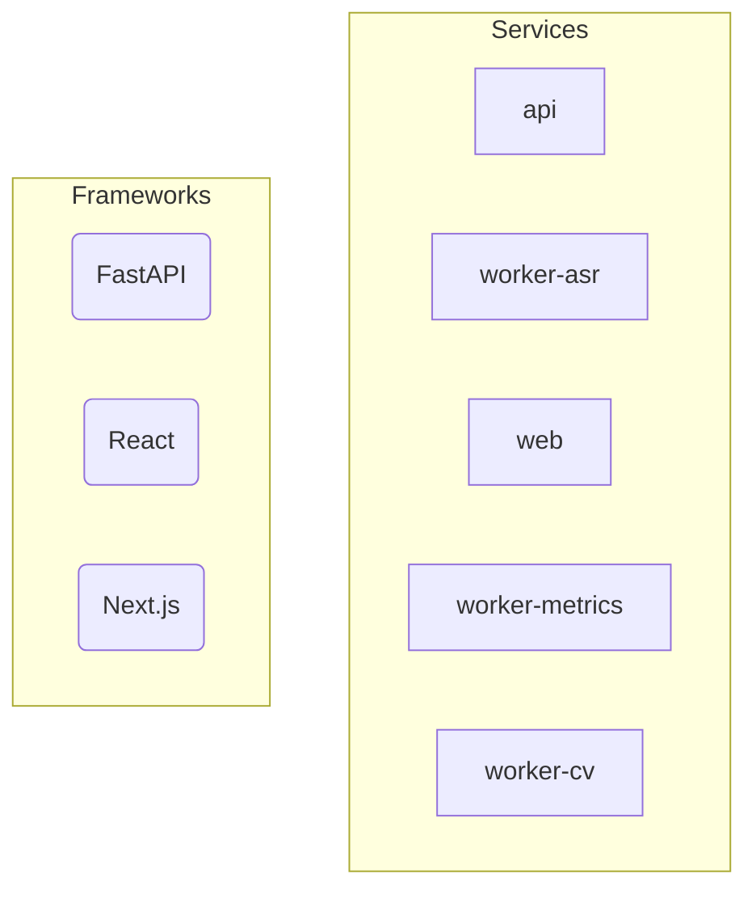

# Architecture Diagrams

## Services & Frameworks

```mermaid
graph TD
    subgraph Services
        api["api"]
        click api href "services/api" "Go to api source"
        worker_asr["worker-asr"]
        click worker_asr href "services/worker-asr" "Go to worker-asr source"
        web["web"]
        click web href "services/web" "Go to web source"
        worker_metrics["worker-metrics"]
        click worker_metrics href "services/worker-metrics" "Go to worker-metrics source"
        worker_cv["worker-cv"]
        click worker_cv href "services/worker-cv" "Go to worker-cv source"
    end

    subgraph Frameworks
        FastAPI(FastAPI)
        React(React)
        Next_js(Next.js)
    end

```
